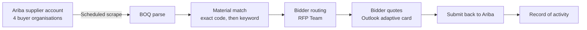

# Business Requirements Document (BRD)

The **why**: what business problem we are solving, who benefits, and what success looks like.

Related: [SRS](02-SRS-Software-Requirements-Specification.md) · [Glossary](03-Glossary-and-Acronyms.md) · [SAD](../02-architecture/04-SAD-Software-Architecture-Document.md)

---

## 1. Executive summary

Bahra Electric receives Requests for Proposals (RFPs) from customers via its **single SAP Ariba supplier account**. Four buyer organisations — Saudi Energy (SEC), Aramco e-Marketplace, HADEED - RAJHI STEEL, and Saudi Aramco Mobil Refinery — publish into that one account and are switched between with Ariba's company selector. Each RFP contains a Bill of Quantities (BOQ) that must be matched against Bahra's material master, routed to internal bidders, priced, and submitted back — often under tight deadlines.

The manual process is **slow, error-prone, and opaque**:
- BOQ items are copy-pasted or re-keyed into spreadsheets
- Material matching is done from memory or by searching SAP one item at a time
- Bidder assignment is by email, with status tracked in scattered Outlook folders
- No central audit trail of *who quoted what when*
- Missed deadlines are frequent

The **RFP Automation Portal** ingests RFPs by scraping Bahra's Ariba supplier account on a schedule, extracts material codes and description keywords from the downloaded BOQ workbook, matches them against the material master in Dataverse, routes to assigned bidders via adaptive-card emails, captures their responses inside Outlook, and keeps a record of every step. Bidders' priced workbooks are pushed back to Ariba by the same browser automation from the portal's Submit dialog.

## 2. Business problem

| # | Pain point | Impact |
|---|---|---|
| BP-01 | Manual data entry from PDF/XLSX BOQs to internal tools | 1–3 hours per RFP; transcription errors |
| BP-02 | No material-master auto-match; bidders search SAP manually | Lost bidding opportunities; wrong parts quoted |
| BP-03 | Ad-hoc email handoffs with no deadline tracking | Missed RFP due dates; lost deals |
| BP-04 | Scattered pricing history across Outlook / OneDrive / SharePoint | Inconsistent pricing; unable to audit |
| BP-05 | No visibility for managers on in-flight RFPs | Can't prioritise or intervene |
| BP-06 | The Ariba supplier account has to be checked by hand for new RFPs | Delayed response; manual polling |
| BP-07 | Bidders lose context switching between email, Excel, and SAP | Errors in quote packaging |

## 3. Goals

### 3.1 Business goals
- **G1.** Cut the per-RFP processing time from hours to minutes
- **G2.** Eliminate transcription errors between BOQ and internal tools
- **G3.** Never miss an RFP deadline because of manual coordination
- **G4.** Produce a defensible audit trail for every bid decision
- **G5.** Free up senior engineers from clerical work so they focus on pricing strategy

### 3.2 Success metrics (KPIs)

| Metric | Baseline (manual) | Target (year 1) |
|---|---|---|
| Mean time from RFP receipt to bidder assignment | ~4 hours | < 30 minutes |
| Mean time from RFP receipt to submission | 2–3 days | < 1 day |
| RFPs missed due to coordination failure | ~5 / month | 0 |
| BOQ auto-match rate | n/a (manual) | ≥ 70 % of line items |
| Admin time spent on status-chasing | 6 hrs/week | < 1 hr/week |
| Bidder satisfaction (survey) | n/a | ≥ 4 / 5 |

### 3.3 Non-goals (v1)
- Automated *pricing* — the system assists, it does not set prices
- Negotiation with customers
- Full SAP write-back (only password push for internal use)
- Mobile-native app (web works on mobile browsers; native is phase 2+)
- Multi-tenant / external customer login — only internal Bahra users

## 4. Stakeholders

| Role | Interest | Representative |
|---|---|---|
| Executive Sponsor | ROI, strategic alignment | *(fill in)* |
| Procurement Head | Workflow ownership, success metrics | *(fill in)* |
| IT Operations | System stability, security | *(fill in)* |
| Sales Engineers ("Bidders") | Day-to-day users | Multiple — domain SMEs |
| Admins | User & role provisioning, settings | IT admin team |
| Legal / Compliance | Audit, data retention | *(fill in)* |
| External customers | Receive submissions (indirectly) | SEC, Aramco, others |

## 5. Scope

### 5.1 In-scope (v1)
- **Ingestion:** Scheduled scrape of Bahra's single Ariba supplier account (Playwright browser automation), cycling through the four buyer organisations via Ariba's company selector. The schedule runs as Windows Scheduled Tasks on the application server.
- **Extraction:** Material codes and description keywords pulled from the downloaded XLSX BOQ — 9-digit SAP material-code regex plus keyword tokenization from the Name / Description columns.
- **Matching:** Deterministic two-tier match against the material-master table in Dataverse — (1) exact equality on the 9-digit SAP code, (2) substring keyword containment on material name / description when the exact match misses. No scoring, ranking, or threshold is involved; see [Glossary → Material Matching](03-Glossary-and-Acronyms.md#material-matching).
- **Routing:** Rule-based bidder assignment (via the RFP Team table) plus adaptive-card emails delivered to assigned bidders' Outlook inboxes.
- **Response capture:** Inline in Outlook via Office 365 actionable messages. Responses are first-response-wins per product line.
- **Tracking:** RFP lifecycle state, an Open RFP tracker with per-line reminder and delegation actions, deadline-based reminder emails (3 days before due date and 1 day before), and a manager dashboard.
- **Admin:** User, role, permission, and master-data CRUD (materials, keywords, RFP team, column configuration).
- **Audit:** Append-only log of role changes, master-data changes, and user lifecycle events in `cr673_bahra_audit_logs`.
- **Reporting:** KPI tiles, material insights, per-company analytics, XLSX export.

### 5.2 Out-of-scope (v1)
- Automated price generation / ML-based bidding
- Contract lifecycle management (post-submission)
- Supplier-to-supplier marketplace
- SSO with external identity providers beyond Azure AD
- Offline mode

### 5.3 Assumptions
- Bahra has a Microsoft 365 tenant with Dataverse, Graph, SharePoint, and Power Automate available
- Bahra maintains **one** Ariba supplier account covering all four buyer organisations
- Ariba uses static login credentials (no MFA, or MFA-exempted service account)
- Bidders have Outlook Web or desktop with actionable-messages enabled
- Entra ID P1/P2 is available, so the Outlook cards can reach the system through Entra Application Proxy without exposing the portal to the internet

### 5.4 Constraints
- Must run in Bahra's existing Azure tenant (no new cloud region)
- No on-prem dependency beyond the Windows host for automation
- Must retain audit data per internal records policy (estimated 7 years)

## 6. Personas

### 6.1 Basim the Bidder
- Sales engineer, 8 years experience
- Manages 10–15 RFPs per week
- Prefers Outlook over web apps
- Cares about: fast quote turnaround, not missing anything
- Pain today: has 4 inboxes, juggles Excel versions, searches SAP manually

### 6.2 Khalid the Admin
- IT administrator
- Provisions users, rotates SAP password, tweaks schedules
- Cares about: system uptime, audit readiness
- Pain today: role changes require DB edits or config pushes

### 6.3 Salma the Sponsor
- Procurement director
- Reports to the CFO on bid win rates and cycle time
- Cares about: dashboards, KPIs, win/loss analysis
- Pain today: asks Khalid to run Excel pivots on weekends

## 7. High-level business process

## 8. Requirements (business-level)

Detailed functional and non-functional requirements live in the [SRS](02-SRS-Software-Requirements-Specification.md). At the business level:

- **BR-01.** System must ingest RFPs from Bahra's Ariba supplier account on a schedule with no manual copy-paste
- **BR-02.** Users with appropriate role must be able to see, act on, and track RFPs from a single screen
- **BR-03.** Material matching must be explainable — for every line item a human must be able to see whether it matched on the SAP code, on a keyword, or not at all
- **BR-04.** Every change (price, status, assignment) must be attributed to a user and timestamped
- **BR-05.** Admins must be able to create roles and assign permissions without developer involvement
- **BR-06.** The system must be usable on Bahra's standard corporate laptops without software installation (browser only)
- **BR-07.** The system must operate during business hours (Sun–Thu, 08:00–18:00 AST) without unplanned outage
- **BR-08.** All customer-facing data (pricing, RFP contents) must remain inside Bahra's Microsoft tenant

## 9. Business rules

- **BR-R1.** Only Admins can create or delete roles.
- **BR-R2.** Only users with `sap_password.change` permission can change the SAP service password; every change creates a record in the SAP password log table.
- **BR-R3.** Reminder emails go to assigned bidders 3 days before the RFP deadline and again 1 day before, using the `Reminder_3Day_Sent` / `Reminder_1Day_Sent` flags to prevent duplicate sends. **This rule is implemented but not currently firing — see §13.1.**
- **BR-R4.** All audit rows are append-only; no user role can delete them.
- **BR-R5.** Material master changes (add/edit/delete) require `material_master.*` permission and are audited.
- **BR-R6.** For each product line on an RFP, the **first** response received is the one that counts; a later response from a colleague on the same line is not applied.
- **BR-R7.** A permission change takes effect only after the affected user signs out and back in.

## 10. Benefits & ROI

Estimated, for discussion — not contractual:

| Benefit | Quantified (year 1) |
|---|---|
| Engineering time saved (per RFP: 2.5 hr → 0.5 hr, 400 RFPs/year) | 800 hours (~10 FTE-months) |
| Missed-deadline losses avoided | 3–5 deals at avg SAR 500k each |
| Audit preparation time saved | 2 weeks annually |
| Reduction in quote errors → fewer credit notes | Estimate 2–3 % of bid value |

Payback period: estimated 6–9 months at current RFP volume.

## 11. Risks & mitigations

| ID | Risk | Likelihood | Impact | Mitigation |
|---|---|---|---|---|
| BRisk-01 | Azure AD app secret expires → outage | Medium | High | 30-day calendar reminder + runbook rotation procedure |
| BRisk-02 | Server system crash (Windows host down, process hang, disk / memory exhaustion) | Medium | High | Process monitoring and auto-restart on the Windows host; operator notification; manual restart runbook |

## 12. Dependencies

- Microsoft 365 tenant (existing)
- Power Platform / Dataverse licence
- Entra ID (Azure AD) application registration
- Entra ID P1/P2 licence + an Application Proxy connector on the application server, so Outlook's Submit/Decline buttons can reach the system
- Shared mailbox for outbound RFP emails and actionable-card replies
- **One** Ariba supplier account with a scraping-friendly service session
- Dedicated Windows host for deployment
- Internet access from the host for Graph, Dataverse, Ariba

## 13. Current release

| Release | Scope | Status |
|---|---|---|
| Current | Ariba scraping · BOQ material-code + keyword extraction · Dataverse material match · adaptive-card bidder routing · Open RFP tracker with delegation · admin · RBAC (42 permissions) · audit · analytics dashboard | Live at `https://be-aramco-01.bahra-cables.com/rfp` |

### 13.1 Known issues affecting business users

Two things do **not** currently work as the screens imply. Do not plan around them until the [Operations Runbook](../03-operations/10-Operations-Runbook.md) records them as resolved.

| Issue | Business impact |
|---|---|
| **The Schedule & Automation screen does not change the live schedule.** The download and portal-sync schedules moved to Windows Scheduled Tasks on the server; the screen still updates the retired Power Automate flow and shows a success message that has no effect. | Changing the automation cadence is currently a server-side task for IT, not a self-service portal action. |
| **Deadline reminder emails are not being sent.** The reminder job was driven by a Power Automate flow that no longer reaches the system, and no scheduled task has replaced it yet. | Bidders will not receive the 3-day / 1-day nudges. Chase non-responders manually from the **Open RFP** page, which does send reminders on demand. |

## 14. Acceptance & sign-off

This BRD is considered accepted when:
- Executive sponsor signs the cover memo
- Procurement head validates the KPI definitions in §3.2
- IT operations confirms the deployment model in §12
- Legal confirms audit retention requirements in §8 and §9

## 15. Glossary pointer

See [03-Glossary-and-Acronyms.md](03-Glossary-and-Acronyms.md) for domain terms (RFP, BOQ, bidder, adaptive card, etc.).

## 16. Revision history

| Version | Date | Author | Change |
|---|---|---|---|
| 1.2 | 2026-07-17 | Manish Soni | Verified against code; corrected matching description, single Ariba tenant, 42 permissions, known issues |
