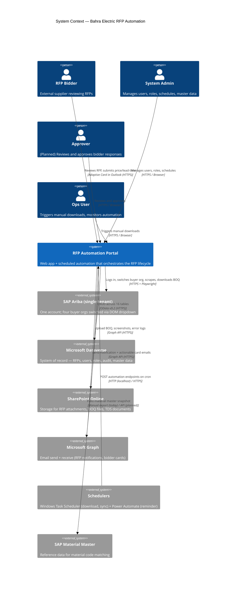
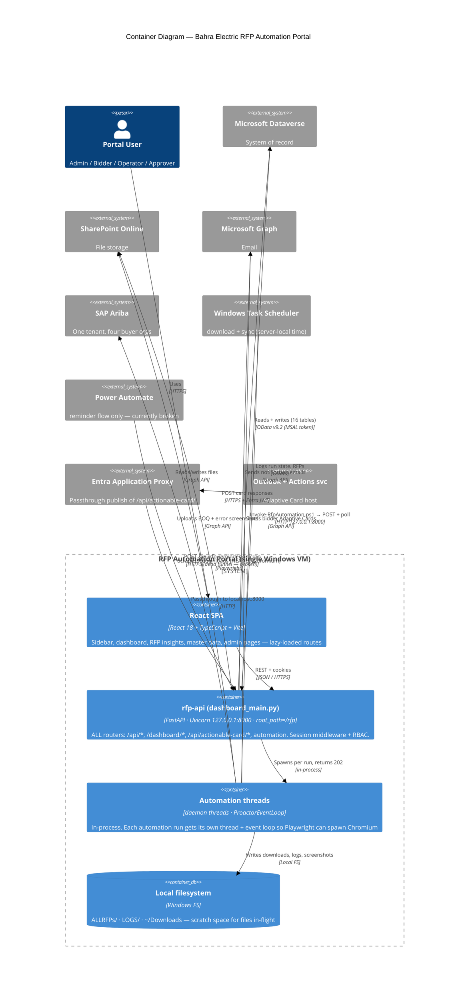
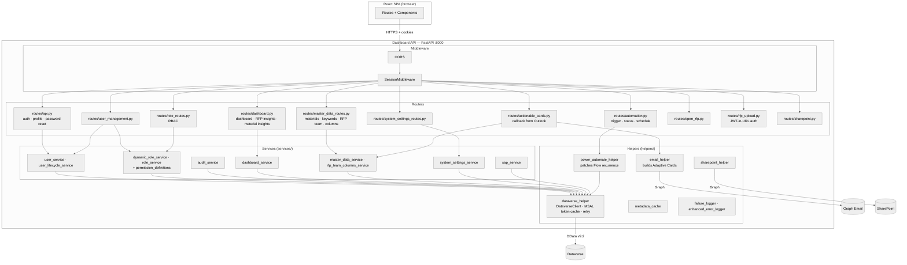
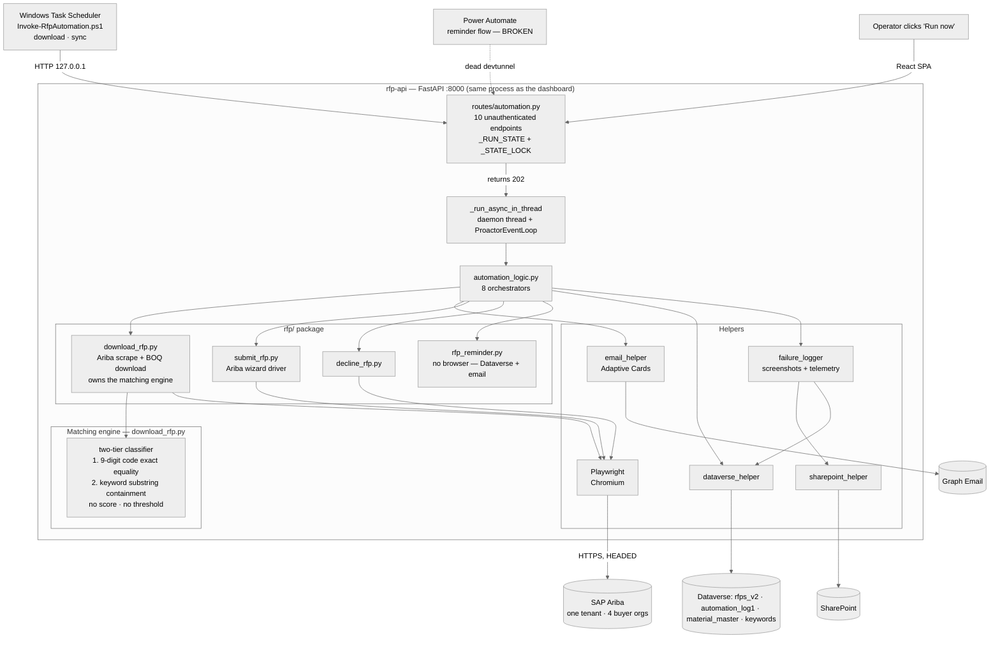
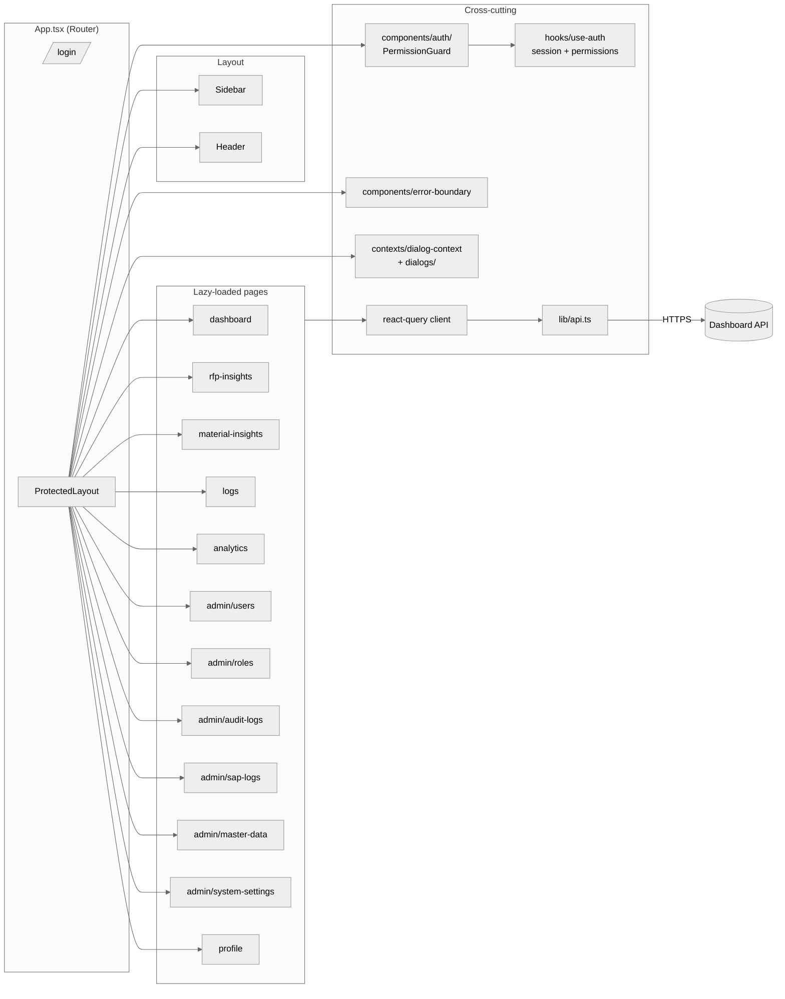
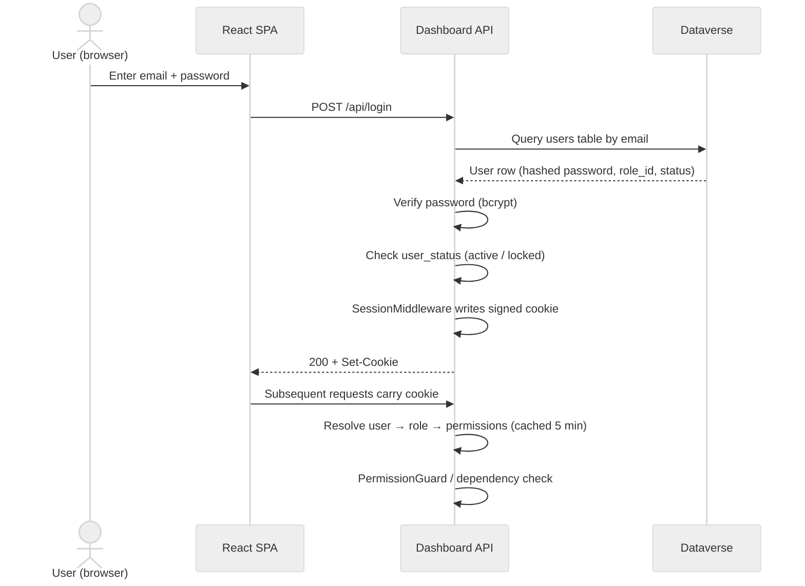
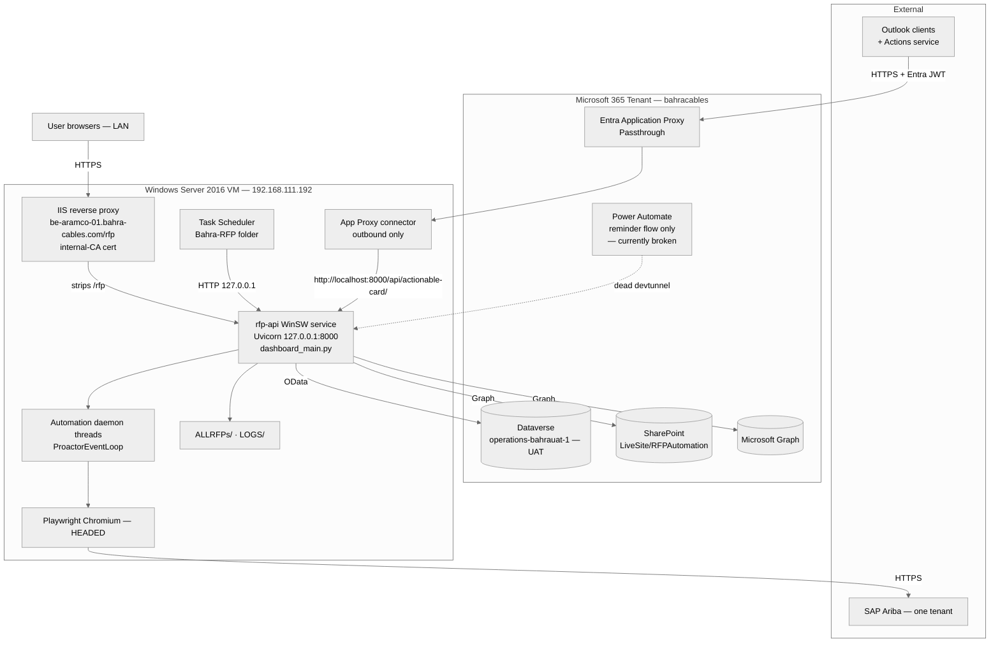

# Software Architecture Document (SAD)

> **Read this first if you are:** a new developer who needs the big picture, an architect evaluating a change, or an integration partner trying to understand how the system fits with Dataverse / SharePoint / SAP / Power Automate.
>
> **Pair with:** [Glossary](../01-business/03-Glossary-and-Acronyms.md) for terminology · [Data Dictionary](07-Data-Dictionary-and-ER-Diagram.md) for table-level detail · [API Documentation](08-API-Documentation.md) for endpoint contracts.

---

## 1. Purpose and Scope

This document describes the **as-built** architecture of the Bahra Electric RFP Automation Portal. It uses the **C4 model** (Context → Container → Component) to progressively zoom in from the system's place in the business landscape down to the internal modules of the FastAPI backend and the React frontend.

**In scope**
- Logical architecture: layers, modules, responsibilities
- Physical architecture: processes, hosts, ports, dependencies
- Integration architecture: every external system the portal talks to and the protocol used
- Cross-cutting concerns: authentication, authorization (RBAC), session management, caching, logging, error handling

**Out of scope** (covered elsewhere)
- Detailed module/class design → see [HLD](05-HLD-High-Level-Design.md) and [LLD](06-LLD-Low-Level-Design.md)
- Per-table column definitions → see [Data Dictionary](07-Data-Dictionary-and-ER-Diagram.md)
- Endpoint contracts → see [API Documentation](08-API-Documentation.md)
- Deployment runbook → see [Deployment Guide](../03-operations/09-Deployment-Guide.md)

---

## 2. Architectural Drivers

The architecture exists to satisfy these business and technical drivers. Every significant decision in §6 traces back to one of these.

| # | Driver | Type | Rationale |
|---|--------|------|-----------|
| D1 | Fully automate the discovery → match → notify → respond → log loop for RFPs across all buyer organisations in the Ariba tenant | Functional | Eliminate manual portal monitoring and Excel-based BOQ matching |
| D2 | Bidder responses must round-trip from email → Dataverse without portal login | Functional | Bidders are external; reducing friction increases response rate |
| D3 | Master data (materials, keywords, RFP team, status) must be editable by Admins without code change | Functional | Business owns its master data; engineering should not gate routine changes |
| D4 | Role-based access control with audit trail | Non-functional (Security) | Compliance requirement — every privileged action is traceable |
| D5 | The system must run on a single Windows VM and be deployable in hours, not days | Non-functional (Operability) | Customer infrastructure is on-prem Windows; no Kubernetes / Linux / cloud-native options |
| D6 | Browser automation against the Ariba portal must survive UI changes and CAPTCHAs gracefully | Non-functional (Reliability) | Ariba UI is volatile; failures must produce useful diagnostics, not silent drops |
| D7 | Material matching must be tunable without redeploy | Functional | Matching is driven entirely by **data** — the Material Master and Keyword Master rows in Dataverse (Admin-editable). There are no thresholds or weights to tune: the algorithm is a fixed exact-code / keyword-containment classifier (§5.2) |

---

## 3. C4 Level 1 — System Context

The portal sits between four sets of human actors and five external systems.

> **One Ariba tenant, not four portals.** The system integrates with a **single SAP Ariba tenant** (`config.py`). What the UI calls "companies" — `Saudi Energy` (default), `Aramco e-Marketplace`, `HADEED - RAJHI STEEL`, `Saudi Aramco Mobil Refinery Company Limited` — are **buyer organisations inside that one Ariba account**, switched at runtime by a DOM interaction (`select_company_from_portal` in [automation_logic.py](../../backend/automation_logic.py) clicks Ariba's "more…" link, waits for the org picker, selects the anchor, re-checks login). There are no per-portal adapters and no separate credentials, endpoints, or integrations per company. `COMPANY_RFP_SELECTORS` maps all four to the *same* default selector list today — it is an extension point that has not yet needed to diverge.

### 3.1 Actors

| Actor | Channel | Authority |
|-------|---------|-----------|
| **RFP Bidder** | Outlook email (Adaptive Card) | Submit price/lead-time, decline with reason. No portal login required. |
| **System Admin** | Browser (React app) | Full access — users, roles, schedules, master data, system settings, all logs |
| **Approver** *(planned)* | Browser | Review submitted bidder responses; approve/reject/escalate |
| **Ops User** | Browser | Trigger manual downloads, view dashboard, monitor automation health |

### 3.2 External systems

| System | Role | Coupling | Failure mode |
|--------|------|----------|--------------|
| **SAP Ariba (one tenant)** | Source of truth for new RFPs across all four buyer organisations | Tight (UI scraping via Playwright) | Sensitive to UI changes; failures captured as screenshots in `LOGS/` and uploaded to SharePoint |
| **Microsoft Dataverse** | System of record for everything except files | Tight — most reads/writes go through `helpers/dataverse_helper.py` | Health check at `/health` verifies token + table read |
| **SharePoint Online** | Object storage for BOQ files, TDS documents, error screenshots | Loose — accessed via Microsoft Graph | Fall back to local `LOGS/` directory if Graph is unreachable |
| **Microsoft Graph (Email)** | Outbound email channel for all notifications | Loose | Email failures logged, automation continues |
| **Windows Task Scheduler** (on the prod VM) | Primary scheduling engine for `download` and `sync` | Loose — `scripts/Invoke-RfpAutomation.ps1` POSTs to `127.0.0.1:8000` and polls to completion | If the task is disabled, no scheduled runs; manual trigger still works |
| **Power Automate** | Legacy scheduling engine; **reminder flow only** as of the migration (§7.7) | Loose — Cloud Flow with a Recurrence trigger; the portal patches the flow's recurrence via the Dataverse `workflow` table | **Currently broken** — the reminder flow points at a retired dev tunnel, so reminder emails are not sending |
| **SAP** | Source of Material Master reference data | Loose — currently a manual export imported into `cr673_bahra_material_master` | Stale data degrades matching accuracy but does not break the system |

---

## 4. C4 Level 2 — Container Diagram

The portal runs as **one FastAPI process** on a Windows host plus a **React/Vite SPA** delivered to the browser.

> **Correction to earlier revisions of this document:** production does **not** run a second automation process. `dashboard_main.py` mounts **every** router — including `automation` — so the Playwright pipelines execute inside the same process as the dashboard API, on background threads (§7.7). `automation_main.py` (port 8100) exists only as a standalone-automation deployment option: it mounts *only* the automation router and is a strict subset of `dashboard_main` with no SessionMiddleware and narrower CORS. **It is not deployed in production and no new functionality should be added to it.**

**Path prefix:** the app is created as `FastAPI(root_path="/rfp")` and the reverse proxy strips `/rfp` before forwarding. Every path in this document is the **internal** path FastAPI matches — externally, prepend `/rfp`.

### 4.1 Containers

| # | Container | Process | Port | Responsibility |
|---|-----------|---------|------|----------------|
| C1 | **React SPA** | Browser-side JS bundle built by Vite (`base: '/rfp/'`) | served by IIS in prod; dev server on 3000 | UI for all roles. Lazy-loaded route-level code splitting. State via Zustand + React Query. UI library: Radix UI + Tailwind. |
| C2 | **rfp-api** | `dashboard_main.py` → `uvicorn` | 8000 (localhost-only in prod) | Owns everything: auth/session, RBAC, all CRUD, dashboard aggregation, system settings, master data, audit logs, actionable-card callback, **and** the automation pipelines. |
| C3 | **Automation threads** | daemon threads inside C2 | n/a | Playwright browser sessions, Ariba scraping, BOQ download/parse, material matching, RFP submit/decline, reminder emails. Long-running, CPU+I/O heavy. |
| C4 | **Local filesystem** | `ALLRFPs/`, `LOGS/`, `~/Downloads` | n/a | Scratch space for files currently being processed. Authoritative copies live in SharePoint. |

> **Why threads and not a second process?** Playwright must spawn a Chromium subprocess, and uvicorn on Windows runs a `SelectorEventLoop`, which **cannot spawn subprocesses**. Rather than split the deployment, each automation run is handed to a **new daemon thread running its own `asyncio.ProactorEventLoop`**, and the triggering request returns `202` immediately. See §7.7. The cost of this choice: automation shares a process (and a fate) with the dashboard, and the run-state lock is in-memory, so it assumes **exactly one uvicorn worker**.

### 4.2 Process and port summary

| Process | Entry point | Port | Notes |
|---------|-------------|------|-------|
| rfp-api (prod) / Dashboard API (dev) | [dashboard_main.py](../../backend/dashboard_main.py) | 8000 | `root_path="/rfp"`. Mounts **all 12 routers** (api, automation, dashboard, role, actionable_cards, master_data, system_settings, open_rfp, rfp_upload, sharepoint, user_management) — 118 route decorators. Must be launched with the working directory set to `backend/`. |
| Automation API (**not deployed**) | [automation_main.py](../../backend/automation_main.py) | 8100 | Standalone-automation option only. Mounts only the `automation` router; no SessionMiddleware. Do not add functionality here. |
| Vite dev server | `frontend/` `npm run dev` | 3000 | Dev only. Proxies **`/rfp/api`, `/rfp/dashboard`, `/rfp/upload`** → `http://localhost:8000`, each rewriting away the `/rfp` prefix to mirror the prod proxy. Production builds are served statically by IIS. |

### 4.3 Routing quirks that matter architecturally

| Quirk | Detail |
|---|---|
| **`error_analysis_routes.py` is not mounted** | The router exists (6 endpoints) but the `include_router` call is commented out. It is **dead, unreachable code** — do not treat it as available API or plan against it. |
| **The automation router is double-mounted** | `dashboard_main.py` includes it twice — once with `prefix="/api"` and once bare — so all 10 automation endpoints are live at **both** `/api/x` and `/x`, producing duplicate OpenAPI operation IDs. |
| **All 10 automation endpoints are unauthenticated** | No session dependency, no permission dependency. Mitigated only by network position (backend is bound to `127.0.0.1` and IIS keeps it LAN-only). Also unauthenticated: `GET /api/company-options`, `GET /api/actionable-card/responses/{rfp_id}`, `/health`, and the login/logout/forgot/reset set. |
| **Four auth mechanisms coexist** | (a) `Depends(require_permission(...))` / `require_admin` / `get_current_user` from [middleware/auth.py](../../backend/middleware/auth.py); (b) inline `request.session.get("user")` → 401 (much of `dashboard.py`, plus profile/error-files in `api.py`); (c) inline `has_access_to_feature(...)` via `services/role_service` (`user_management.py` only); (d) token-based — Entra bearer + JWKS (`actionable_cards.py`), query/form JWT (`rfp_upload.py`). Consolidating these is an open improvement, not a completed design. |

---

## 5. C4 Level 3 — Component Diagrams

### 5.1 Dashboard API components

**Layering rule:** routers depend on services; services depend on helpers; helpers depend on external systems. Routers do **not** call helpers directly except for `actionable_cards.py` (which builds Adaptive Cards inline because the email shape is tightly coupled to the route's response).

**Read the diagram carefully on two points:**
- `SessionMiddleware` sits in front of every router because it is app-wide middleware — but that is **not** the same as those routes being *protected*. `routes/automation.py` reads no session and declares no permission dependency; its 10 endpoints are open to anyone who can reach the port (§4.3).
- `routes/error_analysis_routes.py` is deliberately absent from this diagram: it is not mounted (§4.3).

### 5.2 Automation components

**Notes on this diagram:**
- [automation_logic.py](../../backend/automation_logic.py) exposes **8** top-level orchestrators: `run_automation_download`, `run_automation_download_open_rfps` (**the one the scheduler calls**), `run_automation_submit`, `run_automation_decline`, `run_automation_reminder`, `run_automation_sync_portal`, `run_automation_download_all_rfps`, `run_sync_sharepoint_dataverse`.
- **Chromium runs HEADED**, not headless — `common_flow` hardcodes `headless_mode = False`. This is why the service must run on a host where a browser can render, and why "no visible browser" is not a valid health signal. Each run gets an isolated `pw-profile-{label}-{uuid8}` user-data-dir under temp, which permits parallel automations.
- `rfp_reminder.py` drives **no browser** — it is a pure Dataverse read plus Graph sendMail, on a 3-day/1-day cadence with `Reminder_3Day_Sent` / `Reminder_1Day_Sent` idempotency flags.

### 5.3 Frontend component map

---

## 6. Architectural Decisions

> Each decision lists what was chosen, what was rejected, and why. Use these as the starting point if you ever consider changing one.

| ID | Decision | Why | Trade-off accepted |
|----|----------|-----|--------------------|
| **AD-01** | **Dataverse as system of record** (not SQL Server / Postgres) | Customer is Microsoft 365 + Power Platform shop; D4 (audit) and D3 (admin-editable master data) come "free" via Dataverse + Power Apps | Vendor lock-in; awkward query language (OData); EntitySetName pluralization quirks |
| **AD-02** | **One process; automation on daemon threads with their own `ProactorEventLoop`** | uvicorn's `SelectorEventLoop` cannot spawn the Chromium subprocess Playwright needs; a thread-local Proactor loop fixes that without splitting the deployment | Automation shares a process (and a crash) with the dashboard; `_RUN_STATE` is in-memory, so the design assumes a single uvicorn worker and loses run state on restart |
| **AD-03** | **Playwright (Python) for Ariba** vs. Selenium / API integration | Ariba lacks a public RFP-list API; Playwright is more robust against modern SPA-style portals | Browser footprint; Windows event-loop constraint (AD-02); browsers install per-user, which bites when the service identity changes |
| **AD-04** | **Windows Task Scheduler as cron** (download + sync), superseding Power Automate | The PA flows fired at a dev tunnel that no longer exists, and ran on **India Standard Time** — a "12:00" trigger fired at 09:30 Riyadh. Task Scheduler runs server-local (Riyadh), calls `127.0.0.1` so no public ingress is needed, and `Invoke-RfpAutomation.ps1` polls to completion so "Last Run Result" reflects the run, not just its acceptance | The schedule is no longer editable from the portal UI — and the Schedule Automation page still writes to the retired flow, making it a **silent no-op** (§7.7, R8). Migration is incomplete: the reminder flow is still on Power Automate and is broken |
| **AD-05** | **Session cookie auth** (`SessionMiddleware`) for the SPA + **MSAL client-credential** for Dataverse | Internal users authenticate against the portal's own user table; backend uses app identity for Dataverse | No SSO with Entra ID for portal users (today); two auth domains to maintain |
| **AD-06** | **42 fine-grained permissions** in code + role table in Dataverse | D4 — admins create custom roles without code change; permissions stay in source-of-truth `services/permission_definitions.py` | Adding a permission means a code release. Permissions are also snapshotted into the session at login, so **grants and revokes only take effect on re-login** |
| **AD-07** | **Adaptive Cards / Actionable Messages** for bidder responses (vs. magic-link login) | D2 — zero-friction response from Outlook; an Entra-issued token verifies the caller | Originator ID required; Outlook-only (not Gmail/external). Legacy EAT auth was retired, so the callback now validates **Microsoft Entra** tokens and must accept both v1.0 and v2.0 issuers (§7.8) |
| **AD-08** | **All Dataverse columns read as strings** (`use_display_names=True`) | Display-name addressing simplifies code; numeric / date conversion happens at use-site | Slight perf cost; risk of silent type errors |
| **AD-09** | **In-process TTL caches** (`RBAC_CACHE_TTL_SECONDS=300`, `DASHBOARD_TTL_SECONDS=300`) | D5 — single-VM deployment; no Redis | Permission revocation takes up to 5 min to propagate |
| **AD-10** | **React + Vite + TypeScript** vs. server-rendered Jinja | Rich admin UI (data tables, role editors, charts) needs a real SPA | Two-stack maintenance (Python + TS); CORS configuration |

---

## 7. Cross-Cutting Concerns

### 7.1 Authentication and session

**Knobs** (in `config/config.py`):
- `SESSION_TIMEOUT_SECONDS = 7200` — the cookie `max_age`, and the **only** timeout actually enforced. Session cookie is `rfp_session`, scoped `path="/rfp"`.
- `ACCOUNT_LOCKOUT_THRESHOLD = 5` failed attempts
- `RBAC_CACHE_TTL_SECONDS = 300`

> **`IDLE_TIMEOUT_SECONDS = 1800`, `SESSION_WARNING_SECONDS = 300` and `SESSION_REFRESH_INTERVAL = 300` exist in `config.py` but are never read by any code.** `last_activity` is written into the session and echoed back, but never compared against a threshold. **There is no idle timeout** — the effective policy is a flat 2-hour absolute cap, after which the cookie expires regardless of activity. Treat the presence of these constants as a documentation hazard, not a control.

### 7.2 Authorization (RBAC)

- **42 permissions** across 15 modules, defined in [services/permission_definitions.py](../../backend/services/permission_definitions.py). Two groupings of the same 42 keys coexist: `MODULE_LABELS` (backend namespaces) and `PERMISSION_CATEGORIES` (mirrors the Roles UI, shorter labels). **This document uses the `MODULE_LABELS` grouping.**
- **Default roles** seeded by `services/dynamic_role_service.py`, both flagged `is_system`: `Admin` (computed as all 42) and `RFP Bidder` (exactly 10 — `rfp.view/download/submit/decline`, `rfp.open.view`, `rfp.open.delegate`, `rfp.sharepoint.view`, `dashboard.view`, `logs.view`, `material_insights.view`; notably **not** `rfp.open.remind` or `analytics.view`).
- **Backend enforcement** is the real boundary: `require_permission(key)` checks `key in user["permissions"]` **straight from the session**, which is frozen at login — so **permission changes require re-login**, and the 5-minute RBAC cache does not help a live session.
- **`require_admin` bypasses the permission system entirely** — it is a hardcoded `role.lower() == "admin"` name check. Renaming the Admin role silently breaks it (and `useIsAdmin()` on the frontend). Role names are load-bearing here, and separately in `role_permissions` rows, which store `role_name` denormalized — **renaming a role orphans its permission rows**.
- **Frontend enforcement is cosmetic only.** `<PermissionGuard>` wraps protected routes in [App.tsx](../../frontend/src/App.tsx) and `useHasPermission()` gates UI, but the Zustand store **persists `user.permissions` to `localStorage`** (key `auth-storage`), so a user can edit their own permission list and unlock the UI. Nothing behind it is exposed unless the backend also allows it. `PermissionGuard` with an array uses `.some()` — **ANY match grants access**, not all.

### 7.3 Audit logging

`services/audit_service.py` writes rows to `cr673_bahra_audit_logs` with `action`, `category`, `actor_email`, `actor_name`, `target_type`, `target_id`, `details` (JSON, **truncated to 4000 chars**), `ip_address`, `created_date`. Categories: `AUTH`, `USER`, `ROLE`, `RFP`, `SYSTEM`. Logs are queryable via the Audit Logs page; nothing is ever deleted.

**Scope is narrower than "every privileged action" — be precise about what is and is not covered:**
- **Covered:** authentication (LOGIN, LOGIN_FAILED, LOGOUT, PASSWORD_CHANGED/RESET), user lifecycle (CREATED/UPDATED/DELETED/ACTIVATED/DEACTIVATED/UNLOCKED), roles (ROLE_CREATED/UPDATED/DELETED, ROLE_PERMISSIONS_UPDATED, SEED_ROLES), and settings (SETTING_UPDATED, SETTING_REVEALED — reads of masked secrets are audited).
- **Not covered:** **no RFP operation is audited** — download, submit, decline, remind and delegate write nothing to the audit table. The `RFP` category is defined but never used. **No permission-denied (403) events are recorded either.**
- **Delivery is best-effort:** audit writes are fire-and-forget on a daemon thread and failures only print, so rows can be silently lost, and in-flight writes may be dropped at interpreter exit. Do not treat this table as a tamper-evident or complete record.

### 7.4 Caching strategy

| Layer | TTL | Implementation | Invalidation |
|-------|-----|----------------|--------------|
| RBAC (user → permissions) | 300 s | In-process dict | TTL only |
| Dashboard aggregations | 300 s | In-process dict + `Cache-Control: max-age=30` on the response | TTL only |
| Logs | 300 s | In-process dict | TTL only |
| SAP password logs | 300 s | In-process dict | TTL only |
| Dataverse column display→logical mapping | Process lifetime | `helpers/dataverse_helper.py::_column_mapping_cache` | Process restart |
| MSAL access token | Token expiry minus 5 min | `helpers/dataverse_helper.py` | Auto-refresh |

### 7.5 Error handling and observability

- **Global exception handler** in `dashboard_main.py` catches anything not handled by FastAPI and returns `{"detail": "Internal server error", "error_id": <8-char uuid>}` so logs and the user share a correlation ID
- **Dataverse client** retries on 429/5xx with exponential backoff (3 attempts, 1–8 s) — see `helpers/dataverse_helper.py::_retry_request`
- **Automation failures** capture a Playwright screenshot to `LOGS/screenshot_<label>_<ts>.png`, upload it to SharePoint via `helpers/failure_logger.py`, and email a failure notification
- **Health check** at `GET /health` — verifies Dataverse connectivity (table read)

### 7.6 Configuration

Single source of truth: [config/config.py](../../backend/config/config.py). Sections: Azure AD, Dataverse, SharePoint, Power Automate, Ariba, Email, Security, Caching, Local paths.

**`config.py` is not tracked in git** — it is gitignored and has never been committed. It is a local, untracked file maintained per host. **Editing it requires a service restart** (`Restart-Service rfp-api`) to take effect; an unrestarted backend after a config edit is a recurring source of confusing 500s.

`RESOURCE_URL` currently points at `https://operations-bahrauat-1.crm11.dynamics.com` — a **UAT** org configured as the default. Confirm this is intentional for your environment before deploying.

**Runtime-mutable settings** (managed via the System Settings page, stored in `cr673_bahra_system_settings`): email recipient lists, company name overrides. Everything else is code-managed. One deliberate exception: `ACTIONABLE_CARD_CALLBACK_URL` is in `REMOVED_KEYS` in the settings seed, so it is **intentionally not** read from Dataverse — `config.py` is its single source of truth.

### 7.7 Concurrency and scheduling

**In-process concurrency** ([routes/automation.py](../../backend/routes/automation.py)):
- `_run_async_in_thread` puts each automation on a **new daemon thread with its own `ProactorEventLoop`** (AD-02); the handler returns **202** immediately.
- `_RUN_STATE` + `_STATE_LOCK` guard concurrent jobs. Keys: `download`, `submit`, `decline`, `sync`, `sync_sp_dv`, `sync_all`, `last`, `submitting_rfps` (a set). `_try_start_operation(key)` does an atomic check-and-set **inside** the lock (no TOCTOU); a second caller gets **409**. `_finish_operation(key)` clears in a `finally`.
- **Different keys do not exclude each other.** `download` and `sync` can run **concurrently against the same Ariba account** — the lock only prevents two of the *same* job. Collision avoidance is by **schedule offset only** (see the task table below).
- `_RUN_STATE` is in-memory and process-local: not durable across restarts, and correct only with a single uvicorn worker.
- `sync_all` is a **dead flag** — read but never set; permanently `False`. `/rfp-reminder` has no guard and no thread: it awaits directly and blocks until done.

**Scheduling is hybrid and mid-migration.** Production has moved `download` and `sync` onto **Windows Task Scheduler** on the VM; the reminder remains on **Power Automate**.

`scripts/Invoke-RfpAutomation.ps1` is a trigger-and-poll runner (`-Job {download|sync|sync-sp-dv|reminder}`, `-BaseUrl http://127.0.0.1:8000`, `-SkipIfRunning`, `-TimeoutMinutes`) so that Task Scheduler's "Last Run Result" reflects completion rather than mere acceptance. Exit codes: `0` finished · `1` API unreachable · `2` already running (409) · `3` timeout (**the run is not killed — it continues server-side**).

> **Exit 0 means the job FINISHED, not that it SUCCEEDED.** The run flag clears in a `finally`, so a crashed run also exits 0. Real failure signal comes from `backend\LOGS\` bundles and the `EMAIL_TO_AUTOMATION_FAILURE` notification — not from the scheduler.

`scripts/Register-RfpSchedules.ps1` registers the tasks (elevated, idempotent, `-WhatIf` supported) under the `\Bahra-RFP\` folder. **Times are server-local (Riyadh):**

| Task | Job | Daily triggers | Timeout |
|---|---|---|---|
| `RFP-Download-OpenRFPs` | `download` | 00:00, 06:00, 12:00, 18:00 | 90 min |
| `RFP-Sync-Portal` | `sync` | 03:00, 09:00, 15:00, 21:00 | 60 min |

Sync is offset 3 h from download **precisely because the two `_RUN_STATE` flags would not stop them colliding**. Tasks run as SYSTEM (RunLevel Highest), which is justified because the task only makes a localhost HTTP call and writes a log — **it does not run Playwright; the `rfp-api` service does that under its own identity.**

**Power Automate flows** — all three fire at a dead dev tunnel, which is what forced the migration:

| Flow | Endpoint | Disposition |
|---|---|---|
| `Bahra-E-binding-cron-job` | `/download-rfps-automation` | **Turn off** — replaced by `RFP-Download-OpenRFPs` |
| `Bahra-sync-open-rfp-status-cron-job` | `/api/sync_portal_data` | **Turn off** — replaced by `RFP-Sync-Portal` |
| `Bahra-RFP-Reminder-Emails-Cron-job` | `/api/rfp-reminder` | **Left on** — out of scope by decision, but see R9 |

### 7.8 Adaptive-Card callback trust

The callback is published to Outlook via **Microsoft Entra Application Proxy in Passthrough mode** (§8), and the endpoint itself validates the token in [routes/actionable_cards.py](../../backend/routes/actionable_cards.py):

- **Signature:** RS256 against the tenant's v2.0 JWKS, discovered from the OIDC metadata document; the JWKS client is cached globally.
- **Audience:** must equal `ACTIONABLE_CARD_APP_ID_URI`; **fails closed if unconfigured**. Both the AppIdUri and the bare client id are accepted.
- **Issuer:** verified **manually after decode** (`verify_iss=False` is passed deliberately) because **both v1.0 and v2.0 issuers are valid** — `login.microsoftonline.com/{tenant}/v2.0` *and* `sts.windows.net/{tenant}/`. Microsoft's Actions service sends either, depending on the resource app's token-version setting. This is the single most common source of confusion in this code path.
- **Caller:** `azp` (falling back to `appid` on v1.0) must equal `ACTIONABLE_CARD_ACTIONS_APP_ID` — **Microsoft's fixed Actions app id (`48af08dc-…`), not ours**. This is what stops any other caller who happens to hold a token for our audience.
- Identity comes from `preferred_username` / `upn` / `unique_name` / `email` — **never `sub`**, which is an opaque id, not an email.
- `POST /response/refresh` backs Outlook's `autoInvokeAction` on open and **must respond within ~2 s** or Outlook times out. First response wins per team row.
- **`GET /responses/{rfp_id}` performs no token verification and reads no session — it is currently unauthenticated** (R10).

---

## 8. Deployment View

**Topology notes**
- **Production host:** VM **192.168.111.192** (Windows Server 2016). Repo lives at **`C:\Bahra-Automation-RFP-System`** — *not* the dev path `C:\python\RFP-automation`. The backend runs as the **`rfp-api`** service (WinSW) bound to **`127.0.0.1:8000`** (localhost-only), fronted by **IIS** at **`https://be-aramco-01.bahra-cables.com/rfp`** with an internal-CA-issued cert for `be-aramco-01.bahra-cables.com`, issued by Bahra's **internal certificate authority** — trusted on the LAN (the CA root is distributed to company machines) but **not publicly trusted**. The VM **co-hosts COA — do not touch COA.**
- **Single host** runs the API, the automation threads, and Playwright (D5).
- **The Adaptive-Card callback is on Entra Application Proxy (Passthrough)** — this **supersedes the dev tunnel**; any instruction elsewhere to "keep the dev tunnel running" is stale.
  - The connector is **outbound-only** (443 to `*.msappproxy.net` and `*.servicebus.windows.net`): **no inbound port, no public IP, no port-forward**. Requires Entra ID **P1/P2**.
  - It **must be Passthrough, not Entra-ID pre-auth** — Outlook's Actions service presents a service token, not an interactive sign-in, so pre-auth would redirect to a login page and break the buttons. Users/groups are left empty.
  - The connector must run **on the VM itself**, because the backend is localhost-only.
  - **Scope — intended vs. actual.** The *design intent* is to publish only `/api/actionable-card/`, keeping the RBAC dashboard, the upload page and `/api/automation/*` LAN-only. **The live configuration does not achieve this.** The card callback is `…msappproxy.net/rfp/api/actionable-card/response`, so the `/rfp` prefix must survive the proxy — meaning the Internal URL points at IIS at the site root rather than being path-scoped to the callback. Sibling paths under that origin are therefore likely public too, including the **unauthenticated** `/api/automation/*`. This is tracked as **RR-21** in [Security & Compliance §11](../03-operations/12-Security-and-Compliance.md#11-residual-risks) and is the highest-priority open security item; verify from off-LAN and restrict. (Other settings: Validate Backend TLS off, Translate URLs in Body off, timeout 85 s.)
  - The only code change is `ACTIONABLE_CARD_CALLBACK_URL` in `config.py`, which **must keep the exact suffix `/api/actionable-card/response`** — the card builder appends `/refresh` and derives `/decline` from that one value. Changing `config.py` requires a **service restart**.
- **Outbound** connectivity required: `*.dynamics.com`, `*.sharepoint.com`, `graph.microsoft.com`, `service.ariba.com`, `*.environment.api.powerplatform.com`, `login.microsoftonline.com`, plus `*.msappproxy.net` / `*.servicebus.windows.net` for the connector.
- **Inbound** required: 443 from corporate LAN users only. **No inbound path from the internet** — the card callback arrives via the connector's outbound tunnel.
- **Runbooks** at the repo root: `Azure-App-Proxy-Adaptive-Card-Setup.md` (current target state) and `HTTPS-NotSecure-Fix-Plan.md` (earlier plan — its Phase-2 dev tunnel is exactly what App Proxy retires).

---

## 9. Data View (Summary)

The 16 Dataverse tables fall into five clusters. Each is detailed in the [Data Dictionary](07-Data-Dictionary-and-ER-Diagram.md).

| Cluster | Tables | Purpose |
|---------|--------|---------|
| **RFP lifecycle** | `cr673_bahra_rfps_v2`, `cr6db_cr673_bahra_rfp_response`, `cr673_bhara_rfp_status` | RFP records, bidder responses, lookup of valid statuses |
| **Identity & RBAC** | `cr673_bahra_users`, `cr673_bahra_roles`, `cr673_bahra_role_permissions`, `cr673_bahra_user_status`, `cr673_bahra_audit_logs` | Users, roles, permissions, lockout state, audit trail |
| **Master data** | `cr673_bahra_material_master`, `cr673_bahra_keywords`, `cr673_bahra_rfp_team`, `cr673_bahra_rfp_team_columns` | SAP material codes, keyword dictionary, RFP team assignments, dynamic column config |
| **Operations** | `cr673_bahra_automation_log1`, `cr673_bahra_automation_schedules` | Automation run history, schedule configuration |
| **Integration** | `cr673_bahra_sap_infomation`, `cr673_bahra_system_settings` | SAP password rotation log, runtime settings |

> **Naming quirk:** Dataverse's EntitySetName pluralization is **not predictable** — sometimes `es` (`cr673_bahra_roles` → `cr673_bahra_roleses`), sometimes `s` (`cr673_bahra_rfp_reminder_for_info` → `…_infos`), sometimes a stem change (`cr673_bahra_user_status` → `…_statuses`). **Never guess.** Query `EntityDefinitions(LogicalName='...')?$select=EntitySetName` to confirm; each setup script prints the resolved name so it can be pasted into config. Both forms are stored in `config/config.py` as `*_LOGICAL` (metadata) and `*_API` (CRUD path). Always use the API name for `query_rows()`.

> **Two schema typos are real and load-bearing** — they are the actual names in Dataverse and must not be "corrected": `cr673_bahra_sap_infomation` (missing `r`) and `cr673_bhara_rfp_status` (prefix transposed to `bhara`, unique among the tables).

---

## 10. Quality Attributes

| Attribute | Strategy |
|-----------|----------|
| **Performance** | TTL caches on hot read paths; lazy-loaded React routes; React Query client cache; pagination caps (`MAX_PAGE_SIZE = 500`) |
| **Scalability** | Single-VM today (D5). Vertical scaling only. Horizontal scaling would require externalizing session state (Redis) and the in-process caches. |
| **Availability** | Health check (`GET /health` reads a Dataverse table and returns 200 healthy / 503 unhealthy); Dataverse retry/backoff; per-run isolated browser profiles. **Automation is not process-isolated from the dashboard** (AD-02) — a Playwright crash inside a run thread is contained by exception handling, but the two share a process. |
| **Security** | Bcrypt password hashing; account lockout; signed session cookie; RBAC on most routers (**but not the automation router — §4.3**); audit log on auth/user/role/settings actions only (**not RFP actions — §7.3**); secrets in an untracked local `config/config.py` with no secret store (see §11) |
| **Maintainability** | Strict layering (router → service → helper); single Dataverse client; permissions defined in one file; React routes match permission names |
| **Operability** | Health endpoint; structured failure logger with screenshots; TTL cache stats can be added; system settings editable from the UI without redeploy |

---

## 11. Known Risks and Limitations

| # | Risk | Impact | Mitigation status |
|---|------|--------|-------------------|
| R1 | Secrets (CLIENT_SECRET, Dataverse URL, SAP credentials) live in a plaintext `config/config.py` on each host, with **no secret store and manual rotation**. **`config.py` is gitignored and has never been committed — the secrets are *not* in git.** The risk is host-local exposure and rotation drift, not repository leakage. | Medium | **Open** — move to environment variables / Key Vault |
| R2 | `SessionMiddleware` uses hard-coded `secret_key="change-me-please"` — **session cookies are forgeable by anyone with source access** | High | **Open** — generate per-deployment, store outside the repo. Tracked in `backend/Support-Files/OPTIMIZATION_PLAN.md`. |
| R3 | Single-VM deployment = single point of failure | Medium | Accepted (D5). DR plan in [Security & Compliance](../03-operations/12-Security-and-Compliance.md). |
| R4 | Ariba portal UI changes can break scraping silently | Medium | Mitigated by failure-logger screenshots + email alerts; not eliminated |
| R5 | Approver role exists in design but no Approver-specific routes/role yet | Low | Planned — see [BRD](../01-business/01-BRD-Business-Requirements.md) |
| R6 | SAP material master is a manual export (not API) | Medium | Accepted; matching engine tolerates stale data, just less accurate |
| R7 | Permissions are frozen in the session at login, so **revokes do not take effect until re-login** (up to the 2 h cookie cap) | Medium | **Open** — a force-logout / session-invalidation flow would close this |
| R8 | **The Schedule Automation page is a silent no-op post-migration.** It still targets `Bahra-E-binding-cron-job` — the exact flow the migration turns off. The Dataverse row saves, the flow recurrence updates, a success toast shows, and the **actual download cadence (now Task Scheduler) does not change**. Worse, if that flow is ever re-enabled, downloads fire from **both** sources. | High | **Open** — either repoint the page at Task Scheduler or remove it |
| R9 | **Reminder emails are not sending.** The reminder flow points at the retired dev tunnel and no scheduled task replaces it; App Proxy publishes only `/api/actionable-card/`, not `/api/rfp-reminder`. `Invoke-RfpAutomation.ps1 -Job reminder` exists but nothing schedules it. | High | **Open** — register a scheduled task for the reminder job |
| R10 | All 10 automation endpoints are unauthenticated, as is `GET /api/actionable-card/responses/{rfp_id}` | Medium | Mitigated only by network position (localhost bind + IIS LAN-only). **Open** — add auth dependencies |
| R11 | `UPLOAD_TOKEN_SECRET` still carries its placeholder default | Medium | **Open** — set a real value |
| R12 | `system_settings.edit` alone permits **revealing** masked secrets — there is no separate reveal permission | Low | Reveals are audited (`SETTING_REVEALED`), but not separately authorized |

---

## 12. Reference

- **Code entry points:** [dashboard_main.py](../../backend/dashboard_main.py) · [automation_main.py](../../backend/automation_main.py) · [automation_logic.py](../../backend/automation_logic.py)
- **Frontend root:** [frontend/src/App.tsx](../../frontend/src/App.tsx)
- **Configuration:** [config/config.py](../../backend/config/config.py)
- **Permission catalog:** [services/permission_definitions.py](../../backend/services/permission_definitions.py)
- **Dataverse client:** [helpers/dataverse_helper.py](../../backend/helpers/dataverse_helper.py)
- **Default-role seed:** [services/dynamic_role_service.py](../../backend/services/dynamic_role_service.py)
- **C4 model reference:** https://c4model.com/

## 13. Change history

| Version | Date | Author | Change |
|---------|------|--------|--------|
| 1.0 | 2026-04-22 | Manish Soni | Initial SAD — Context, Container, Component diagrams; ADs; cross-cutting; deployment |
| 1.1 | 2026-07-17 | Manish Soni | Verified against code; corrected matching engine (no fuzzy), single Ariba tenant, scheduling migration, App Proxy callback |
