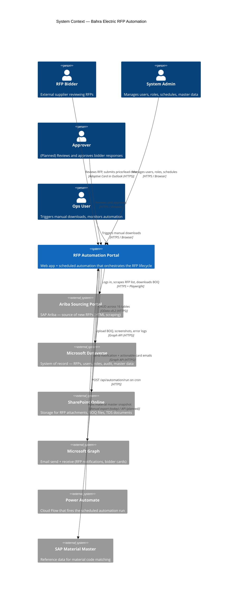
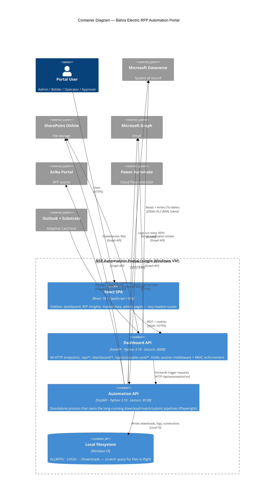
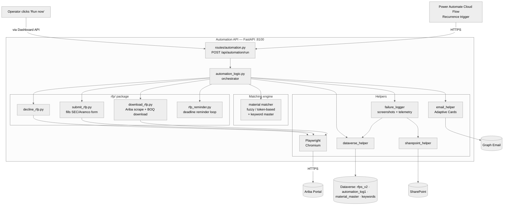
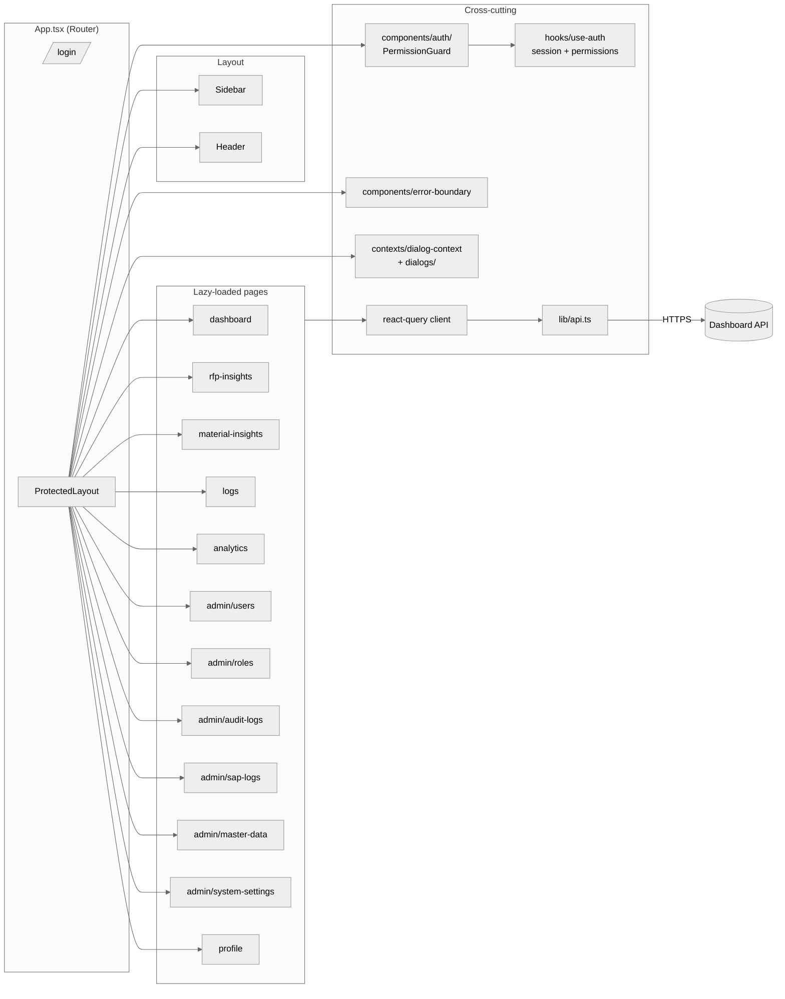
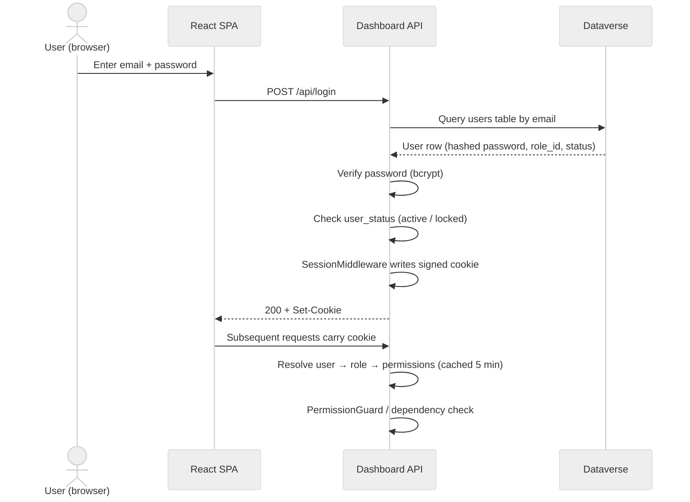
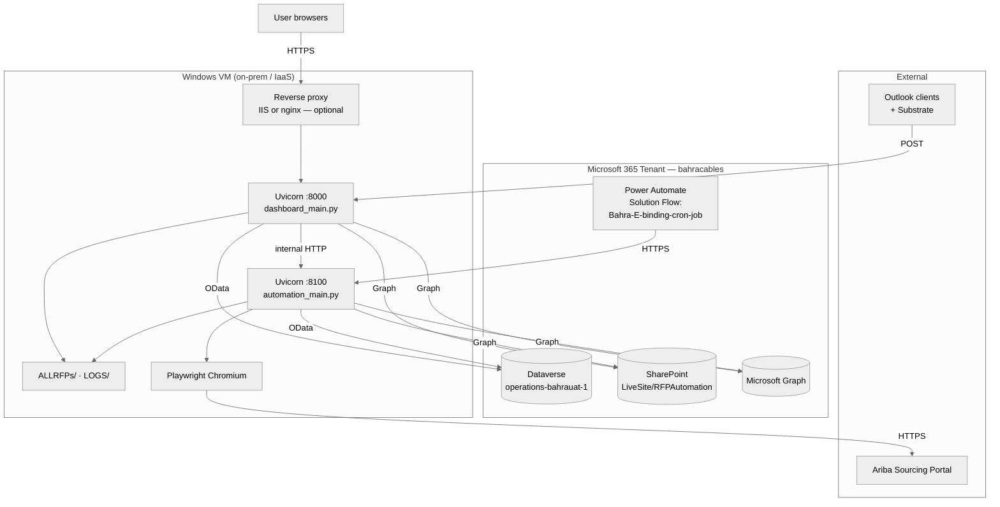

# Software Architecture Document (SAD)

> **Read this first if you are:** a new developer who needs the big picture, an architect evaluating a change, or an integration partner trying to understand how the system fits with Dataverse / SharePoint / SAP / Power Automate.
>
> **Pair with:** [Glossary](../01-business/03-Glossary-and-Acronyms.md) for terminology · [Data Dictionary](07-Data-Dictionary-and-ER-Diagram.md) for table-level detail · [API Documentation](08-API-Documentation.md) for endpoint contracts.

---

## 1. Purpose and Scope

This document describes the **as-built** architecture of the Bahra Electric RFP Automation Portal. It uses the **C4 model** (Context → Container → Component) to progressively zoom in from the system's place in the business landscape down to the internal modules of the FastAPI backend and the React frontend.

**In scope**
- Logical architecture: layers, modules, responsibilities
- Physical architecture: processes, hosts, ports, dependencies
- Integration architecture: every external system the portal talks to and the protocol used
- Cross-cutting concerns: authentication, authorization (RBAC), session management, caching, logging, error handling

**Out of scope** (covered elsewhere)
- Detailed module/class design → see [HLD](05-HLD-High-Level-Design.md) and [LLD](06-LLD-Low-Level-Design.md)
- Per-table column definitions → see [Data Dictionary](07-Data-Dictionary-and-ER-Diagram.md)
- Endpoint contracts → see [API Documentation](08-API-Documentation.md)
- Deployment runbook → see [Deployment Guide](../03-operations/09-Deployment-Guide.md)

---

## 2. Architectural Drivers

The architecture exists to satisfy these business and technical drivers. Every significant decision in §6 traces back to one of these.

| # | Driver | Type | Rationale |
|---|--------|------|-----------|
| D1 | Fully automate the discovery → match → notify → respond → log loop for SEC/Aramco RFPs | Functional | Eliminate manual portal monitoring and Excel-based BOQ matching |
| D2 | Bidder responses must round-trip from email → Dataverse without portal login | Functional | Bidders are external; reducing friction increases response rate |
| D3 | Master data (materials, keywords, RFP team, status) must be editable by Admins without code change | Functional | Business owns its master data; engineering should not gate routine changes |
| D4 | Role-based access control with audit trail | Non-functional (Security) | Compliance requirement — every privileged action is traceable |
| D5 | The system must run on a single Windows VM and be deployable in hours, not days | Non-functional (Operability) | Customer infrastructure is on-prem Windows; no Kubernetes / Linux / cloud-native options |
| D6 | Browser automation against the Ariba portal must survive UI changes and CAPTCHAs gracefully | Non-functional (Reliability) | Ariba UI is volatile; failures must produce useful diagnostics, not silent drops |
| D7 | Fuzzy material matching must be tunable without redeploy | Functional | Match thresholds depend on supplier-supplied descriptions which evolve over time |

---

## 3. C4 Level 1 — System Context

The portal sits between four sets of human actors and five external systems.

### 3.1 Actors

| Actor | Channel | Authority |
|-------|---------|-----------|
| **RFP Bidder** | Outlook email (Adaptive Card) | Submit price/lead-time, decline with reason. No portal login required. |
| **System Admin** | Browser (React app) | Full access — users, roles, schedules, master data, system settings, all logs |
| **Approver** *(planned)* | Browser | Review submitted bidder responses; approve/reject/escalate |
| **Ops User** | Browser | Trigger manual downloads, view dashboard, monitor automation health |

### 3.2 External systems

| System | Role | Coupling | Failure mode |
|--------|------|----------|--------------|
| **Ariba Sourcing Portal** | Source of truth for new RFPs (Saudi Electricity Co., Aramco) | Tight (UI scraping via Playwright) | Sensitive to UI changes; failures captured as screenshots in `LOGS/` and uploaded to SharePoint |
| **Microsoft Dataverse** | System of record for everything except files | Tight — most reads/writes go through `helpers/dataverse_helper.py` | Health check at `/health` verifies token + table read |
| **SharePoint Online** | Object storage for BOQ files, TDS documents, error screenshots | Loose — accessed via Microsoft Graph | Fall back to local `LOGS/` directory if Graph is unreachable |
| **Microsoft Graph (Email)** | Outbound email channel for all notifications | Loose | Email failures logged, automation continues |
| **Power Automate** | Scheduling engine (Cloud Flow with Recurrence trigger) | Loose — flow POSTs to `/api/automation/run` on cron; portal can also patch flow's recurrence schedule | If flow is down, no scheduled runs; manual trigger still works |
| **SAP** | Source of Material Master reference data | Loose — currently a manual export imported into `cr673_bahra_material_master` | Stale data degrades matching accuracy but does not break the system |

---

## 4. C4 Level 2 — Container Diagram

The portal runs as **two FastAPI processes** on the same Windows host plus a **React/Vite SPA** delivered to the browser. Power Automate is shown because it is the cron driver for production; everything else is internal.

### 4.1 Containers

| # | Container | Process | Port | Responsibility |
|---|-----------|---------|------|----------------|
| C1 | **React SPA** | Browser-side JS bundle built by Vite | served by API or dev server (5173) | UI for all roles. Lazy-loaded route-level code splitting. State via Zustand + React Query. UI library: Radix UI + Tailwind. |
| C2 | **Dashboard API** | `dashboard_main.py` → `uvicorn` | 8000 | Owns: auth/session, RBAC, all CRUD, dashboard aggregation, system settings, master data, audit logs, actionable card callback. **Single user-facing process.** |
| C3 | **Automation API** | `automation_main.py` → `uvicorn` | 8100 | Owns: Playwright browser sessions, Ariba scraping, BOQ download/parse, fuzzy matching, RFP submit/decline against the portal, deadline reminder emails. **Long-running, CPU+I/O heavy.** |
| C4 | **Local filesystem** | `ALLRFPs/`, `LOGS/`, `~/Downloads` | n/a | Scratch space for files currently being processed. Authoritative copies live in SharePoint. |

> **Why two FastAPI processes?** The automation pipeline starts a Chromium instance via Playwright, can run for minutes per RFP, and needs Windows' `WindowsProactorEventLoopPolicy`. Isolating it from the user-facing API means a hung browser session or a crashed scraper does not take down the dashboard.

### 4.2 Process and port summary

| Process | Entry point | Port | Auto-reload | Notes |
|---------|-------------|------|-------------|-------|
| Dashboard API | [dashboard_main.py](../../dashboard_main.py) | 8000 | yes (dev) | Mounts 8 routers (api, automation, dashboard, role, actionable_cards, master_data, system_settings, user_management) |
| Automation API | [automation_main.py](../../automation_main.py) | 8100 | yes (dev) | Mounts only the `automation` router |
| Vite dev server | `frontend/` `npm run dev` | 5173 | yes | Dev only — production builds are statically served |

---

## 5. C4 Level 3 — Component Diagrams

### 5.1 Dashboard API components

```mermaid
%%{init: {'theme':'neutral'}}%%
flowchart TB
    subgraph spa["React SPA (browser)"]
        UI[Routes + Components]
    end

    subgraph dashapi["Dashboard API — FastAPI :8000"]
        direction TB
        subgraph mw["Middleware"]
            CORS[CORS] --> SESSION[SessionMiddleware]
        end

        subgraph routers["Routers"]
            R_API[routes/api.py<br/>auth · profile · password reset]
            R_DASH[routes/dashboard.py<br/>dashboard · RFP insights · material insights]
            R_AUTO[routes/automation.py<br/>trigger · status · schedule]
            R_USER[routes/user_management.py]
            R_ROLE[routes/role_routes.py<br/>RBAC]
            R_AC[routes/actionable_cards.py<br/>callback from Outlook]
            R_MD[routes/master_data_routes.py<br/>materials · keywords · RFP team · columns]
            R_SS[routes/system_settings_routes.py]
            R_ER[routes/error_analysis_routes.py]
        end

        subgraph services["Services (services/)"]
            S_AUTH[user_service · user_lifecycle_service]
            S_ROLE[dynamic_role_service · role_service<br/>+ permission_definitions]
            S_AUDIT[audit_service]
            S_DASH[dashboard_service]
            S_MASTER[master_data_service · rfp_team_columns_service]
            S_SETTINGS[system_settings_service]
            S_SAP[sap_service]
        end

        subgraph helpers["Helpers (helpers/)"]
            H_DV[dataverse_helper<br/>DataverseClient · MSAL token cache · retry]
            H_EMAIL[email_helper<br/>builds Adaptive Cards]
            H_SP[sharepoint_helper]
            H_META[metadata_cache]
            H_FAIL[failure_logger · enhanced_error_logger]
            H_PA[power_automate_helper<br/>patches Flow recurrence]
        end
    end

    UI -- HTTPS + cookies --> CORS
    SESSION --> R_API
    SESSION --> R_DASH
    SESSION --> R_AUTO
    SESSION --> R_USER
    SESSION --> R_ROLE
    SESSION --> R_AC
    SESSION --> R_MD
    SESSION --> R_SS
    SESSION --> R_ER

    R_API --> S_AUTH
    R_USER --> S_AUTH
    R_USER --> S_ROLE
    R_ROLE --> S_ROLE
    R_DASH --> S_DASH
    R_MD --> S_MASTER
    R_SS --> S_SETTINGS
    R_AC --> H_EMAIL
    R_AC --> S_MASTER

    S_AUTH --> H_DV
    S_ROLE --> H_DV
    S_AUDIT --> H_DV
    S_DASH --> H_DV
    S_MASTER --> H_DV
    S_SETTINGS --> H_DV
    S_SAP --> H_DV
    R_AUTO --> H_PA
    H_PA --> H_DV

    H_DV -- OData v9.2 --> DV[(Dataverse)]
    H_EMAIL -- Graph --> GR[(Graph Email)]
    H_SP -- Graph --> SP[(SharePoint)]
```

**Layering rule:** routers depend on services; services depend on helpers; helpers depend on external systems. Routers do **not** call helpers directly except for `actionable_cards.py` (which builds Adaptive Cards inline because the email shape is tightly coupled to the route's response).

### 5.2 Automation API components

### 5.3 Frontend component map

---

## 6. Architectural Decisions

> Each decision lists what was chosen, what was rejected, and why. Use these as the starting point if you ever consider changing one.

| ID | Decision | Why | Trade-off accepted |
|----|----------|-----|--------------------|
| **AD-01** | **Dataverse as system of record** (not SQL Server / Postgres) | Customer is Microsoft 365 + Power Platform shop; D4 (audit) and D3 (admin-editable master data) come "free" via Dataverse + Power Apps | Vendor lock-in; awkward query language (OData); EntitySetName pluralization quirks |
| **AD-02** | **Two FastAPI processes** (Dashboard + Automation) | Isolate long-running Playwright browser sessions from user-facing API (D6) | Two ports to deploy; cross-process trigger via HTTP |
| **AD-03** | **Playwright (Python) for Ariba** vs. Selenium / API integration | Ariba lacks a public RFP-list API; Playwright is more robust against modern SPA-style portals | Browser footprint; Windows requires `WindowsProactorEventLoopPolicy` |
| **AD-04** | **Power Automate Cloud Flow as cron** vs. Windows Task Scheduler / APScheduler | Customer wants the schedule editable from the portal UI; Power Automate flow recurrence can be patched via Dataverse `workflow` table | Flow must live inside a Power Platform Solution; "My Flows" cannot be patched |
| **AD-05** | **Session cookie auth** (`SessionMiddleware`) for the SPA + **MSAL client-credential** for Dataverse | Internal users authenticate against the portal's own user table; backend uses app identity for Dataverse | No SSO with Entra ID for portal users (today); two auth domains to maintain |
| **AD-06** | **41 fine-grained permissions** in code + role table in Dataverse | D4 — admins create custom roles without code change; permissions stay in source-of-truth `services/permission_definitions.py` | Adding a permission means a code release |
| **AD-07** | **Adaptive Cards / Actionable Messages** for bidder responses (vs. magic-link login) | D2 — zero-friction response from Outlook; substrate token verifies sender | Originator ID required; only works for users with Outlook (not Gmail/external) |
| **AD-08** | **All Dataverse columns read as strings** (`use_display_names=True`) | Display-name addressing simplifies code; numeric / date conversion happens at use-site | Slight perf cost; risk of silent type errors |
| **AD-09** | **In-process TTL caches** (`RBAC_CACHE_TTL_SECONDS=300`, `DASHBOARD_TTL_SECONDS=300`) | D5 — single-VM deployment; no Redis | Permission revocation takes up to 5 min to propagate |
| **AD-10** | **React + Vite + TypeScript** vs. server-rendered Jinja | Rich admin UI (data tables, role editors, charts) needs a real SPA | Two-stack maintenance (Python + TS); CORS configuration |

---

## 7. Cross-Cutting Concerns

### 7.1 Authentication and session

**Knobs** (in `config/config.py`):
- `SESSION_TIMEOUT_SECONDS = 7200` (2 h hard cap)
- `IDLE_TIMEOUT_SECONDS = 1800` (30 min sliding)
- `SESSION_WARNING_SECONDS = 300` (5 min warning toast)
- `ACCOUNT_LOCKOUT_THRESHOLD = 5` failed attempts
- `RBAC_CACHE_TTL_SECONDS = 300`

### 7.2 Authorization (RBAC)

- **41 permissions** across 15 modules, defined in [services/permission_definitions.py](../../services/permission_definitions.py)
- **Default roles** seeded by `services/dynamic_role_service.py`: `Admin` (all 41) and `RFP Bidder` (7)
- **Backend enforcement**: FastAPI dependency in routers checks `permission` against the cached user→role→permissions resolution
- **Frontend enforcement**: `<PermissionGuard permission="...">` wrapper around every protected route in [App.tsx](../../frontend/src/App.tsx); `useHasPermission()` hook for inline checks

### 7.3 Audit logging

Every privileged action (login, role change, RFP submit, master data edit) writes a row to `cr673_bahra_audit_logs` via `services/audit_service.py`. Logs are queryable via the Audit Logs page; nothing is ever deleted from this table.

### 7.4 Caching strategy

| Layer | TTL | Implementation | Invalidation |
|-------|-----|----------------|--------------|
| RBAC (user → permissions) | 300 s | In-process dict | TTL only |
| Dashboard aggregations | 300 s | In-process dict + `Cache-Control: max-age=30` on the response | TTL only |
| Logs | 300 s | In-process dict | TTL only |
| SAP password logs | 300 s | In-process dict | TTL only |
| Dataverse column display→logical mapping | Process lifetime | `helpers/dataverse_helper.py::_column_mapping_cache` | Process restart |
| MSAL access token | Token expiry minus 5 min | `helpers/dataverse_helper.py` | Auto-refresh |

### 7.5 Error handling and observability

- **Global exception handler** in `dashboard_main.py` catches anything not handled by FastAPI and returns `{"detail": "Internal server error", "error_id": <8-char uuid>}` so logs and the user share a correlation ID
- **Dataverse client** retries on 429/5xx with exponential backoff (3 attempts, 1–8 s) — see `helpers/dataverse_helper.py::_retry_request`
- **Automation failures** capture a Playwright screenshot to `LOGS/screenshot_<label>_<ts>.png`, upload it to SharePoint via `helpers/failure_logger.py`, and email a failure notification
- **Health check** at `GET /health` — verifies Dataverse connectivity (table read)

### 7.6 Configuration

Single source of truth: [config/config.py](../../config/config.py). Sections: Azure AD, Dataverse, SharePoint, Power Automate, Ariba, Email, Security, Caching, Local paths.

**Runtime-mutable settings** (managed via the System Settings page, stored in `cr673_bahra_system_settings`): email recipient lists, company name overrides. Everything else is code-managed.

---

## 8. Deployment View

**Topology notes**
- **Single host** runs both APIs and Playwright (D5)
- **Reverse proxy** (IIS / nginx) is optional but recommended for TLS termination and serving the built React bundle
- **Outbound** connectivity required: `*.dynamics.com`, `*.sharepoint.com`, `graph.microsoft.com`, `service.ariba.com`, `*.environment.api.powerplatform.com`, `substrate.office.com`, `login.microsoftonline.com`
- **Inbound** required: 443 from corporate users; 443 from Power Automate (public IP / dev tunnel for the actionable card callback URL)

---

## 9. Data View (Summary)

The 16 Dataverse tables fall into five clusters. Each is detailed in the [Data Dictionary](07-Data-Dictionary-and-ER-Diagram.md).

| Cluster | Tables | Purpose |
|---------|--------|---------|
| **RFP lifecycle** | `cr673_bahra_rfps_v2`, `cr6db_cr673_bahra_rfp_response`, `cr673_bhara_rfp_status` | RFP records, bidder responses, lookup of valid statuses |
| **Identity & RBAC** | `cr673_bahra_users`, `cr673_bahra_roles`, `cr673_bahra_role_permissions`, `cr673_bahra_user_status`, `cr673_bahra_audit_logs` | Users, roles, permissions, lockout state, audit trail |
| **Master data** | `cr673_bahra_material_master`, `cr673_bahra_keywords`, `cr673_bahra_rfp_team`, `cr673_bahra_rfp_team_columns` | SAP material codes, keyword dictionary, RFP team assignments, dynamic column config |
| **Operations** | `cr673_bahra_automation_log1`, `cr673_bahra_automation_schedules` | Automation run history, schedule configuration |
| **Integration** | `cr673_bahra_sap_infomation`, `cr673_bahra_system_settings` | SAP password rotation log, runtime settings |

> **Naming quirk:** Dataverse pluralizes EntitySetName by appending `es` (e.g., `cr673_bahra_roles` → `cr673_bahra_roleses`). Both forms are stored in `config/config.py` as `*_LOGICAL` (metadata) and `*_API` (CRUD path). Always use the API name for `query_rows()`.

---

## 10. Quality Attributes

| Attribute | Strategy |
|-----------|----------|
| **Performance** | TTL caches on hot read paths; lazy-loaded React routes; React Query client cache; pagination caps (`MAX_PAGE_SIZE = 500`) |
| **Scalability** | Single-VM today (D5). Vertical scaling only. Horizontal scaling would require externalizing session state (Redis) and the in-process caches. |
| **Availability** | Health check + reverse proxy retry; Dataverse retry/backoff; automation isolated from dashboard so a Playwright crash doesn't take down the UI |
| **Security** | Bcrypt password hashing; account lockout; 90-day password rotation policy; signed session cookie; RBAC at every router; audit log on every privileged action; secrets in `config/config.py` (today — see §11) |
| **Maintainability** | Strict layering (router → service → helper); single Dataverse client; permissions defined in one file; React routes match permission names |
| **Operability** | Health endpoint; structured failure logger with screenshots; TTL cache stats can be added; system settings editable from the UI without redeploy |

---

## 11. Known Risks and Limitations

| # | Risk | Impact | Mitigation status |
|---|------|--------|-------------------|
| R1 | Secrets (CLIENT_SECRET, Dataverse URL, flow signatures) committed in `config/config.py` | High | **Open** — move to environment variables / Key Vault before production |
| R2 | `SessionMiddleware` uses hard-coded `secret_key="change-me-please"` | High | **Open** — generate per-deployment, store outside repo |
| R3 | Single-VM deployment = single point of failure | Medium | Accepted (D5). DR plan in [Security & Compliance](../03-operations/12-Security-and-Compliance.md). |
| R4 | Ariba portal UI changes can break scraping silently | Medium | Mitigated by failure-logger screenshots + email alerts; not eliminated |
| R5 | Approver role exists in design but no Approver-specific routes/role yet | Low | Planned — see [BRD](../01-business/01-BRD-Business-Requirements.md) |
| R6 | SAP material master is a manual export (not API) | Medium | Accepted; matching engine tolerates stale data, just less accurate |
| R7 | RBAC cache TTL means revoked permissions remain valid up to 5 min | Low | Accepted (D9). Force-logout flow could shorten this. |

---

## 12. Reference

- **Code entry points:** [dashboard_main.py](../../dashboard_main.py) · [automation_main.py](../../automation_main.py) · [automation_logic.py](../../automation_logic.py)
- **Frontend root:** [frontend/src/App.tsx](../../frontend/src/App.tsx)
- **Configuration:** [config/config.py](../../config/config.py)
- **Permission catalog:** [services/permission_definitions.py](../../services/permission_definitions.py)
- **Dataverse client:** [helpers/dataverse_helper.py](../../helpers/dataverse_helper.py)
- **Default-role seed:** [services/dynamic_role_service.py](../../services/dynamic_role_service.py)
- **C4 model reference:** https://c4model.com/

## 13. Change history

| Version | Date | Author | Change |
|---------|------|--------|--------|
| 1.0 | 2026-04-22 | Manish Soni | Initial SAD — Context, Container, Component diagrams; ADs; cross-cutting; deployment |
