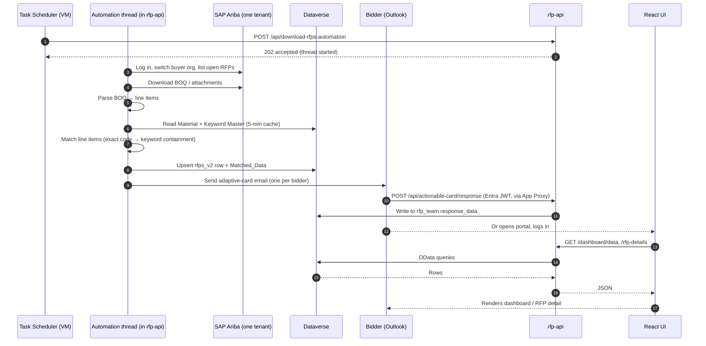
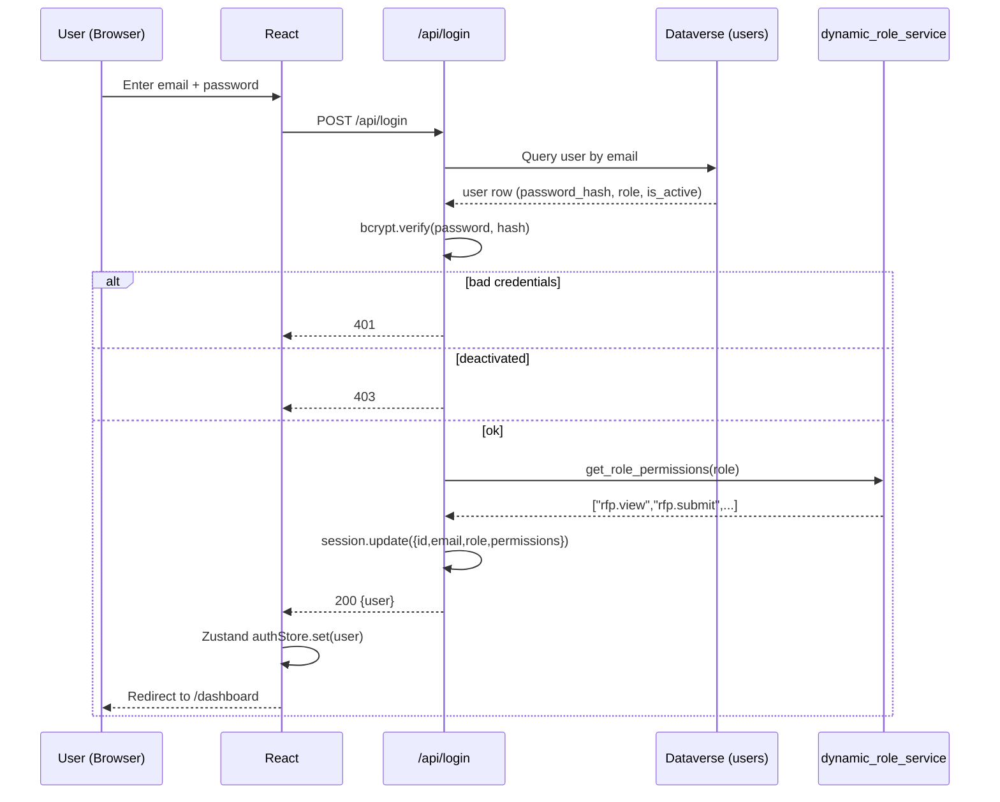
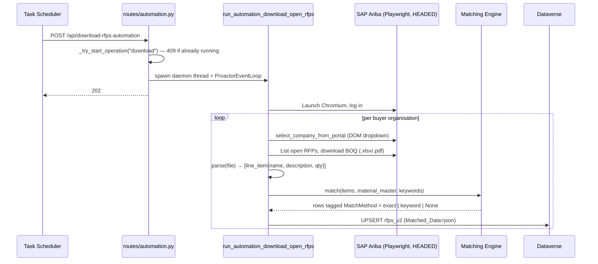
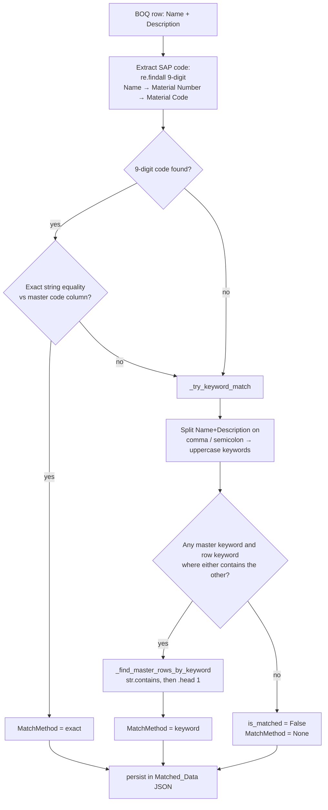
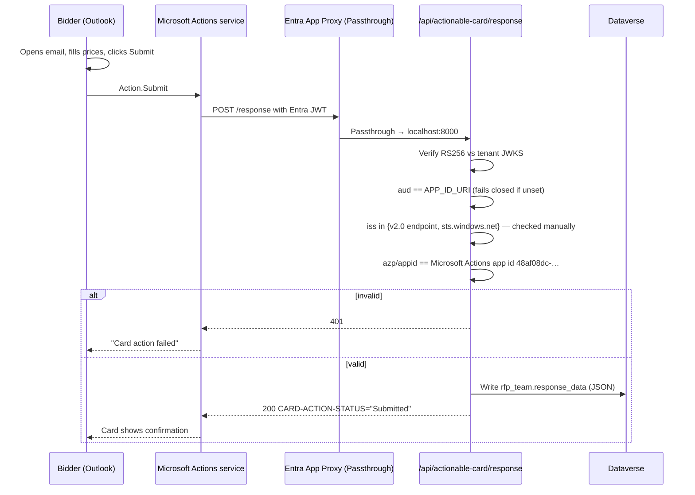
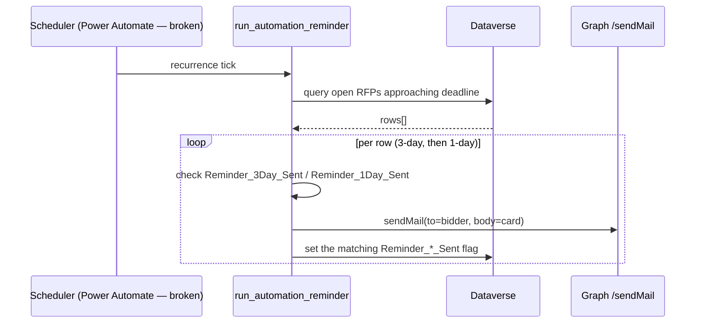
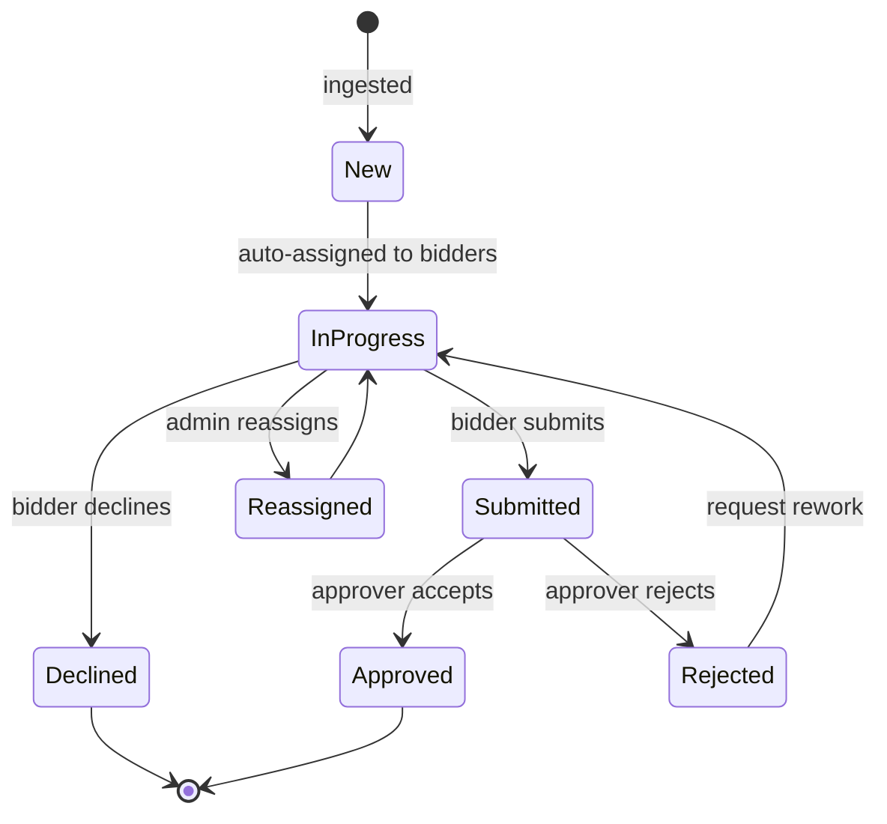
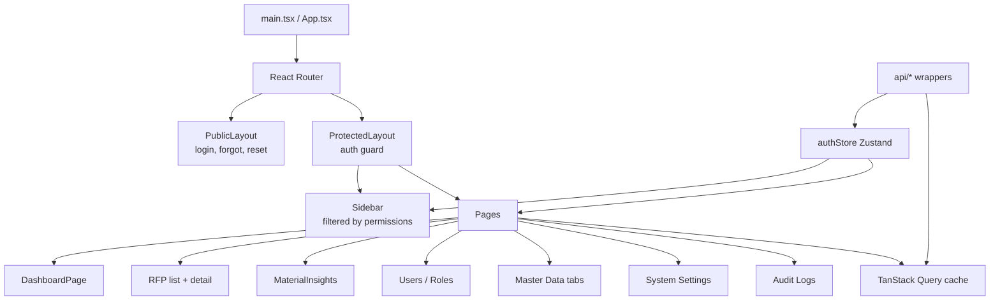

# High Level Design (HLD)

Module-level design and end-to-end data flow for the RFP Automation platform. This document sits between the Software Architecture Document (big picture) and the Low Level Design (class/function).

Related: [SAD](04-SAD-Software-Architecture-Document.md) · [LLD](06-LLD-Low-Level-Design.md) · [Data Dictionary](07-Data-Dictionary-and-ER-Diagram.md) · [API](08-API-Documentation.md)

---

## 1. Module map

```
RFP Automation
├── rfp-api — one FastAPI process (:8000, root_path=/rfp)
│   ├── Authentication Module          auth, session, password hashing
│   ├── Authorization Module (RBAC)    permission check, role cache
│   ├── RFP Module                     list, detail, status, submit, decline
│   ├── Material Insights Module       match analytics, grouping
│   ├── Master Data Module             material/keyword/team/columns CRUD
│   ├── User & Role Admin Module       user/role CRUD, audit
│   ├── System Settings Module         get/set cached settings
│   ├── Actionable-Card Module         Entra-token callbacks
│   ├── Dataverse Client (shared)      token cache, retry, query, upsert
│   │
│   └── Automation (in-process, on daemon threads)
│       ├── Orchestrators              8 entry points in automation_logic.py
│       ├── Ariba Pipeline             Playwright (HEADED) → switch buyer org → scrape → download
│       ├── BOQ Parser                 Excel/PDF → line items
│       ├── Matching Engine            exact 9-digit code, else keyword substring containment
│       ├── Assignment Engine          rule-based bidder assignment
│       ├── Notification Engine        adaptive-card email per bidder
│       └── SharePoint ⇄ Dataverse Sync
│
└── Frontend (React + Vite)
    ├── Router + Layouts               ProtectedLayout, PublicLayout
    ├── Feature Pages                   dashboard, RFP list, RFP detail, admin, master data, settings, insights
    ├── Shared Components               tables, forms, dialogs, toasts
    ├── Auth Store (Zustand)            user session, permissions
    ├── API Client                      fetch wrappers, error interceptor
    └── Hooks                           useHasPermission, useRFPs, useSettings
```

**Three things this map deliberately does not show:**
- **`automation_main.py` (:8100)** — a standalone-automation deployment option that mounts only the automation router. It is **not deployed**; production runs everything in `dashboard_main.py`. Don't add functionality to it.
- **An Error-Analysis module** — `routes/error_analysis_routes.py` exists but its `include_router` call is commented out. It is **dead, unreachable code**.
- **Per-portal adapters** — there is **one SAP Ariba tenant**. `Saudi Energy`, `Aramco e-Marketplace`, `HADEED - RAJHI STEEL` and `Saudi Aramco Mobil Refinery Company Limited` are **buyer organisations inside that single account**, selected at runtime through a DOM dropdown (`select_company_from_portal`). They are not separate portals, credentials, or integrations.

---

## 2. End-to-end flow (happy path)



The scheduler's `202` means *accepted*, not *done* — `scripts/Invoke-RfpAutomation.ps1` therefore polls the run-state endpoint until the job clears before reporting a result (§7).

---

## 3. Per-workflow sequence diagrams

### 3.1 Login + session



### 3.2 RFP intake from Ariba



**Intake is Ariba-only.** There is no email-scanning or SharePoint-scanning intake pipeline — the eight orchestrators in `automation_logic.py` cover download, submit, decline, reminder, portal sync and SharePoint⇄Dataverse sync. `run_sync_sharepoint_dataverse` reconciles files that already exist; it does not discover new RFPs.

### 3.3 Material matching engine

> **There is no fuzzy matching in this system.** No similarity library (`rapidfuzz`, `fuzzywuzzy`, `difflib`, …) is imported anywhere in `backend/`; the only tools used are `re` and pandas `str.contains`. There is **no similarity score, no confidence value and no threshold**. `MatchMethod` is a categorical label — `"exact"`, `"keyword"`, or `None` — not a number.

The engine lives in [rfp/download_rfp.py](../../backend/rfp/download_rfp.py) (`process_folder`) and is a **deterministic two-tier classifier**:



**Known limitations — state these plainly rather than implying precision the code does not have:**
- **Containment is bidirectional and unranked.** The test is `if csv_keyword in mat_keyword or mat_keyword in csv_keyword`, so a short master keyword such as `CU` matches any row whose text contains that substring anywhere. Short keywords over-match badly.
- **`.head(1)` picks arbitrarily.** When several master rows contain the keyword, the engine takes the **first** row pandas returns — not the best one. There is no ranking and no tie-break.
- **No tunable knob exists.** Match quality is changed by editing **data** (Material Master / Keyword Master rows in Dataverse), never by adjusting a threshold or weights.

Reference data comes from `get_all_materials_for_matching()` / `get_all_keywords_for_matching()` in [services/master_data_service.py](../../backend/services/master_data_service.py) — Dataverse-first with a SharePoint CSV fallback (`RFP-logs/master-files/material.csv`, `unique_keywords.csv`), cached with a 5-minute TTL. See [LLD](06-LLD-Low-Level-Design.md) §Matching Engine.

### 3.4 Adaptive-card response flow



Notes: the callback reaches the VM through **Entra Application Proxy in Passthrough mode** (not a dev tunnel, and not Entra pre-auth — pre-auth would redirect the Actions service to a sign-in page and break the buttons). **Card submissions are not written to the audit log** — no RFP operation is. `POST /response/refresh` backs Outlook's `autoInvokeAction` and must answer within ~2 s. First response wins per team row.

### 3.5 Deadline reminder emails

> **Status: not running.** The reminder is the one job still scheduled by Power Automate, and that flow fires at a dev tunnel that no longer exists. No Windows scheduled task replaces it, and App Proxy publishes only `/api/actionable-card/`, so nothing reaches `/api/rfp-reminder` on a schedule. `Invoke-RfpAutomation.ps1 -Job reminder` can run it manually. See §7.



`rfp_reminder.py` drives **no browser** — it is a pure Dataverse read plus Graph sendMail. The cadence is 3-day then 1-day, and the `Reminder_3Day_Sent` / `Reminder_1Day_Sent` flags provide idempotency, so re-running the job does not re-send. Unlike every other automation route, `/rfp-reminder` takes no run-state lock and spawns no thread — it awaits inline and blocks until finished.

### 3.6 Dashboard view logs

User-facing activity log is in `cr673_bahra_automation_log1` and mirrors to `audit_logs` for security-relevant actions. See [Data Dictionary §automation_log1](07-Data-Dictionary-and-ER-Diagram.md).

---

## 4. Data flow (state transitions)

RFP lifecycle states:



---

## 5. Module responsibilities

### 5.1 Authentication (`routes/api.py`, `services/user_service.py`)

- Verify credentials (bcrypt)
- Start / end / refresh server session
- Emit `LOGIN_SUCCESS`, `LOGIN_FAILURE`, `LOGOUT` audit rows
- Responsible for: nothing beyond identity. Does **not** enforce authorization.

### 5.2 Authorization / RBAC (`services/dynamic_role_service.py`, `services/permission_definitions.py`)

- Single source of truth for the permission catalogue — **42 permissions across 15 modules**
- Cache role → permissions (TTL 300 s)
- Expose `user_has_permission(user, perm)` as the single API
- Seeds default roles on deploy: `Admin` (all 42, computed dynamically) and `RFP Bidder` (exactly 10)
- **Caveat:** `require_permission` reads permissions from the **session**, frozen at login — changes need a re-login. `require_admin` bypasses this entirely with a hardcoded `role.lower() == "admin"` check, so renaming the Admin role breaks it.

### 5.3 RFP Module (`routes/dashboard.py`, `routes/api.py`)

- Listing with filter/search/pagination
- Detail with BOQ, match preview, dynamic response form
- Status transitions (auth-checked)
- XLSX export

### 5.4 Matching Engine (`rfp/download_rfp.py`)

- Pure-Python **exact / substring** classifier — `re` for the 9-digit SAP code, pandas `str.contains` for keywords. **No fuzzy library, no score, no threshold** (§3.3)
- Consumes `material_master` and `keywords` via `master_data_service` (Dataverse-first, SharePoint CSV fallback, 5-min TTL)
- Produces `Matched_Data` JSON stored on the RFP row, tagging each line `MatchMethod = exact | keyword | None`
- Tuned by **editing master data**, not by configuration

### 5.5 Notification Engine (`helpers/email_helper.py`)

- Renders adaptive-card JSON per RFP + bidder
- Sends app-only via Microsoft Graph `POST /users/{sender}/sendMail` (MSAL client credentials)
- **Builds a raw MIME message rather than using the JSON sendMail body.** This is deliberate and non-obvious: both Power Automate and Graph's JSON sendMail **strip `<script>` tags**, and the card payload lives inside a `<script type="application/adaptivecard+json">` block — a JSON send would silently destroy the card. Do not "simplify" this back to JSON.
- Supports `dev` mode (single catch-all recipient) for safer testing

### 5.6 Orchestrators (`automation_logic.py`)

Eight top-level entry points, not one generic pipeline:

| Function | Notes |
|---|---|
| `run_automation_download(company=None)` | |
| `run_automation_download_open_rfps()` | **the one the scheduler calls** |
| `run_automation_submit(rfp_id, company=None, allowed_tds_filenames=None)` | |
| `run_automation_decline(rfp_id, company=None)` | |
| `run_automation_reminder()` | no Playwright — Dataverse read + email |
| `run_automation_sync_portal(rfp_ids=None)` | |
| `run_automation_download_all_rfps(selected_company="")` | |
| `run_sync_sharepoint_dataverse(company=None)` | |

Runs log to `automation_log1`; failures produce `LOGS/` bundles (screenshot + context) uploaded to SharePoint plus a failure email.

### 5.7 Master Data Module (`routes/master_data_routes.py`, `services/`)

- CRUD for `material_master`, `keywords`, `rfp_team`, `rfp_team_columns`
- Bulk-import CSV/XLSX with row-level validation
- Cache invalidation on write

### 5.8 System Settings Module (`routes/system_settings_routes.py`, `services/system_settings_service.py`)

- Key/value with optional section
- In-memory TTL cache
- Sensitive values masked in list endpoint; revealed on demand with audit

### 5.9 Power Automate Integration (`helpers/power_automate_helper.py`)

- Patches a flow's **Recurrence trigger** by writing the `workflow` table in the **same Dataverse environment**, through the existing `DataverseClient` — there is no separate auth, because `api.flow.microsoft.com` is unsupported for this
- Called from `POST /dashboard/schedule-automation`; failure is **non-fatal** (logged, the save still succeeds)
- **This integration is now largely vestigial.** It targets `POWER_AUTOMATE_FLOW_NAME = "Bahra-E-binding-cron-job"` — the very flow the scheduling migration turns off (§7) — which makes the Schedule Automation page a **silent no-op**.

---

## 6. Frontend module map



See [SAD §Frontend Component](04-SAD-Software-Architecture-Document.md) for the component diagram.

---

## 7. Concurrency & scheduling

### 7.1 Concurrency

- The backend runs as **a single Uvicorn worker**, and this is a hard constraint, not a default: `routes/automation.py` keeps run state in an **in-memory** `_RUN_STATE` dict guarded by `_STATE_LOCK`. A second worker would have its own copy and the mutual exclusion would silently stop working. Run state is also lost on restart.
- **Automation runs in-process on daemon threads.** uvicorn's `SelectorEventLoop` cannot spawn subprocesses on Windows, and Playwright must launch Chromium — so `_run_async_in_thread` gives each run a **fresh thread with its own `ProactorEventLoop`**, and the route returns **202** immediately.
- `_try_start_operation(key)` performs an atomic check-and-set **inside** the lock (no TOCTOU window); a duplicate request gets **409**. `_finish_operation(key)` clears in a `finally`.
- **Different keys do not exclude each other.** `download` and `sync` can run **at the same time against the same Ariba account** — the lock only stops two of the *same* job. They are kept apart **by schedule offset alone** (§7.2).
- Chromium runs **HEADED**; each run gets an isolated `pw-profile-{label}-{uuid8}` user-data-dir under temp, which is what makes concurrent automations possible at all.
- `sync_all` is a dead flag (read, never set). `/rfp-reminder` takes no lock and spawns no thread — it blocks.

### 7.2 Scheduling — hybrid, mid-migration

Scheduling has moved off Power Automate for the two Playwright jobs and onto **Windows Task Scheduler on the prod VM**. The trigger for the migration: all three PA flows fired at a **dead dev tunnel**, and the flows ran on **India Standard Time** — so a "12:00" recurrence actually fired at **09:30 Riyadh**.

`scripts/Invoke-RfpAutomation.ps1` is a **trigger-and-poll** runner (`-Job {download|sync|sync-sp-dv|reminder}`, `-BaseUrl http://127.0.0.1:8000`, `-SkipIfRunning`) so Task Scheduler's "Last Run Result" reflects completion rather than acceptance. Exit codes: `0` finished · `1` API unreachable · `2` already running (409) · `3` timeout (the run is **not** killed — it continues server-side).

> **Exit 0 means FINISHED, not SUCCEEDED.** The run flag clears in a `finally`, so a crashed run also exits 0. Real failure signal comes from `backend\LOGS\` bundles and the `EMAIL_TO_AUTOMATION_FAILURE` email.

`scripts/Register-RfpSchedules.ps1` (elevated, idempotent, `-WhatIf`) registers under `\Bahra-RFP\`. **Times are server-local (Riyadh):**

| Task | Job | Daily triggers | Timeout |
|---|---|---|---|
| `RFP-Download-OpenRFPs` | `download` | 00:00, 06:00, 12:00, 18:00 | 90 min |
| `RFP-Sync-Portal` | `sync` | 03:00, 09:00, 15:00, 21:00 | 60 min |

The 3-hour offset is the collision-avoidance mechanism (§7.1). Tasks run as SYSTEM, which is acceptable because the task only makes a localhost HTTP call and writes a log — **Playwright runs under the `rfp-api` service identity, not the task's.**

| Power Automate flow | Endpoint | Disposition |
|---|---|---|
| `Bahra-E-binding-cron-job` | `/download-rfps-automation` | **Turn off** — replaced by `RFP-Download-OpenRFPs` |
| `Bahra-sync-open-rfp-status-cron-job` | `/api/sync_portal_data` | **Turn off** — replaced by `RFP-Sync-Portal` |
| `Bahra-RFP-Reminder-Emails-Cron-job` | `/api/rfp-reminder` | **Left on** by decision — but see below |

**Two open issues to carry, not paper over:**
1. **Reminder emails are not sending** — the reminder flow still points at the dead dev tunnel, and no scheduled task replaces it (§3.5).
2. **The Schedule Automation page is a silent no-op** — `POWER_AUTOMATE_FLOW_NAME` is exactly the flow the migration retires. The Dataverse row saves, the recurrence updates, the toast says success, and the real download cadence does not move. If that flow is ever re-enabled, downloads fire from **both** Task Scheduler and Power Automate.

## 8. Caching strategy (HLD-level)

| Cache | Where | TTL | Invalidation trigger |
|---|---|---|---|
| Role permissions | `dynamic_role_service` | 300 s | Role create/update/delete, permission change |
| System settings | `system_settings_service` | 300 s | Any setting write, `POST /reload-cache` |
| Dataverse metadata | `helpers/metadata_cache.py` | 24 h | Manual invalidation |
| Dashboard aggregates | `routes/api.py` | 300 s | RFP row changes (best-effort) |

See [LLD](06-LLD-Low-Level-Design.md) for the lock and cache-key design.

## 9. Error handling contract

- All routes funnel uncaught exceptions through a global handler that:
  1. Generates an `error_id`
  2. Logs traceback with `error_id`
  3. Returns `{"detail": "Internal error — please retry. Reference: <error_id>", "error_id": "..."}`
- External calls (Graph, Dataverse) retry with exponential backoff inside the client wrapper; surface `429`/`503` as-is after exhausting retries.
- Validation errors (`400`) always include a list of field-level issues.

## 10. Key assumptions & invariants

- Exactly one role per user
- `rfps_v2.Matched_Data` is always valid JSON when non-empty
- **Exactly one Uvicorn worker** — the automation run-state lock is in-memory (§7.1)
- Dataverse EntitySetName pluralization is **unpredictable** (`es`, `s`, or a stem change depending on the ending). It is never derived — each name is confirmed against `EntityDefinitions` and pinned in `config.py` as a `_LOGICAL` + `_API` pair.
- **Datetimes are Saudi local time, not UTC**, even though Dataverse returns them with a `Z` suffix. Do **not** pass them through `new Date()` — that shifts them by the browser's offset. Parse the wall-clock components as-is via `formatDateMDY` in [frontend/src/lib/utils.ts](../../frontend/src/lib/utils.ts). Dates are written MDY (`%#m/%#d/%Y %#I:%M %p` on Windows).
- Session secret is treated as a key rotation boundary (rotating invalidates all sessions)

## 11. Non-goals at HLD level

This document intentionally avoids:
- Precise function signatures and internal class diagrams (→ see [LLD](06-LLD-Low-Level-Design.md))
- Deployment specifics (→ [Deployment Guide](../03-operations/09-Deployment-Guide.md))
- Security controls detail (→ [Security & Compliance](../03-operations/12-Security-and-Compliance.md))
- API request/response schemas (→ [API Documentation](08-API-Documentation.md))
