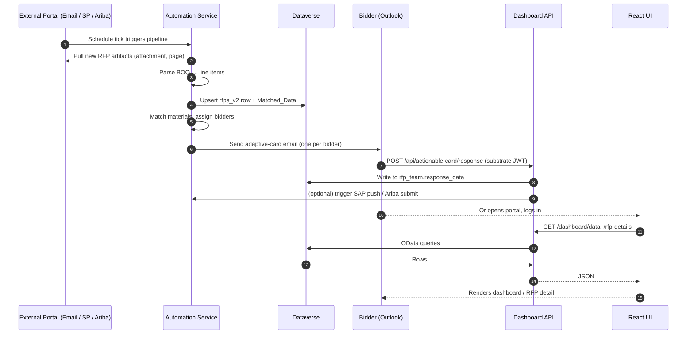
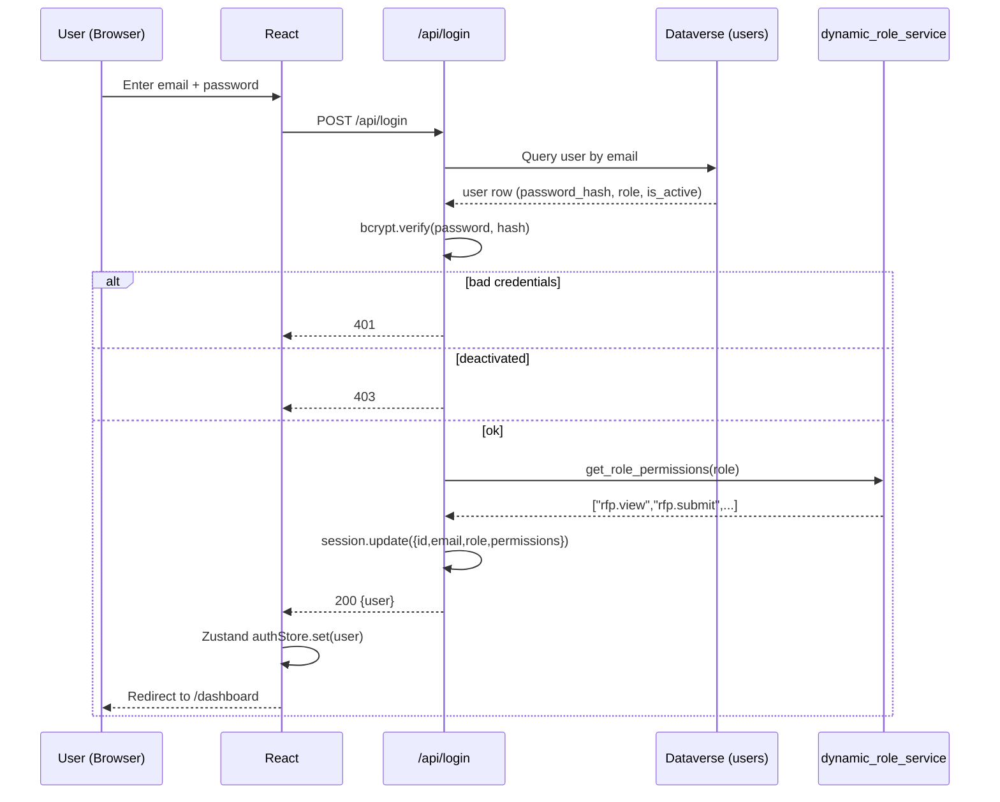
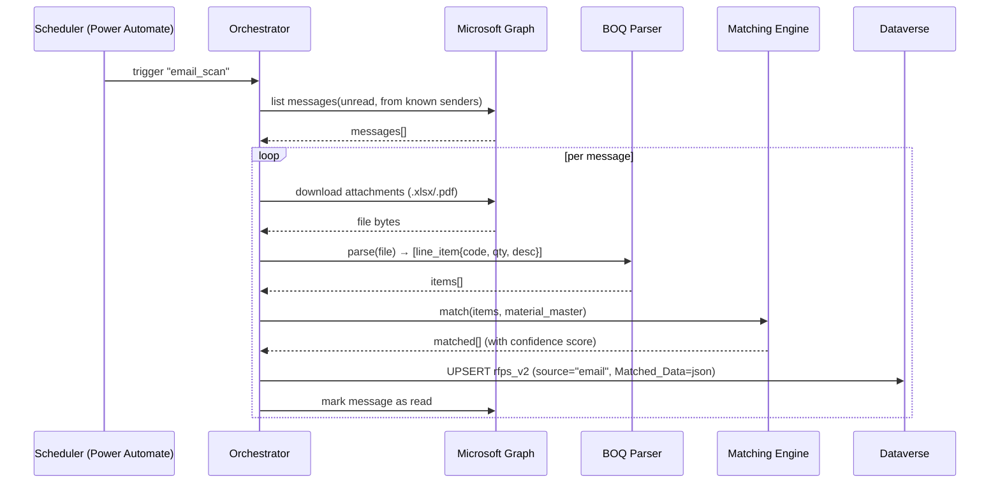
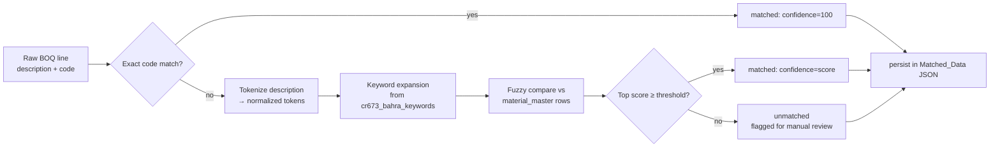
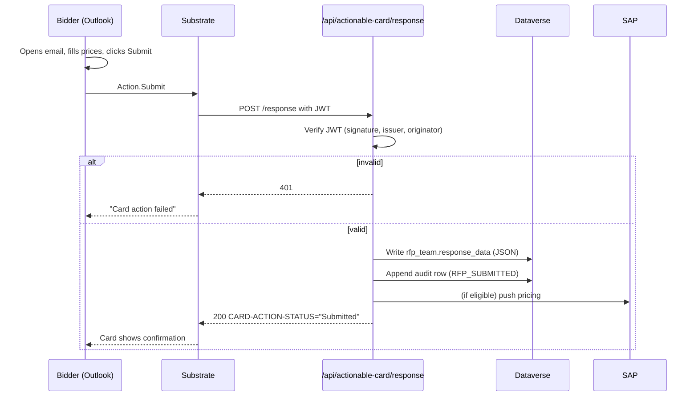
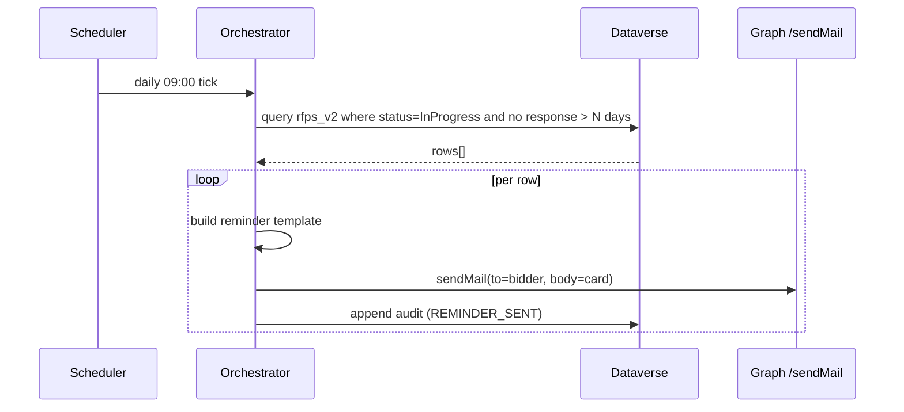
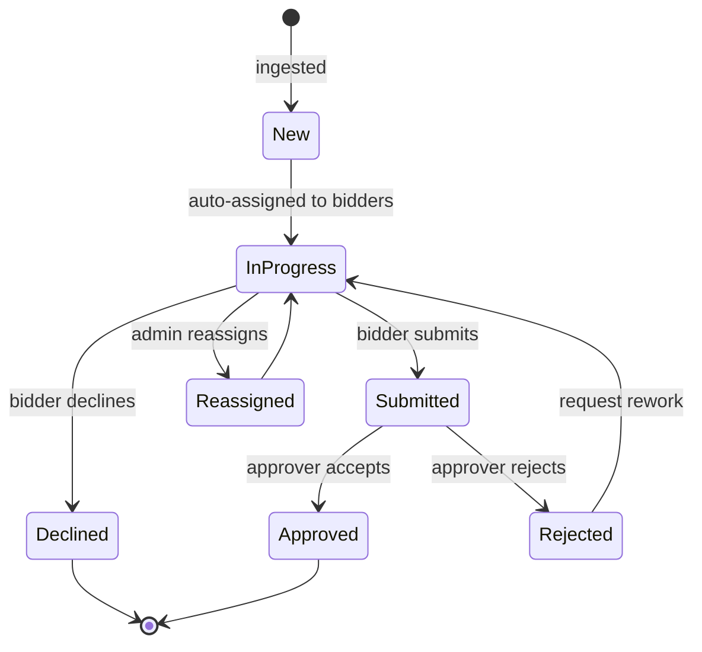
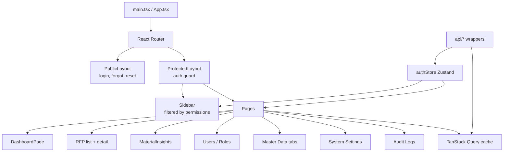

# High Level Design (HLD)

Module-level design and end-to-end data flow for the RFP Automation platform. This document sits between the Software Architecture Document (big picture) and the Low Level Design (class/function).

Related: [SAD](04-SAD-Software-Architecture-Document.md) · [LLD](06-LLD-Low-Level-Design.md) · [Data Dictionary](07-Data-Dictionary-and-ER-Diagram.md) · [API](08-API-Documentation.md)

---

## 1. Module map

```
RFP Automation
├── Dashboard API (FastAPI :8000)
│   ├── Authentication Module          auth, session, password hashing
│   ├── Authorization Module (RBAC)    permission check, role cache
│   ├── RFP Module                     list, detail, status, submit, decline
│   ├── Material Insights Module       match analytics, grouping
│   ├── Master Data Module             material/keyword/team/columns CRUD
│   ├── User & Role Admin Module       user/role CRUD, audit
│   ├── System Settings Module         get/set cached settings
│   ├── Actionable-Card Module         substrate-token callbacks
│   ├── Error-Analysis Module          AI-assisted log triage
│   └── Dataverse Client (shared)      token cache, retry, query, upsert
│
├── Automation API (FastAPI :8100)
│   ├── Orchestrator                   schedule trigger → pipeline
│   ├── Email Pipeline                 Graph → download attachments → parse
│   ├── SharePoint Pipeline            Graph Sites → list → download
│   ├── Ariba Pipeline                 Playwright browser → scrape → download
│   ├── BOQ Parser                     Excel/PDF → line items
│   ├── Matching Engine                fuzzy match against material_master
│   ├── Assignment Engine              rule-based bidder assignment
│   ├── Notification Engine            adaptive-card email per bidder
│   └── Power Automate Sync            schedule push + callback inbound
│
└── Frontend (React + Vite)
    ├── Router + Layouts               ProtectedLayout, PublicLayout
    ├── Feature Pages                   dashboard, RFP list, RFP detail, admin, master data, settings, insights
    ├── Shared Components               tables, forms, dialogs, toasts
    ├── Auth Store (Zustand)            user session, permissions
    ├── API Client                      fetch wrappers, error interceptor
    └── Hooks                           useHasPermission, useRFPs, useSettings
```

---

## 2. End-to-end flow (happy path)



---

## 3. Per-workflow sequence diagrams

### 3.1 Login + session



### 3.2 RFP intake via email



### 3.3 Material matching engine



Threshold is configurable in system settings (default 75 %). See [LLD](06-LLD-Low-Level-Design.md) §Matching Engine.

### 3.4 Adaptive-card response flow



### 3.5 Reminder email daily



### 3.6 Dashboard view logs

User-facing activity log is in `cr673_bahra_automation_log1` and mirrors to `audit_logs` for security-relevant actions. See [Data Dictionary §automation_log1](07-Data-Dictionary-and-ER-Diagram.md).

---

## 4. Data flow (state transitions)

RFP lifecycle states:



---

## 5. Module responsibilities

### 5.1 Authentication (`routes/api.py`, `services/user_service.py`)

- Verify credentials (bcrypt)
- Start / end / refresh server session
- Emit `LOGIN_SUCCESS`, `LOGIN_FAILURE`, `LOGOUT` audit rows
- Responsible for: nothing beyond identity. Does **not** enforce authorization.

### 5.2 Authorization / RBAC (`services/dynamic_role_service.py`, `services/permission_definitions.py`)

- Single source of truth for permission catalogue
- Cache role → permissions (TTL 300 s)
- Expose `user_has_permission(user, perm)` as the single API
- Seeds default roles on deploy

### 5.3 RFP Module (`routes/dashboard.py`, `routes/api.py`)

- Listing with filter/search/pagination
- Detail with BOQ, match preview, dynamic response form
- Status transitions (auth-checked)
- XLSX export

### 5.4 Matching Engine (`automation_logic.py`, `helpers/`)

- Pure-Python fuzzy string match
- Consumes `material_master` and `keywords`
- Produces `Matched_Data` JSON stored on the RFP row
- Threshold and weights configurable via system settings

### 5.5 Notification Engine (`helpers/email_helper.py`, `templates/`)

- Renders adaptive-card JSON per RFP + bidder
- Calls Microsoft Graph `/sendMail`
- Supports `dev` mode (single catch-all recipient) for safer testing

### 5.6 Orchestrator (`automation_logic.py`)

- Entry points for each scheduled job (email, SP, Ariba, match, remind)
- Retries + dead-letter to `automation_log1`
- Pluggable scrapers

### 5.7 Master Data Module (`routes/master_data_routes.py`, `services/`)

- CRUD for `material_master`, `keywords`, `rfp_team`, `rfp_team_columns`
- Bulk-import CSV/XLSX with row-level validation
- Cache invalidation on write

### 5.8 System Settings Module (`routes/system_settings_routes.py`, `services/system_settings_service.py`)

- Key/value with optional section
- In-memory TTL cache
- Sensitive values masked in list endpoint; revealed on demand with audit

### 5.9 Power Automate Integration (`helpers/power_automate_helper.py`)

- Push schedule changes from Dataverse → Power Automate HTTP trigger
- Receive webhook callbacks (retries, error handling)

---

## 6. Frontend module map



See [SAD §Frontend Component](04-SAD-Software-Architecture-Document.md) for the component diagram.

---

## 7. Concurrency & scheduling

- **Dashboard service** is a single Uvicorn worker by default. Safe to scale to multiple workers because all state is in Dataverse or in-process caches (cache misses cost one OData query per worker — acceptable).
- **Automation service** must remain a **single worker** — it owns the Playwright browser and assumes single-writer semantics on scraper artefacts.
- Scheduled jobs are triggered by Power Automate (cloud flow, not in-process cron) so horizontal redundancy is the flow's problem, not ours.

## 8. Caching strategy (HLD-level)

| Cache | Where | TTL | Invalidation trigger |
|---|---|---|---|
| Role permissions | `dynamic_role_service` | 300 s | Role create/update/delete, permission change |
| System settings | `system_settings_service` | 300 s | Any setting write, `POST /reload-cache` |
| Dataverse metadata | `helpers/metadata_cache.py` | 24 h | Manual invalidation |
| Dashboard aggregates | `routes/api.py` | 300 s | RFP row changes (best-effort) |

See [LLD](06-LLD-Low-Level-Design.md) for the lock and cache-key design.

## 9. Error handling contract

- All routes funnel uncaught exceptions through a global handler that:
  1. Generates an `error_id`
  2. Logs traceback with `error_id`
  3. Returns `{"detail": "Internal error — please retry. Reference: <error_id>", "error_id": "..."}`
- External calls (Graph, Dataverse) retry with exponential backoff inside the client wrapper; surface `429`/`503` as-is after exhausting retries.
- Validation errors (`400`) always include a list of field-level issues.

## 10. Key assumptions & invariants

- Exactly one role per user
- `rfps_v2.Matched_Data` is always valid JSON when non-empty
- Dataverse EntitySetName pluralization quirk (append `es`) is handled centrally in `config.py`
- All times stored in UTC ISO-8601 in Dataverse; displayed in local time in the UI
- Session secret is treated as a key rotation boundary (rotating invalidates all sessions)

## 11. Non-goals at HLD level

This document intentionally avoids:
- Precise function signatures and internal class diagrams (→ see [LLD](06-LLD-Low-Level-Design.md))
- Deployment specifics (→ [Deployment Guide](../03-operations/09-Deployment-Guide.md))
- Security controls detail (→ [Security & Compliance](../03-operations/12-Security-and-Compliance.md))
- API request/response schemas (→ [API Documentation](08-API-Documentation.md))
