# User Manual — Bidder

Welcome. This guide walks you through everything you need to respond to RFPs quickly and correctly.

> **First time here?** Read the [Quick Start Guide](16-Quick-Start-Guide.md) first (5 minutes).

---

## What you can do

The **RFP Bidder** role gives you ten permissions. In plain terms, you can:

- See the Dashboard and the full RFP list (**RFP Insights**)
- See which materials the system matched on each RFP, and how
- Trigger a download of new RFPs from the Ariba account
- Push a completed response back to the buyer, or decline an RFP
- Answer RFPs straight from Outlook, without opening the portal
- Track who still owes a response on the **Open RFP** page, and hand a product line to a colleague
- Open an RFP's SharePoint folder
- Browse **Activity Logs** and **Material Insights**

You **cannot**:

- Send reminder emails from the Open RFP page (that needs `rfp.open.remind`, which the Bidder role does not include — ask your admin if you need it)
- Open Analytics, Users, Roles, Audit Logs, SAP Logs, Master Data, or System Config
- Edit the material master or keyword list

If you need any of these, your admin can build you a custom role.

---

## 1. Logging in

1. Go to **https://be-aramco-01.bahra-cables.com/rfp**.
2. Enter your **email** and **password**.
3. Click **Sign in**.

If you forgot your password:

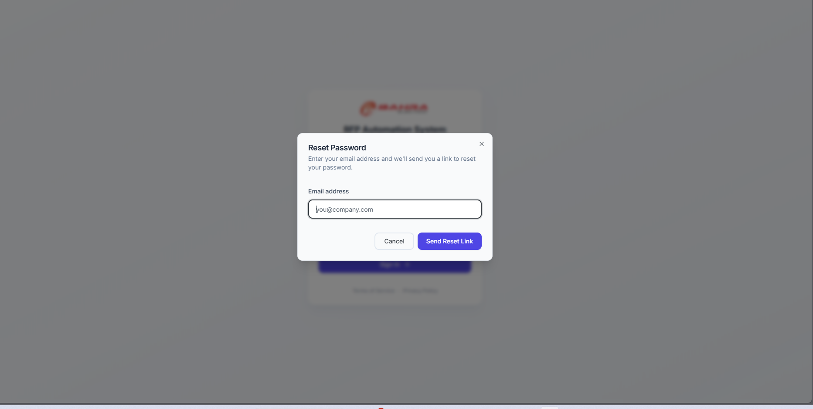

1. Click **Forgot password?** on the login screen.
2. Enter your email.
3. Check your inbox for a reset link. **The link is only valid for 30 minutes** — request a fresh one if it expires.
4. Click the link and set a new password.

**If you get five passwords wrong in five minutes**, the portal stops accepting attempts from you and tells you how many seconds to wait. Nothing is permanently locked and you do not need your admin — wait it out and try again. If you are still blocked after that, then contact your admin.

**Your session lasts 2 hours from the moment you sign in**, whether or not you are active. Being busy does not extend it — two hours after login you will be asked to sign in again. If you're part-way through something long, save your work.

---

## 2. The dashboard

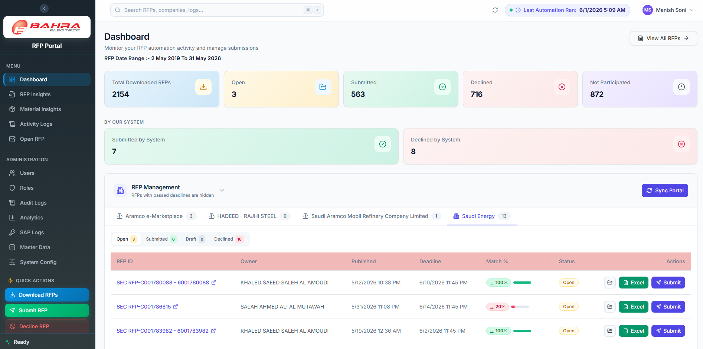

After login you land on the **Dashboard**. Across the top:

| Tile | What it means |
|---|---|
| **Total Downloaded RFPs** | Every RFP pulled from Ariba in the selected date range |
| **Open** | Not yet submitted or declined |
| **Submitted** | A response has been sent to the buyer |
| **Declined** | Someone declined to bid |
| **Not Participated** | Bahra did not take part |

Below that, **Submitted by System** and **Declined by System** count the ones the automation handled without a person.

Use the date range and company filters to narrow the view.

---

## 3. Finding your RFPs

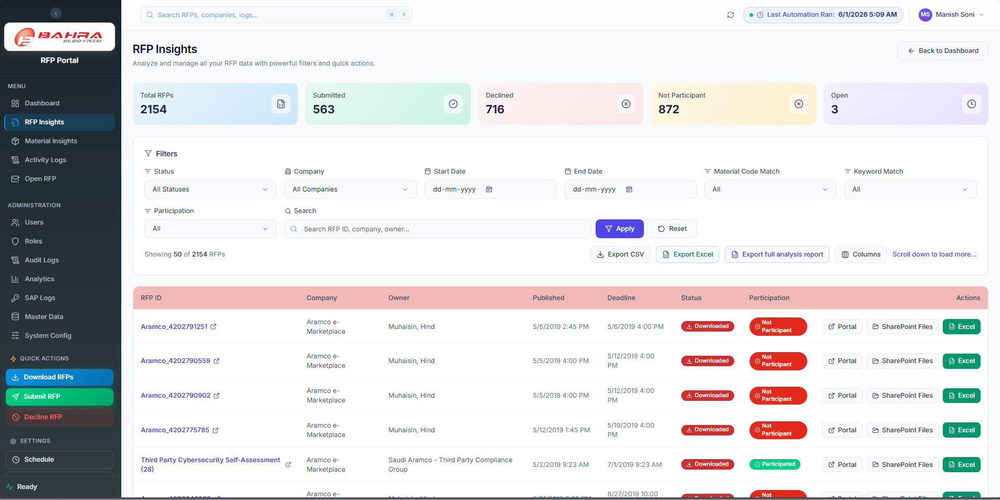

1. Click **RFP Insights** in the sidebar.
2. You get one row per RFP, with count tiles above (Total RFPs, Submitted, Declined, Not Participant, Open).
3. Narrow it down with the filters: status, company, date range, free-text search, whether it matched on material or keyword, and participation.
4. **Open** is the pile that needs you.

To take the list elsewhere, use **Export CSV** or **Export Excel** (both honour your current filters), or **Export full analysis report** — a three-sheet workbook of materials, RFPs, and an RFP-count pivot. Note that the full analysis report **ignores your filters** and always exports everything.

---

## 4. Understanding the match

On the Dashboard, each RFP shows a **Match %**. Click it to open the **Material Breakdown**.

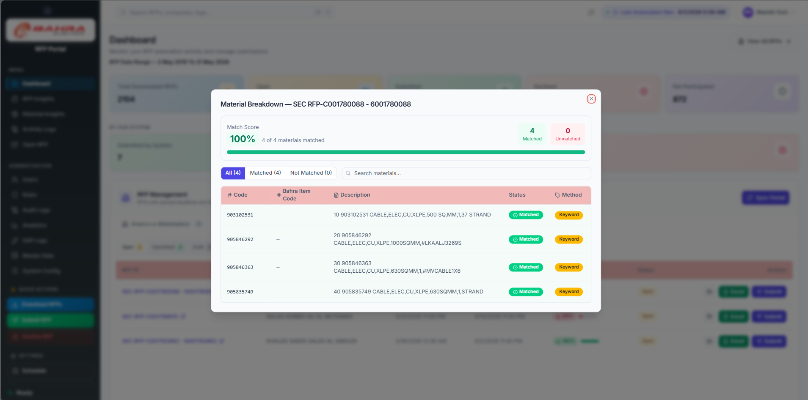

The dialog gives you, per material line: the code, the Bahra item code, the description, whether it **Matched**, and — this is the important column — the **Method**:

| Method badge | What actually happened | How much to trust it |
|---|---|---|
| **Exact** | The BOQ line carried a 9-digit SAP material code and that exact code exists in the Material Master. | Reliable. |
| **Keyword** | No SAP code on the line, so the system compared the line's text against the keyword list and found one that overlapped. | **Check it.** |
| *(none)* | Neither rule matched. The line is listed under **Not Matched**. | Handle it yourself. |

Two things worth knowing, because the screen's wording can mislead:

- **"Match Score" is not a confidence score.** It is coverage — matched lines ÷ total lines. 100% means every line found *something*, not that every match is correct.
- **A Keyword match is not a "best" match.** The system does not rank candidates or score similarity. When several materials share a keyword it simply takes the first one it finds. A short keyword can therefore pull in a related-but-wrong material.

So: **Exact** you can take at face value; **Keyword** deserves a look before you price it. If an item your team quotes regularly keeps landing in **Not Matched**, ask your admin to add a keyword for it — that is the supported fix, and it improves every future RFP.

Use the **All / Matched / Not Matched** tabs and the search box to work through a long list.

---

## 5. Responding to an RFP

Bidders price RFPs **in Outlook**, on the adaptive card the system emails you. The portal is where you look things up and where the finished workbook gets pushed back to the buyer.

### 5.1 In Outlook (this is where you enter prices)

1. Open the RFP email. The card refreshes itself and shows the current state of each product line.
2. Fill in the fields for your product lines — the exact fields are configured by your admin, typically price and lead time.
3. Click **Submit All Responses**.
4. The card updates in place to confirm.

Other buttons on the card:

- **Refresh Status** — re-checks what has already been answered.
- **View Files** — opens the RFP's files.
- **Decline RFP** — say no to the whole RFP.

> **First answer wins.** Each product line accepts one response. If a colleague has already answered a line, your answer for that same line is not applied — the card shows you what is already settled, which is what **Refresh Status** is for.

> **Tip:** The card works in Outlook on the web, desktop, and mobile.

### 5.2 Pushing the response back to Ariba (portal)

When the buyer's workbook is filled in and ready to go back:

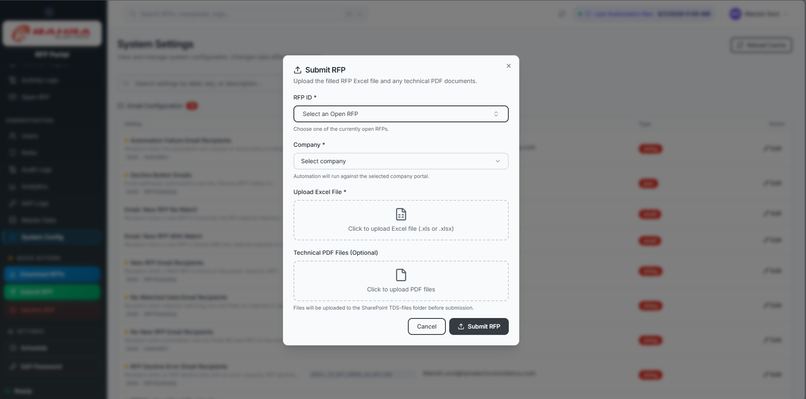

1. Click **Submit RFP** in the sidebar's Quick Actions.
2. Pick the **RFP ID** (search by ID or company) — required.
3. Pick the **Company** — required. If the RFP belongs to a different buyer, the dialog tells you and stops.
4. Upload the **Excel file** — required.
5. Add **Technical PDF Files** if you have them — optional.
6. Click Submit.

The submission runs in the background and drives the Ariba wizard for you; you don't have to keep the dialog open. If a submission is already running for that RFP, the portal tells you rather than starting a second one.

---

## 6. Declining an RFP

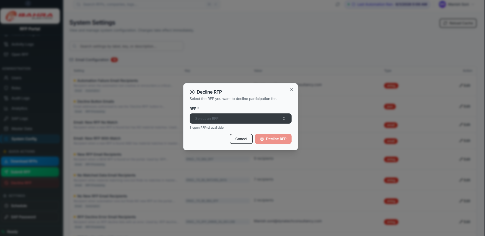

**From the portal:** click **Decline RFP** in Quick Actions, select the RFP and its company, and confirm. The automation declines it on Ariba.

**From Outlook:** click **Decline RFP** on the card.

A declined RFP drops off the active list. If it was declined in error, ask your admin.

---

## 7. Downloading new RFPs

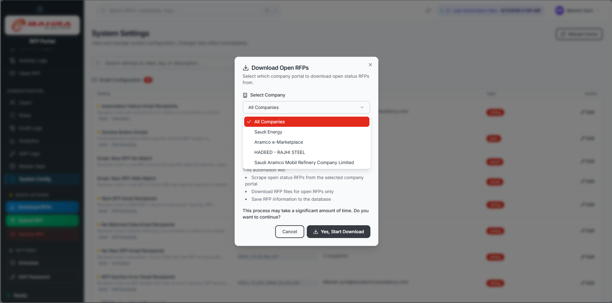

The automation pulls new RFPs on its own four times a day. If you don't want to wait, click **Download RFPs** in Quick Actions, pick a company (or **All Companies**), and start it.

The run happens in the background and can take a while. Only one download runs at a time — if one is already going, the portal says so.

---

## 8. Chasing responses — the Open RFP page

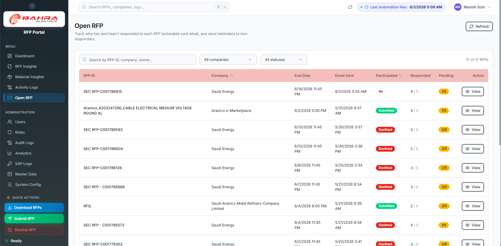

**Open RFP** in the sidebar lists RFPs still awaiting responses, one row per product line, showing who owes what and which reminders have gone out. Click **Reminder History** to see what has already been sent.

As a Bidder you can **Delegate** a pending product line to someone else: click **Delegate** on the row and choose the recipient. The row then shows it was delegated, to whom, by whom, and when — and the new recipient is the one chased from that point.

The **Remind** and **Remind All Pending** buttons need `rfp.open.remind`, which the standard Bidder role does not include, so you may not see them.

> **Heads-up:** the automatic 3-day and 1-day deadline reminder emails are **not being sent at the moment** — this is a known issue your admins are tracking. Don't assume a colleague has been nudged; check this page.

---

## 9. Your activity

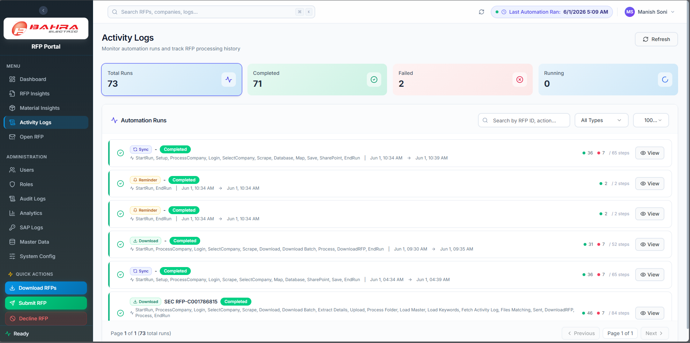

**Activity Logs** in the sidebar shows what you and the automation have done — RFPs downloaded, submissions, declines. This is the place to answer "did my submission actually go through?".

Use the search box to find a specific RFP. Search runs against the whole table on the server, so it will find old runs that aren't in the visible list.

---

## 10. Profile & password

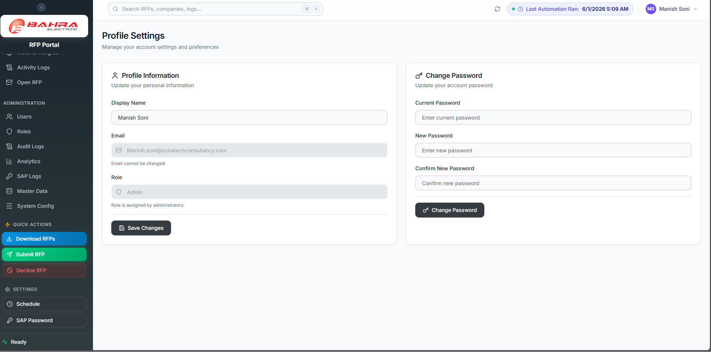

Click your avatar (top right) → **Profile**.

- **Display Name** — you can change this.
- **Email** and **Role** — shown but read-only. Ask an admin to change either.

To change your password:

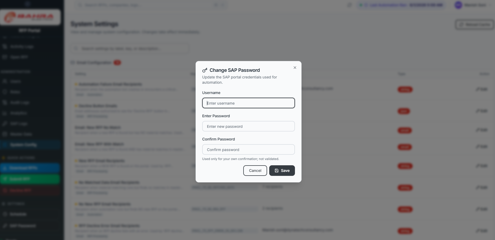

Enter your current password, then the new one twice, and click **Change Password**.

---

## 11. Material insights

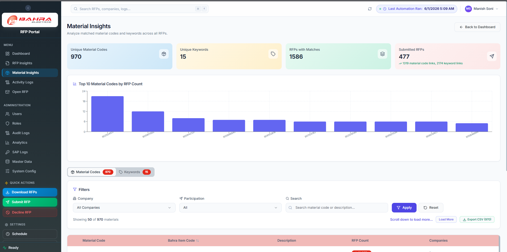

**Material Insights** shows which materials come up most often across RFPs, broken down by company. Useful for:

- Spotting frequently requested items worth a stock check
- Reading a customer's buying patterns
- Preparing for the next tender cycle

There's also a keyword view showing which keywords are actually pulling matches:

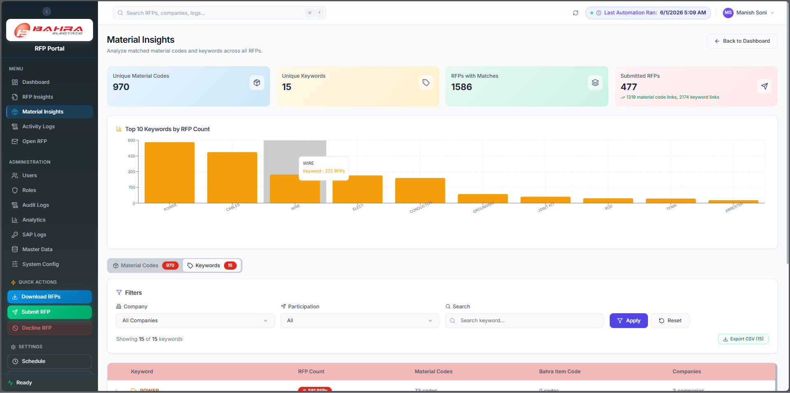

---

## 12. Frequently asked questions

**Q. I submitted by mistake — can I undo?**
Not from the portal. Contact your admin.

**Q. The adaptive card in Outlook is blank or the buttons do nothing.**
Reload the email first. If it stays broken, tell your admin — the card reaches the system through an Entra Application Proxy path they can check. Meanwhile, work the RFP from the portal.

**Q. My colleague answered a line I was working on.**
First response wins, per line. Click **Refresh Status** on the card to see the current state before filling anything in.

**Q. I can't see an RFP a colleague says is assigned to me.**
Check the date filter on RFP Insights — a narrow range hides things. If it's still missing, your role may be missing `rfp.view`; ask your admin.

**Q. Why is the Match % low?**
The BOQ lines didn't carry 9-digit SAP codes and nothing in the keyword list overlapped their descriptions. It's not a quality signal about the matches that *did* land. Ask your admin to add keywords for terms that keep missing.

**Q. A match is plainly wrong.**
Look at the Method badge. If it says **Keyword**, that's expected behaviour — keyword matching is broad and unranked. Fix the BOQ line yourself in the workbook, and tell your admin so they can tighten the keyword.

**Q. My dashboard shows no RFPs at all.**
Either there genuinely are none in the date range, or your role is missing `rfp.view`. Ask your admin.

**Q. Can I export the RFP list?**
Yes — **Export CSV** or **Export Excel** on RFP Insights.

---

## 13. Troubleshooting

| Problem | What to check |
|---|---|
| Can't log in | Caps Lock · try **Forgot password?** · if you're rate-limited, wait the stated seconds · contact admin if still blocked |
| Signed out unexpectedly | Sessions end **2 hours after login**, regardless of activity. Sign back in |
| Reset link says expired | It only lasts 30 minutes — request a new one |
| Adaptive card button does nothing | Try the portal; tell your admin the card failed and give them the RFP ID |
| "Already running" when starting a download or submit | One job of that kind runs at a time. Wait for it to finish |
| No reminder emails arriving | Known issue — automatic deadline reminders aren't sending. Use the Open RFP page to see who's pending |
| Page looks broken / blank | Refresh (Ctrl+F5). If it persists, tell your admin |

---

## 14. Getting help

- Quick questions → your team lead
- Access problems → your admin
- System down → on-call IT

Always include:
- Your email
- The RFP ID (if any)
- A screenshot of the error
- What you were trying to do
