# User Manual — Admin

You have full access to the RFP Automation Portal — all **42** permissions. This manual walks you through every admin task in the order you'll typically do them.

**Tech-deep tasks** (deploying, troubleshooting internals, security hardening) live in:
- [Deployment Guide](../03-operations/09-Deployment-Guide.md)
- [Operations Runbook](../03-operations/10-Operations-Runbook.md)
- [RBAC Permissions Matrix](../03-operations/11-RBAC-Permissions-Matrix.md)
- [Security & Compliance](../03-operations/12-Security-and-Compliance.md)

> **Read §6 before you touch the Schedule screen, and §11 before you promise anyone reminder emails.** Both currently behave differently from what the UI implies.

---

## 1. First login

The portal is at **https://be-aramco-01.bahra-cables.com/rfp**.

Log in with the Admin credentials provided during deployment. **Change the password immediately.** Click your avatar → **Profile** → **Change password**.

Verify you can see the full sidebar. It has four groups:

| Group | Items |
|---|---|
| **Menu** | Dashboard · RFP Insights · Material Insights · Activity Logs · Open RFP |
| **Administration** | Users · Roles · Audit Logs · Analytics · SAP Logs · Master Data · System Config |
| **Quick Actions** | Download RFPs · Submit RFP · Decline RFP |
| **Settings** | SAP Password · Schedule |

Anything missing means your role isn't `Admin` — contact the system owner.

**Sessions last 2 hours from login**, with no idle timeout — you will be signed out two hours after you sign in whether or not you were working. Plan long jobs accordingly.

---

## 2. User management

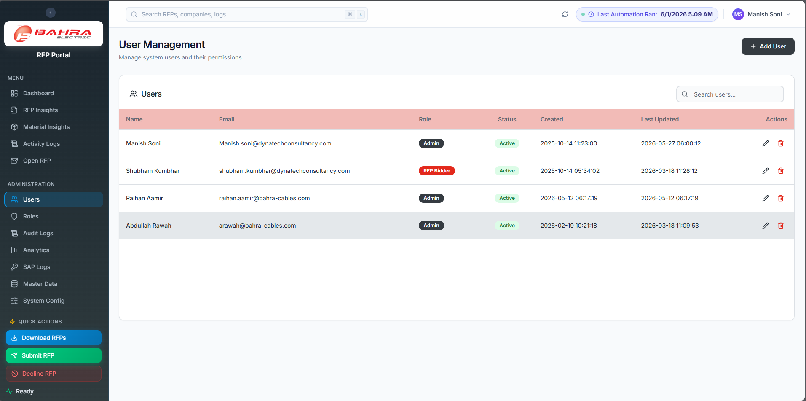

### 2.1 Creating a user

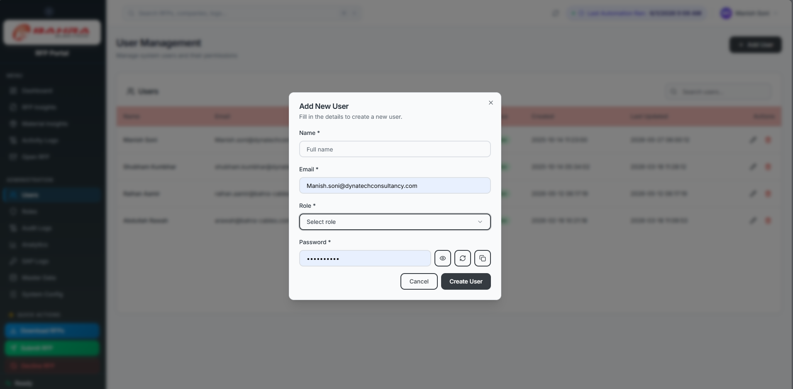

1. Sidebar → **Users** → **Add User**.
2. Fill in the details and pick a **role**.
3. Click **Create User**.

Tell the new user to log in and change their password.

### 2.2 Editing / deleting a user

1. **Users** → click the edit icon on a row.
2. Change the role or other details → **Save Changes**.

**Delete** removes the user. Their audit history stays (audit rows are never deleted), but the account is gone — so prefer this only when you're certain.

### 2.3 Unlocking an account

There is an **Unlock account** button on each user row. Be aware of what it does and doesn't do:

- The lockout users actually hit is a **rate limit**: 5 failed logins from the same email or IP within 5 minutes returns "Too many failed attempts, try again in *N* seconds". It **clears itself** after the window and needs no action from you. It also resets if the API service restarts.
- The Dataverse account lock that the **Unlock** button clears is **never set by failed logins** — that code path isn't wired up. So in practice Unlock is a no-op safety valve.

If a user says they're locked out: tell them to wait five minutes. If they still can't get in, the problem is their password or their account being deactivated, not a lock.

### 2.4 Forgot-password resets

Users self-service via **Forgot password?** on the login page. The reset link is **valid for 30 minutes**. If a user never receives the email, check:

- The email address is correct
- The **Forgot Password Power Automate flow** is turned on — this flow sends the mail, and the portal returns an error if it can't reach it
- No spam-filter rule blocks the portal's sender

---

## 3. Roles & permissions

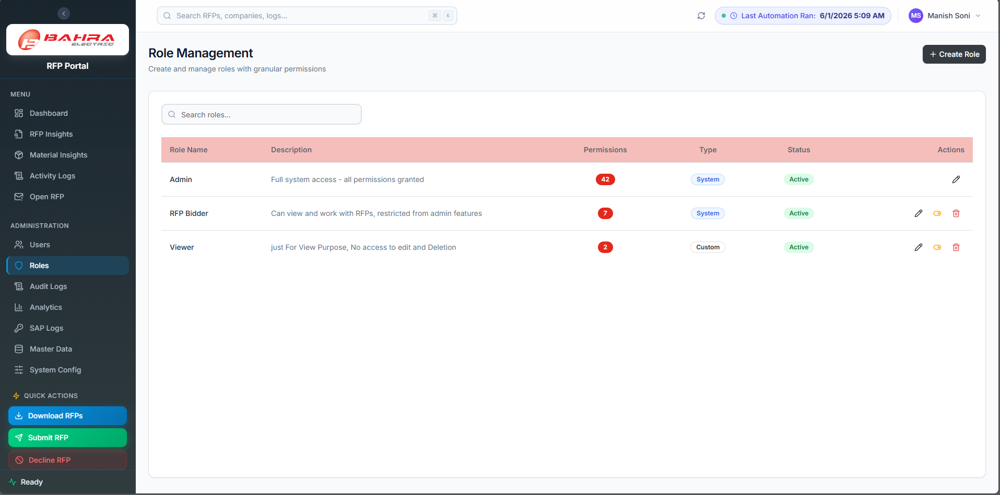

### 3.1 Understanding roles

There are **42 permissions**. Two roles are pre-seeded, both system roles:

- **Admin** — all 42. Defined as "every permission that exists", so it stays complete automatically as new permissions are added.
- **RFP Bidder** — exactly 10: `rfp.view`, `rfp.download`, `rfp.submit`, `rfp.decline`, `rfp.open.view`, `rfp.open.delegate`, `rfp.sharepoint.view`, `dashboard.view`, `logs.view`, `material_insights.view`.

Worth noting what **RFP Bidder deliberately lacks**: `rfp.open.remind` (sending reminders) and `analytics.view`. If bidders need either, make a custom role.

There is **no Approver role and no approval workflow** — an RFP goes straight from open to submitted or declined. See the [Approver manual](15-User-Manual-Approver.md) for how to give managers oversight instead.

> **Never rename the `Admin` role.** Parts of the system check for the literal name `Admin`. Renaming it silently removes admin access from everyone who has it.

### 3.2 Creating a role

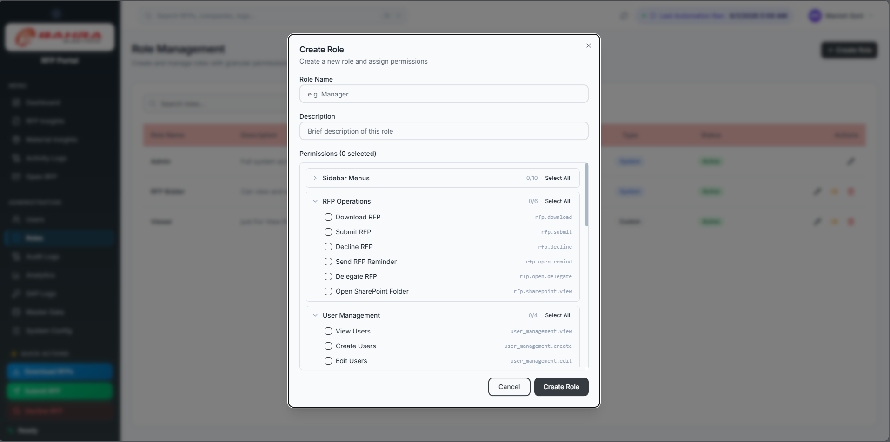

1. Sidebar → **Roles** → **Create Role**.
2. Enter a **Name** (unique) and **Description**.
3. Check permissions. The screen groups them the way the portal is laid out: **Sidebar Menus**, **RFP Operations**, **User Management**, **Role Management**, **Master Data**, **System Settings**, **SAP Password**.
4. Click **Create Role**.

Note that "Sidebar Menus" permissions are what make a page visible *and* accessible — e.g. `rfp.open.view` for the Open RFP page. Grant the page first, then the actions on it.

### 3.3 Editing a role

**Roles** → edit → change name or permissions → **Update Role**.

> ### Permission changes need a re-login
>
> **A user's permissions are read once, at login, and never re-read while they're signed in.** If you add a permission to someone's role, they will not see it until they **sign out and sign back in**. There is no cache to wait out and no refresh button — waiting five minutes does nothing.
>
> Whenever you change a role, tell the affected users to sign out and back in. If someone reports "you gave me access but I still get Access Denied", this is almost always the reason.

Two more things about renaming roles:

- Renaming a role **orphans its permission rows** — the permissions are stored against the role's *name*. Prefer creating a new role over renaming an existing one.
- Any permission key that isn't recognised is **silently dropped** when saving.

### 3.4 Deleting a role

- **Deactivate** (the toggle on the row) — hides the role; existing users keep it until you move them. Reversible, and the safer choice.
- **Permanently delete** — removes the role and its permission mappings. Users on it are left with nothing until reassigned.

Neither is offered for `Admin`.

### 3.5 Assigning a role

At user level: **Users** → edit user → change the **Role** → Save. Remind them to sign out and back in.

---

## 4. Master data

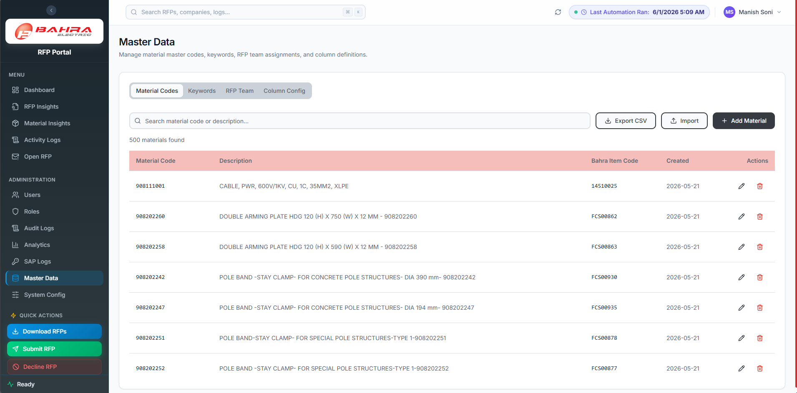

**Master Data** in the sidebar has four tabs. You'll see a tab if you hold the matching `*.view` permission; the page opens if you hold **any** of the four.

### 4.1 Material Codes

The SAP material catalogue used for matching. Add, edit, and delete rows; bulk-import from CSV/XLSX.

Keep this as close to SAP as possible — **tier 1 of matching is exact string equality on the 9-digit code**, so a code that isn't here cannot match exactly, no matter how good the description is. A regular sync from SAP is the single highest-leverage thing you can do for match quality.

### 4.2 Keywords

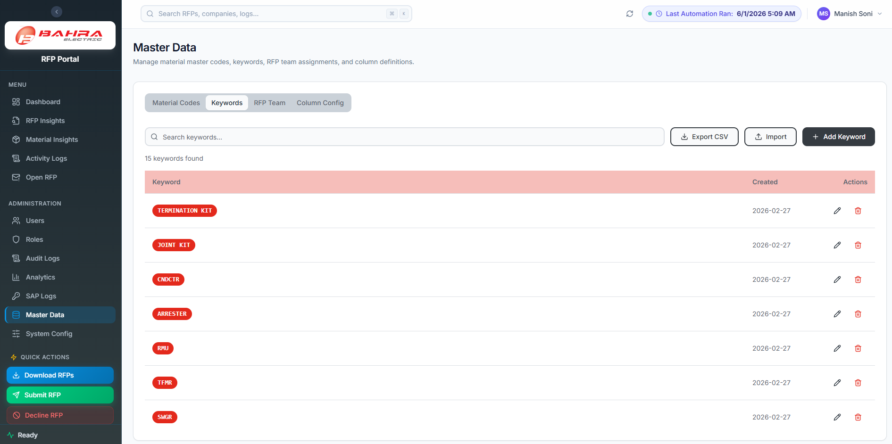

The terms used by **tier 2** of matching, for BOQ lines with no 9-digit code. The system checks whether a keyword and the line's Name/Description contain one another.

This is your main lever when bidders complain that an item isn't matching — add the term the buyer actually writes.

Do it with care, in both directions:

- **Too narrow** → lines fall through to Not Matched.
- **Too broad** → worse. A short keyword matches any line containing those characters, and when several materials qualify the system takes **the first one it finds** — it does not rank or score. A two-letter keyword can silently attach the wrong material to lots of RFPs.

Prefer specific, distinctive terms. There is **no threshold to tune** — matching behaviour is controlled entirely by this data.

### 4.3 RFP Team

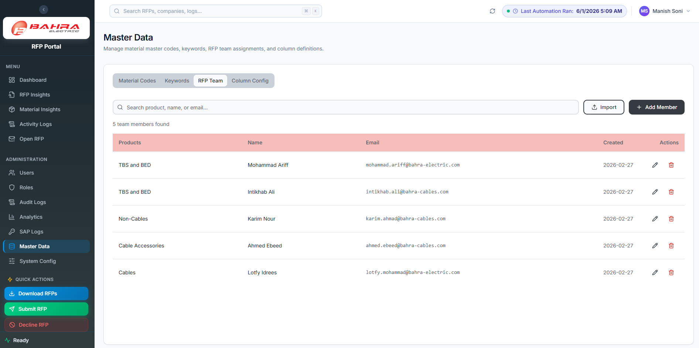

Which products map to which internal recipients. This drives who gets the adaptive-card email — a bidder who isn't in here gets nothing, no matter what role they have.

### 4.4 Column Config

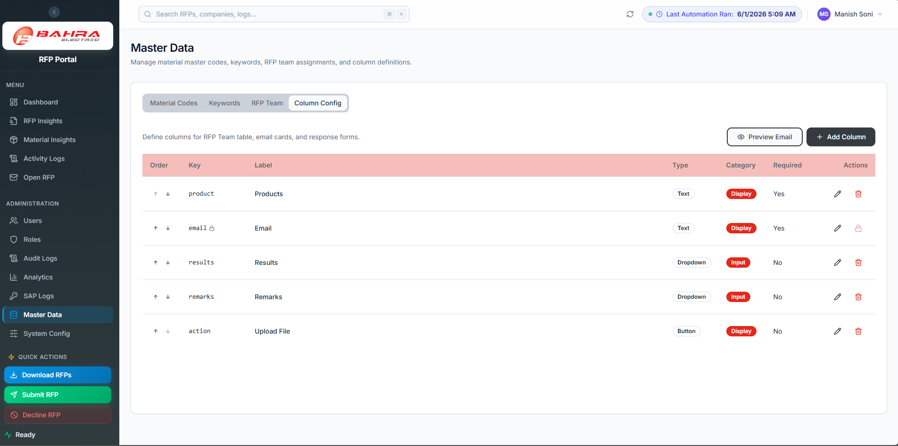

Controls the fields on the adaptive-card response. Per column you set the label, the type (**Text**, **Dropdown**, **Yes / No**, **Button (hyperlink)**), whether it's **Display (read-only)** or **Input (editable)**, and dropdown options where relevant.

Changes apply to cards sent from that point on.

---

## 5. System settings

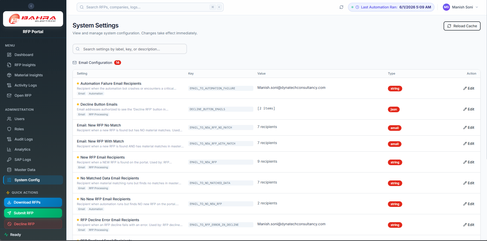

Sidebar → **System Config**. This page holds settings operations staff can change without a deploy — mainly **who receives which email**, per category:

| Setting | Sent when |
|---|---|
| `EMAIL_TO_NEW_RFP`, `EMAIL_TO_NEW_RFP_WITH_MATCH`, `EMAIL_TO_NEW_RFP_NO_MATCH` | A new RFP is ingested |
| `EMAIL_TO_NO_NEW_RFP`, `EMAIL_TO_NO_MATCHED_DATA` | A run found nothing |
| `EMAIL_TO_RFP_SUBMITTED`, `EMAIL_TO_RFP_DECLINED`, `EMAIL_TO_RFP_SAVED_DRAFT` | An RFP changes state |
| `EMAIL_TO_RFP_ERROR_IN_SUBMISSION`, `EMAIL_TO_RFP_ERROR_IN_DECLINE` | A submit or decline fails |
| `EMAIL_TO_AUTOMATION_FAILURE` | An automation run fails — **keep a real person on this one** |
| `EMAIL_TO_RFP_REMINDER` | Deadline reminders (see §11 — not currently firing) |
| `DECLINE_BUTTON_EMAILS` | Who gets a Decline button on their card |

Recipients are semicolon-separated and read at send time, so a change applies to the next email.

**Editing:** click the row → change value → Save. Then click **Reload cache** to apply immediately; otherwise it can take up to 5 minutes.

**Sensitive values** show masked. Click **Reveal** to view — **every reveal is written to the audit log** with your name on it. Note that `system_settings.edit` alone allows revealing; there's no separate permission for it, so grant that permission as carefully as you'd grant the secrets themselves.

Not everything is here. Values like the Adaptive-Card callback URL live in the server's `config.py` on purpose, and **editing that file requires an `rfp-api` service restart** to take effect — a task for whoever runs the server, not this page.

---

## 6. Schedule & Automation — read this before using it

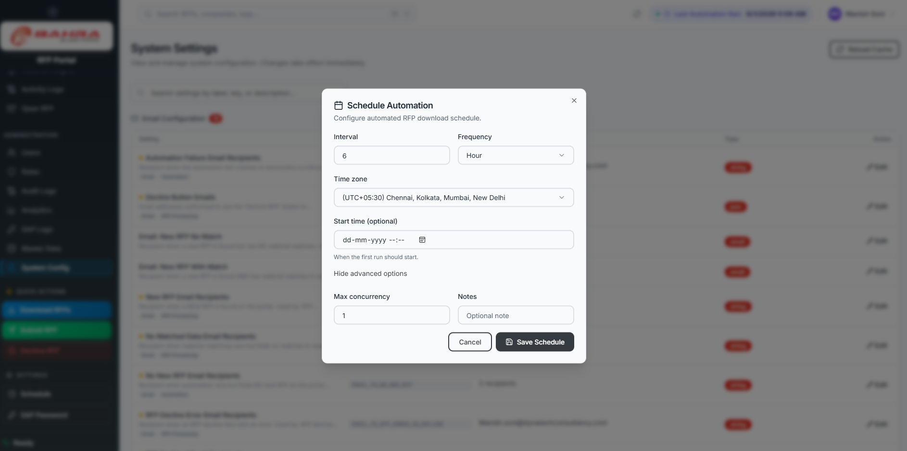

> ### ⚠️ This screen no longer changes the live schedule
>
> The RFP download and portal-sync schedules have moved to **Windows Scheduled Tasks on the application server**. This dialog still writes to the retired Power Automate flow (`Bahra-E-binding-cron-job`).
>
> **It saves, it shows a success message, and nothing you scheduled actually happens.** The success toast is not evidence of anything. Don't use it, and don't tell anyone their schedule change took effect.

**What actually runs**, under the `\Bahra-RFP\` folder in Task Scheduler on the server, in **Riyadh** time:

| Task | What it does | When |
|---|---|---|
| `RFP-Download-OpenRFPs` | Downloads new open RFPs | 00:00, 06:00, 12:00, 18:00 |
| `RFP-Sync-Portal` | Syncs RFP status from Ariba | 03:00, 09:00, 15:00, 21:00 |

Sync is deliberately offset three hours from download — they'd otherwise collide on the same Ariba account.

**To change the cadence**, edit those tasks on the server (or re-run `scripts/Register-RfpSchedules.ps1`). See the [Operations Runbook](../03-operations/10-Operations-Runbook.md). If the old Power Automate flow ever gets re-enabled, downloads will fire from *both* it and the scheduled task — leave it off.

One more trap when reading Task Scheduler: **"Last Run Result: 0" means the run finished, not that it succeeded.** A crashed run also reports 0. Judge success from the automation failure emails and the logs, never from the exit code.

**Need a run right now?** Use **Download RFPs** in Quick Actions.

---

## 7. SAP password

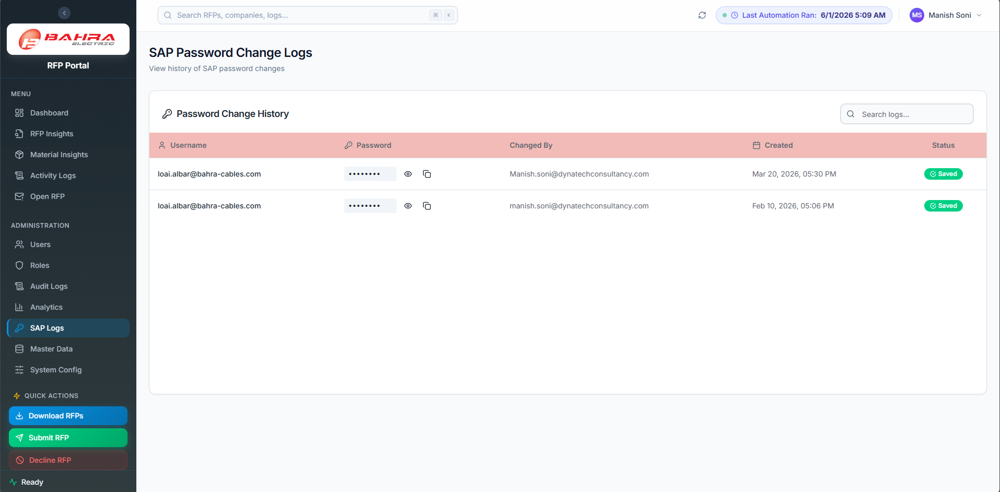

Sidebar → **SAP Logs** (visible with `sap_password.view`).

- **View logs** — every past password change with user, timestamp, and outcome.
- **Change password** — the **SAP Password** quick action (needs `sap_password.change`).

Rotate per your organisation's SAP Basis policy (typically every 90 days).

---

## 8. Audit logs

Sidebar → **Audit Logs**. Filter by user, category, action, and date range. Click a row for the JSON **details** — usually the before/after of the change.

**What is captured:**

- **AUTH** — LOGIN, LOGIN_FAILED, LOGOUT, PASSWORD_CHANGED, PASSWORD_RESET
- **USER** — USER_CREATED / UPDATED / DELETED / ACTIVATED / DEACTIVATED / UNLOCKED
- **ROLE** — ROLE_CREATED / UPDATED / DELETED, ROLE_PERMISSIONS_UPDATED, SEED_ROLES
- **SYSTEM** — SETTING_UPDATED, SETTING_REVEALED, and master-data changes

**What is *not* captured — know this before an audit conversation:**

- **No RFP operations.** Downloads, submissions, declines, reminders, and delegations are **not** in the audit log. To reconstruct RFP activity use the **Activity Logs** page instead.
- **No permission-denied events.** A blocked access attempt leaves no audit trace.
- Audit writes are best-effort and can be lost if the service stops at the wrong moment.

Details longer than 4000 characters are truncated.

**Export** as XLSX for quarterly reviews. **Do not delete audit rows** — the portal exposes no delete; escalate any such request to the system owner and Legal.

---

## 9. Dashboards for monitoring

Keep these bookmarked:

- **Dashboard** — RFP volume and status
- **Activity Logs** — what the automation did
- **Audit Logs** — who changed what
- **SAP Logs** — password-change history

**Analytics** gives you the charted view.

Watch for:

- A sudden drop in RFP ingestion — the scrape may be broken, or a scheduled task may have stopped
- A spike in `LOGIN_FAILED` in Audit Logs
- Automation failure emails to `EMAIL_TO_AUTOMATION_FAILURE`

If anything looks odd, see the [Operations Runbook](../03-operations/10-Operations-Runbook.md).

---

## 10. End-user support

| Question | Answer / Fix |
|---|---|
| "I can't log in" | If they just failed 5 times, they're rate-limited — wait 5 minutes (§2.3) · check the account is active |
| "I got signed out mid-task" | Sessions end 2 hours after login, no idle extension. Expected |
| "You gave me access but I still get Access Denied" | **They must sign out and back in** (§3.3) |
| "I don't see the RFP" | Check date filter · role has `rfp.view` · their RFP Team row exists |
| "The match is wrong" | Check the Method badge. **Keyword** matches are broad and unranked — expected behaviour. Tighten the keyword (§4.2) |
| "It says Match 100% but items are wrong" | Match % is coverage, not confidence. Explain the difference |
| "Reminder emails aren't arriving" | **Known issue** — automatic reminders are not sending (§11). Use Open RFP → Remind |
| "Reminder emails keep coming" | They haven't submitted or declined |
| "Card in Outlook doesn't work" | Have them use the portal; check the App Proxy path with IT; note the RFP ID |
| "I want a new response field" | Master Data → Column Config (§4.4) |
| "Can you change the automation schedule?" | **Not from the portal** (§6) — it's a server task |

---

## 11. Known issues to communicate proactively

Two features look like they work and don't. Set expectations before users find out the hard way.

### 11.1 Deadline reminder emails are not being sent

The 3-day and 1-day reminders are implemented, but **nothing is scheduling them**. The Power Automate flow that used to call the reminder job points at an endpoint that no longer exists, and no scheduled task has replaced it.

**Impact:** bidders get no automatic nudge before a deadline.

**Workaround:** the **Open RFP** page shows exactly who is pending, and its **Remind** and **Remind All Pending** buttons work on demand. Make that part of someone's daily routine until this is fixed. Note that `rfp.open.remind` is **not** in the RFP Bidder role — grant it via a custom role to whoever does the chasing.

### 11.2 The Schedule Automation page is a no-op

See §6. It reports success and changes nothing.

Both are tracked in the [Operations Runbook](../03-operations/10-Operations-Runbook.md). Check there before telling anyone they're fixed.

---

## 12. Onboarding a new bidder — end-to-end checklist

- [ ] Create the user in **Users** with role `RFP Bidder` (or a custom role)
- [ ] Add a row in **Master Data → RFP Team** with their email and products — **without this they receive no cards**
- [ ] Share the portal URL and the [Quick Start Guide](16-Quick-Start-Guide.md)
- [ ] Send them the [Bidder User Manual](13-User-Manual-Bidder.md)
- [ ] Verify they can log in and see at least one RFP
- [ ] Verify they receive an adaptive-card email and that its buttons work

---

## 13. Offboarding a user

- [ ] Reassign their RFP Team products to a teammate first — otherwise their lines go unanswered
- [ ] Delegate or reassign their open RFP lines
- [ ] Remove or replace their **Master Data → RFP Team** entry
- [ ] Delete or reassign the user in **Users**
- [ ] Check Audit Logs for recent sensitive actions
- [ ] Rotate any shared credentials the user knew

---

## 14. Quarterly admin checklist

- [ ] Access review — export the user list, verify roles still make sense
- [ ] Export 90-day Audit Logs to archive
- [ ] Verify the SAP password was rotated in the last 90 days
- [ ] Verify email recipients in System Config are current, especially `EMAIL_TO_AUTOMATION_FAILURE`
- [ ] Confirm both `\Bahra-RFP\` scheduled tasks are still enabled and succeeding
- [ ] Check `backend/LOGS/` on the server isn't bloated (see Operations Runbook)
- [ ] Confirm the Entra app client secret isn't expiring in the next 60 days — **expiry means an outage**

---

## 15. When something is wrong

1. **Don't panic.** Almost nothing is irreversible.
2. Check the [Operations Runbook](../03-operations/10-Operations-Runbook.md) common-errors section.
3. If the portal is down → check the `rfp-api` service on the server.
4. If data looks wrong → check Audit Logs first. Remember RFP operations aren't there — use Activity Logs for those.
5. If a security incident is suspected → follow the [Security & Compliance](../03-operations/12-Security-and-Compliance.md) incident-response playbook.
6. If stuck, contact the system owner.
