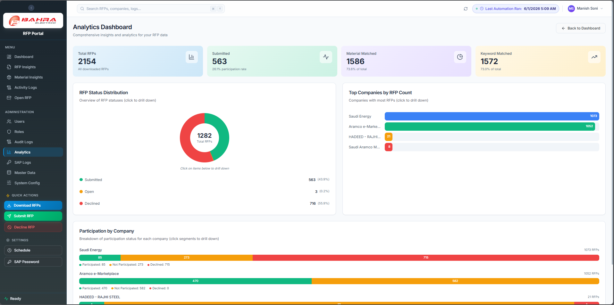
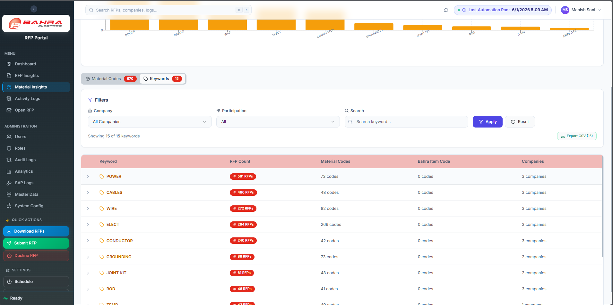
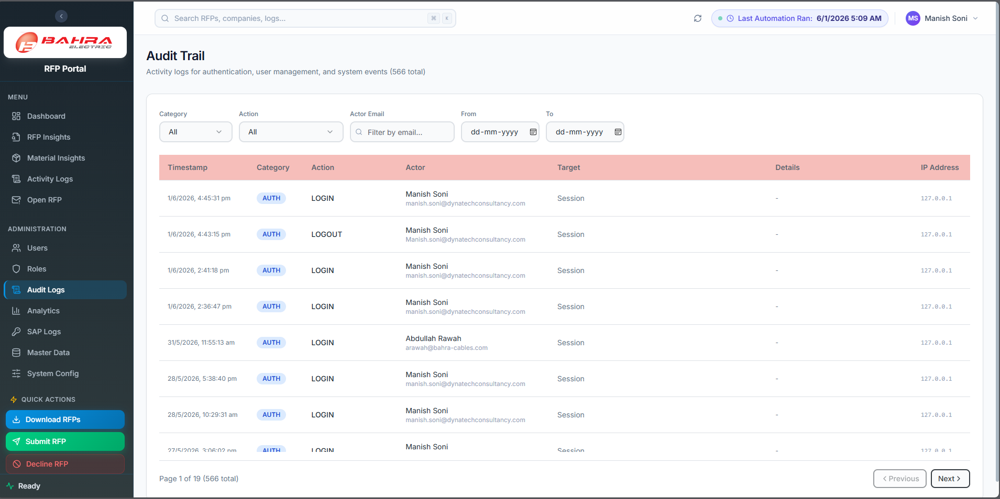

# User Manual — Approver

You oversee the bidding process. This guide covers what the portal gives you and — just as importantly — what it does not.

---

## Start here: there is no approval step

**The system has no approve/reject workflow.** An RFP moves straight from open to `submitted` or `declined`. There is no built-in gate between a bidder pricing an RFP and that price going back to the buyer, no Approve button, no Reject button, and no "send back for clarification" action.

If your process requires sign-off before a bid leaves Bahra, that sign-off happens **outside the portal** today. Agree it with your team as a working practice — the system will not enforce it.

"Approver" is therefore a **business role, not a system role**. There is no seeded Approver role to assign you. What the portal gives you is **visibility**: what's in flight, who owes a response, what was quoted, and what changed.

---

## What you can do

- See RFP volume and status across all buyers
- See what was quoted, on which RFP, and when
- See how each BOQ line was matched to a material
- See who still owes a response, and chase or reassign them
- Read charted analytics and material insights
- Export RFP lists for management reporting

You cannot:

- Approve, reject, or block a submission — the system has no such step
- Edit a bidder's response
- Change system settings, users, or roles

---

## 1. Getting access

Ask your admin to create a **custom role** for you. There is no Approver role out of the box, and the seeded **RFP Bidder** role won't do — it lacks Analytics and the reminder permission.

A sensible oversight role:

| Permission | Gives you |
|---|---|
| `dashboard.view` | Dashboard |
| `rfp.view` | RFP Insights — the full RFP list, filters, exports |
| `analytics.view` | Analytics charts |
| `material_insights.view` | Material Insights |
| `logs.view` | Activity Logs |
| `rfp.open.view` | Open RFP tracker |
| `rfp.open.remind` | The **Remind** buttons on the Open RFP page |
| `rfp.open.delegate` | Reassign a product line to another person |
| `audit_logs.view` | Audit Logs |

Deliberately excluded: `rfp.submit` and `rfp.decline`, so you can't accidentally send something to a buyer. Add `rfp.sharepoint.view` if you need the RFP file folders.

Point your admin at [RBAC Matrix §6](../03-operations/11-RBAC-Permissions-Matrix.md#6-creating-a-custom-role).

> **After your role is created or changed, sign out and sign back in.** Permissions are read only at login — until you do, you'll keep hitting Access Denied on the new pages.

---

## 2. Logging in

Go to **https://be-aramco-01.bahra-cables.com/rfp**, enter your email and password, and click **Sign in**.

Your session lasts **2 hours from login** regardless of activity — no idle timeout, no extension for being busy. Expect to sign in again during a long working day.

---

## 3. The daily view

The **Dashboard** answers "what's the state of play": Total Downloaded RFPs, Open, Submitted, Declined, Not Participated for your date range, plus how many the automation handled by itself (**Submitted by System** / **Declined by System**).

**Open** is the number that should worry you — those are RFPs nobody has answered yet.

---

## 4. Working the RFP list

**RFP Insights** is the full list with count tiles above it. Filter by status, company, date range, free text, whether it matched on material or keyword, and participation.

**Tip:** filter **Status = Open**, sort by deadline, and start there. Bookmark it.

For reporting, use **Export CSV** or **Export Excel** (both honour your filters), or **Export full analysis report** — a three-sheet workbook of materials, RFPs, and an RFP-count pivot. That last one **ignores your filters** and exports everything.

---

## 5. Reading the material match — and its limits

From the Dashboard, clicking an RFP's **Match %** opens the **Material Breakdown**: each line's code, description, whether it matched, and by which **Method**.

Understand what these numbers mean before you use them in a decision:

- **"Match Score" is coverage, not confidence.** It's simply matched lines ÷ total lines. 100% means every line found *something* — not that every match is right.
- **Exact** means the line carried a 9-digit SAP code that exists in the Material Master. Trustworthy.
- **Keyword** means the system found a keyword overlapping the line's text. **This is a broad, unranked rule** — no similarity score, no threshold, and where several materials qualify the system takes the first one it finds. Treat Keyword rows as unverified.
- Anything else lands in **Not Matched** and needs a person.

So a high Match % is not a quality signal, and it is not a reason to skip review. If Keyword rows dominate an RFP, that's a flag for your team, not a pass. Persistent Not Matched items on things you quote often are a **Keyword Master** gap — ask your admin to add the term.

---

## 6. Chasing responses

**Open RFP** is your chasing tool. One row per product line, showing who owes a response and what reminders have gone out. **Reminder History** shows what's already been sent.

With `rfp.open.remind` you get **Remind** on a row and **Remind All Pending** for the whole RFP. With `rfp.open.delegate` you can hand a pending product line to someone else — the row then records who delegated it, to whom, and when.

> ### ⚠️ Automatic reminders are not being sent
>
> The deadline reminders (3 days out, then 1 day out) are **not firing at the moment** — a known issue your admins are tracking. Nobody is being nudged automatically.
>
> Until it's fixed, **this page is the reminder system.** Working it daily is the only thing standing between an open RFP and a missed deadline. See the [Operations Runbook](../03-operations/10-Operations-Runbook.md) for status.

---

## 7. Analytics

**Analytics** gives you the charted view:

- **Total RFPs**, **Submitted**, **Material Matched**, **Keyword Matched** as headline figures
- **RFP Status Distribution**
- **Top Companies by RFP Count**
- **Participation by Company** — clickable to filter

The Material-vs-Keyword split is the useful one for your team: a rising **Keyword Matched** share means more lines are landing on the unranked rule and deserve more human checking. It's also the strongest argument for investing in Material Master accuracy.

---

## 8. Material insights

**Material Insights** shows which materials come up most across RFPs, by company. There's a keyword view too:

Useful for pricing strategy discussions and for spotting where the keyword list is doing the heavy lifting.

---

## 9. Activity logs

**Activity Logs** is where RFP history actually lives — downloads, submissions, declines. Search runs server-side across the whole table, so old runs are findable.

**This — not Audit Logs — is where you trace an RFP.** See §10.

---

## 10. Audit logs

With `audit_logs.view` you can read the audit trail: sign-ins, user and role changes, master-data edits, system-setting changes (including every time someone reveals a masked secret).

**What it does not contain:** RFP operations. Downloads, submissions, declines, reminders, and delegations are **not** written to the audit log. If you need "who submitted this RFP and when", use **Activity Logs** (§9). Worth knowing before you promise an auditor an RFP trail from this screen.

---

## 11. Your profile

Avatar → **Profile**. You can change your Display Name and your password. Email and Role are read-only — ask your admin.

---

## 12. Frequently asked questions

**Q. Where is the Approve button?**
There isn't one. The system has no approval step — see the top of this page.

**Q. Can I stop a bid from going out?**
Not through the portal. Anyone with `rfp.submit` can push a response to the buyer. If that's unacceptable for your process, talk to your admin about who holds that permission.

**Q. Can I edit a bidder's price?**
No. Prices are entered by bidders on the Outlook card and pushed to the buyer from the workbook.

**Q. Two people answered the same RFP — whose price counts?**
The first response on each product line wins. A later answer on the same line is not applied.

**Q. Can I see a bidder's past submissions?**
Filter RFP Insights, or search Activity Logs for their activity.

**Q. I need a Friday summary.**
Export RFP Insights filtered on this week's Submitted, or use the Analytics views.

---

## 13. Troubleshooting

| Problem | Fix |
|---|---|
| Access Denied on a page you were just granted | **Sign out and back in** — permissions are read at login only |
| Can't see RFPs at all | Your role needs `rfp.view` |
| No Analytics in the sidebar | Your role needs `analytics.view` — it's not in the standard Bidder role |
| No Remind buttons on Open RFP | Your role needs `rfp.open.remind` |
| Signed out mid-task | Sessions end 2 hours after login. Expected |
| Can't find an RFP's submission history in Audit Logs | It isn't there — use Activity Logs (§10) |

---

## 14. Getting help

- Workflow questions → your procurement director
- Access and permissions → your admin
- Anything urgent → on-call IT
