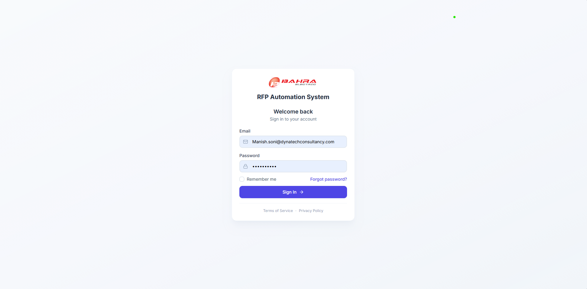

# Quick Start Guide

Read this once (5 minutes) before your first hour on the portal. For role-specific detail, head to the [Bidder](13-User-Manual-Bidder.md), [Admin](14-User-Manual-Admin.md), or [Approver](15-User-Manual-Approver.md) manual.

---

## 1. What the portal does, in one paragraph

It signs in to Bahra's Ariba supplier account four times a day, downloads new RFPs for each of the four buyer organisations (SEC, Aramco e-Marketplace, HADEED, Saudi Aramco Mobil Refinery), matches each Bill of Quantities line against Bahra's SAP material list, emails the right bidders an interactive card in Outlook, and pushes the finished response back to the buyer. Along the way it records what happened so you can look it up later.

---

## 2. Log in

1. Go to **https://be-aramco-01.bahra-cables.com/rfp**.
2. Enter your **email** and **password**.
3. Click **Sign in**.

Forgot your password? Click the link on the login page — the reset link lasts **30 minutes**.

Get it wrong five times in five minutes and the portal makes you wait a few minutes. It clears itself; you don't need an admin.

**Your session lasts 2 hours from login**, whether you're active or not. There's no idle timeout and no extension for being busy — two hours after signing in, you sign in again.

---

## 3. Know your role

You have **one role**. Find it on your avatar (top right) → Profile.

| Role | First place to look |
|---|---|
| **RFP Bidder** (seeded) | Sidebar → RFP Insights → filter Status = **Open** |
| **Admin** (seeded) | Sidebar → everything. Start with Dashboard |
| **A custom role** | Whatever your admin granted — the sidebar shows only what you can reach |

Only **Admin** and **RFP Bidder** exist out of the box. Anything else is a custom role your admin built from the 42 available permissions.

If the sidebar looks emptier than you expect, your role may be missing a permission — ask your admin. And if they just granted you one, **sign out and back in**: permissions are read only at login.

---

## 4. Your first 5 minutes

1. **Dashboard** — glance at the tiles. Any **Open** RFPs?
2. **Match %** on an RFP — click it to open the Material Breakdown.
3. **Read the Method column** — Exact vs Keyword. §6 explains why that matters more than the percentage.
4. **RFP Insights** — filter Status = Open and see what's waiting.
5. **Open RFP** — see who still owes a response.

---

## 5. How to do the 3 most common tasks

### 5.1 Respond to an RFP (Bidder)

**In Outlook** — this is where prices are entered. Open the email, fill in the fields on the card, click **Submit All Responses**. Done. First answer on each product line wins, so click **Refresh Status** first if a colleague may have got there before you.

### 5.2 Push the response back to Ariba (Bidder)

**Submit RFP** in Quick Actions → pick the RFP ID and company → upload the filled Excel workbook (plus optional PDFs) → Submit. The automation drives Ariba for you in the background.

### 5.3 Create a user (Admin)

**Users** → **Add User** → fill in → assign role → Create User. Then add them to **Master Data → RFP Team**, or they'll never receive a card.

---

## 6. Two things that confuse everyone

**"Match Score" is coverage, not confidence.** It's matched lines ÷ total lines. 100% means every line matched *something* — not that the matches are right.

**"Keyword" matches deserve a look.** There are exactly two ways a line matches:

| Method | What happened | Trust it? |
|---|---|---|
| **Exact** | The line had a 9-digit SAP code that exists in the Material Master. | Yes. |
| **Keyword** | No SAP code, so the system found a keyword overlapping the line's text. It doesn't score or rank candidates — where several fit, it takes the first. | Check it. |

There is no fuzzy matching, no confidence percentage, and no threshold to tune. Match quality comes from the Material Master and Keyword Master **data**, so if something you quote often keeps missing, ask an admin to add a keyword — that fixes it for everyone, permanently.

---

## 7. Glossary cheat sheet

| Term | Means |
|---|---|
| **RFP** | Request for Proposal — a customer asking for a quote |
| **BOQ** | Bill of Quantities — the line-item list inside an RFP |
| **Bidder** | Sales engineer who prices the RFP |
| **Buyer / Company** | The customer organisation (SEC, Aramco, HADEED, Saudi Aramco Mobil Refinery) — all four live inside one Ariba account |
| **Match %** | Share of BOQ lines that matched something — coverage, not confidence |
| **Exact / Keyword** | How a line matched: SAP code, or keyword text overlap |
| **Adaptive card** | The interactive email you fill in directly in Outlook |
| **Open RFP** | The page showing who still owes a response |
| **Dataverse** | Where all data is stored (Microsoft's cloud database — you never touch it directly) |

Full glossary: [03-Glossary-and-Acronyms.md](../01-business/03-Glossary-and-Acronyms.md).

---

## 8. Known issues — please read

Two things currently don't work the way the screens suggest:

- **Deadline reminder emails are not being sent.** No automatic 3-day or 1-day nudge is going out. Check the **Open RFP** page yourself rather than waiting to be reminded.
- **The Schedule Automation screen doesn't change the real schedule.** It saves and shows a success message, but the live schedule now runs on the server. Ask IT if the cadence needs to change.

Both are tracked in the [Operations Runbook](../03-operations/10-Operations-Runbook.md).

---

## 9. FAQ (quickest answers)

**Q. Where's my RFP?**
RFP Insights → clear the date filter → use the search box.

**Q. I never got the adaptive card.**
Check spam. If it's still missing, ask your admin — you may not be on the **RFP Team** list for that product.

**Q. I can't see Admin screens.**
You're not an admin. That's by design.

**Q. My admin just gave me access but I still can't get in.**
Sign out and sign back in. Permissions are fixed at login.

**Q. How do I know my submission went through?**
The RFP status changes, and the run shows up in Activity Logs.

**Q. Can I work on mobile?**
The Outlook adaptive card works on mobile. The portal is a desktop-first web app — usable on a phone, but not designed for it.

**Q. Can I change a match the system picked?**
Not in the portal — the Material Breakdown is read-only. Correct the workbook you submit, and tell your admin so they can fix the keyword for next time.

**Q. Something is broken.**
Screenshot → email your admin → say what you clicked, what you expected, and what happened. Include the RFP ID.

---

## 10. Next steps

- **Bidder** → read [User Manual — Bidder](13-User-Manual-Bidder.md)
- **Admin** → read [User Manual — Admin](14-User-Manual-Admin.md)
- **Manager / oversight** → read [User Manual — Approver](15-User-Manual-Approver.md) — start with why there is no approval step
- **Curious** → read the [Glossary](../01-business/03-Glossary-and-Acronyms.md) and skim the [SAD](../02-architecture/04-SAD-Software-Architecture-Document.md) Section 1

Bookmark this page — you'll come back when onboarding teammates.
