# RFP Automation - Flow Diagrams

> All diagrams use Mermaid syntax. View in VS Code (Mermaid extension), GitHub, or any Mermaid-compatible renderer.

---

## Table of Contents

1. [System Architecture](#1-system-architecture)
2. [Login Flow](#2-login-flow)
3. [Dashboard Data Loading](#3-dashboard-data-loading)
4. [Download RFP Flow](#4-download-rfp-flow)
5. [Submit Process + Email Lifecycle](#5-submit-process--email-lifecycle)
6. [Match Percentage 3-Phase Resolution](#6-match-percentage-3-phase-resolution)
7. [Material Breakdown Dialog](#7-material-breakdown-dialog)
8. [Analytics & Insights Data Flow](#8-analytics--insights-data-flow)
9. [Caching Architecture](#9-caching-architecture)
10. [Complete RFP Lifecycle (End-to-End)](#10-complete-rfp-lifecycle-end-to-end)

---

## 1. System Architecture

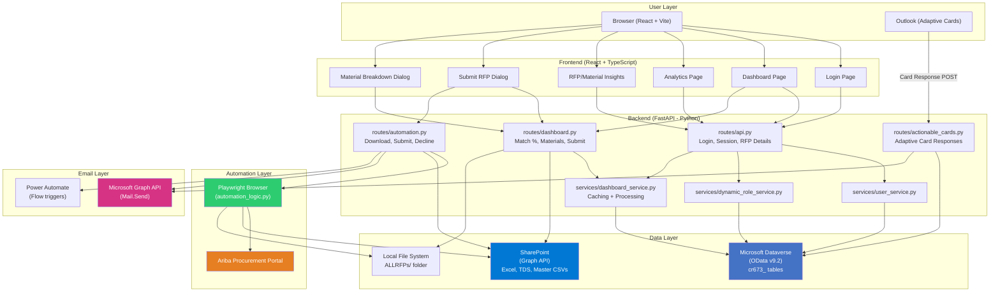

---

## 2. Login Flow

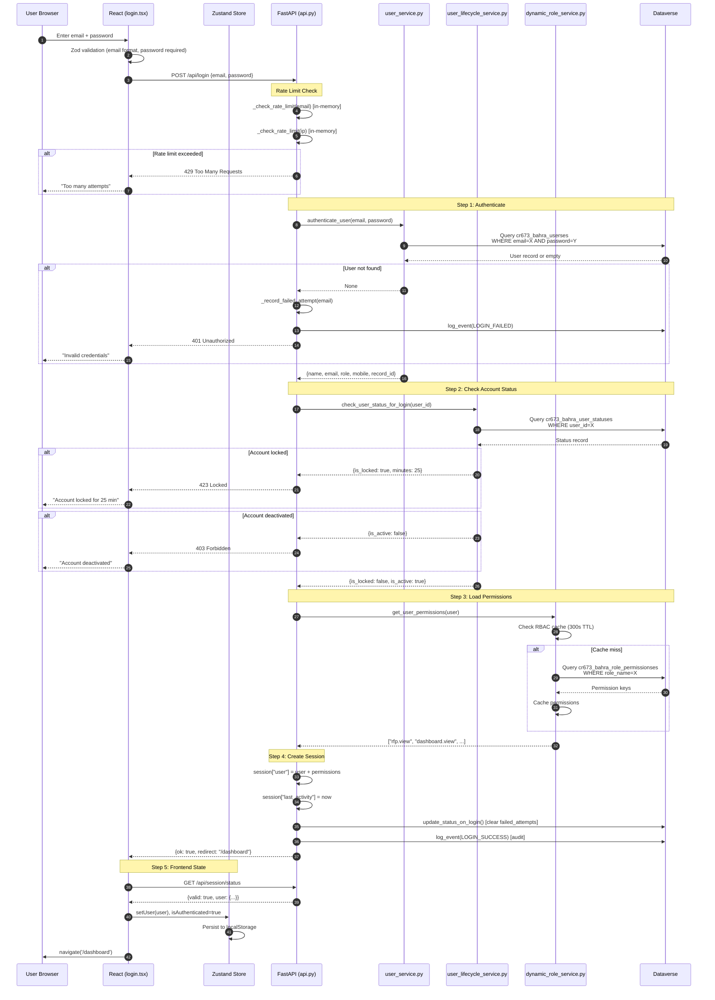

---

## 3. Dashboard Data Loading

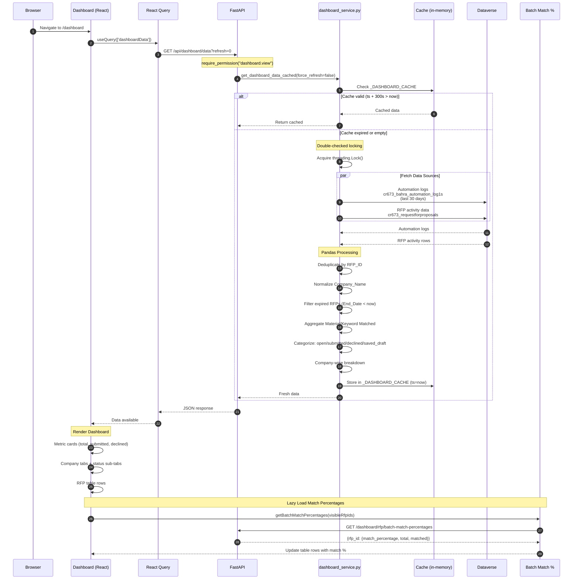

---

## 4. Download RFP Flow

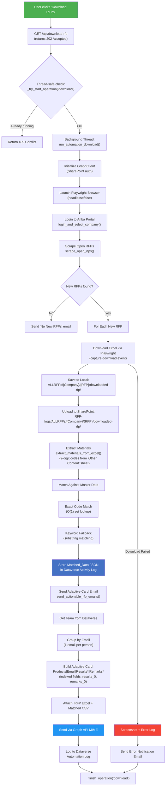

---

## 5. Submit Process + Email Lifecycle

```mermaid
flowchart TD
    subgraph "Phase 1: Upload"
        A["User opens Submit Dialog"] --> B["Enter RFP ID + Upload Excel + TDS PDFs"]
        B --> C["Validate RFP<br/>GET /dashboard/validate-rfp"]
        C -->|"Valid"| D["POST /dashboard/submit-rfp<br/>(FormData)"]
        D --> E["Upload Excel to SharePoint<br/>(2 locations: downloaded-rfp + rfp-upload-file)"]
        E --> F["Upload TDS PDFs to SharePoint<br/>(TDS-files/ folder)"]
        F --> G["Save copies locally"]
    end

    subgraph "Phase 2: Portal Automation"
        G --> H["run_automation_submit()"]
        H --> I["Playwright: Login to Ariba"]
        I --> J["Find matching RFP"]
        J --> K["Read Excel from rfp-upload-file/"]
        K --> L["Fill form + Click Submit"]
        L --> M["Update Dataverse:<br/>participated = 'submitted'"]
    end

    subgraph "Phase 3: Team Email"
        M --> N["Build Adaptive Card per team member"]
        N --> O["Send via Graph API MIME"]
        O --> P["Each person receives email in Outlook"]
    end

    subgraph "Phase 4: Response Collection"
        P --> Q["Team member fills Results + Remarks"]
        Q --> R["Click 'Submit All Responses'"]
        R --> S["POST /api/actionable-card/response"]
        S --> T["Verify bearer token<br/>(substrate.office.com)"]
        T --> U["Parse indexed form data<br/>(results_0, remarks_0, etc.)"]
        U --> V["Upsert to Dataverse<br/>RFP_RESPONSE_TABLE"]
        V --> W{"All team members<br/>responded?"}
    end

    subgraph "Phase 5: Consolidation"
        W -->|"No"| X["Return updated card<br/>(shows partial responses)"]
        W -->|"Yes"| Y["send_consolidated_response_email()"]
        Y --> Z["Build read-only card<br/>with all responses"]
        Z --> AA{"All results = 'No'?"}
        AA -->|"Yes"| AB["Include Decline button<br/>(for authorized emails)"]
        AA -->|"No"| AC["Send without Decline"]
        AB --> AD["Send to all team + admins"]
        AC --> AD
    end

    subgraph "Phase 6: Decline (Optional)"
        AD --> AE["Admin clicks Decline"]
        AE --> AF["run_automation_decline()"]
        AF --> AG["Playwright: Login → Decline on portal"]
        AG --> AH["Update Dataverse:<br/>participated = 'declined'"]
        AH --> AI["Send decline notification"]
    end

    style A fill:#4CAF50,color:#fff
    style O fill:#2196F3,color:#fff
    style Y fill:#9C27B0,color:#fff
    style AF fill:#F44336,color:#fff
```

### Email Response Sequence (Detailed)

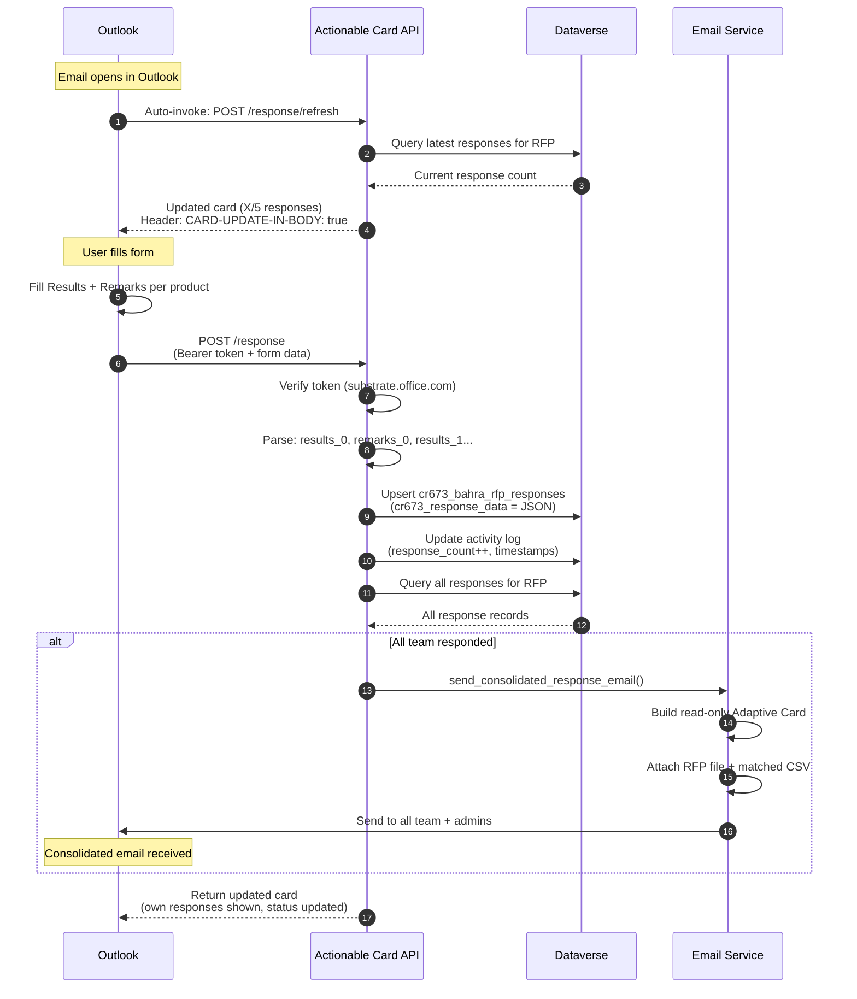

---

## 6. Match Percentage 3-Phase Resolution

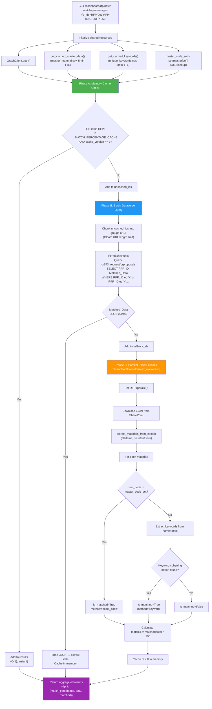

### Performance Comparison

```mermaid
gantt
    title Match % Resolution Time per RFP
    dateFormat X
    axisFormat %Lms

    section Phase A (Cache)
    Memory lookup    :done, 0, 1

    section Phase B (Dataverse)
    OData query      :active, 0, 400

    section Phase C (Excel)
    Download file    :crit, 0, 2000
    Extract materials:crit, 2000, 3500
    Match algorithm  :crit, 3500, 4500
```

---

## 7. Material Breakdown Dialog

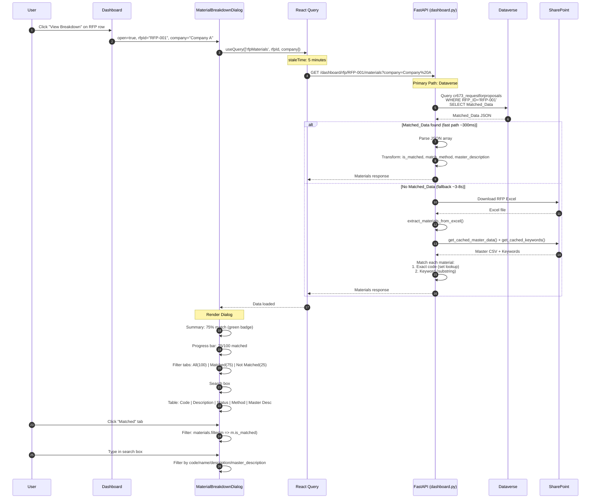

---

## 8. Analytics & Insights Data Flow

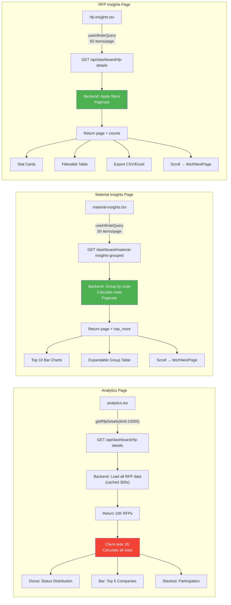

> **Note**: Red = performance bottleneck (analytics client-side computation), Green = properly paginated

---

## 9. Caching Architecture

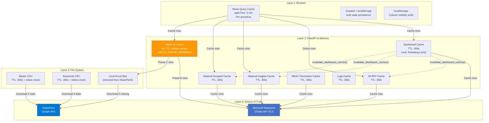

### Cache Invalidation Flow

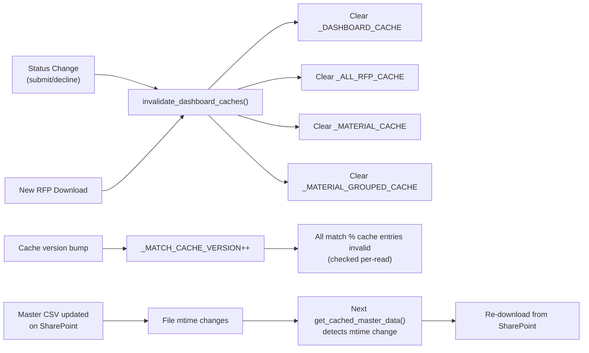

---

## 10. Complete RFP Lifecycle (End-to-End)

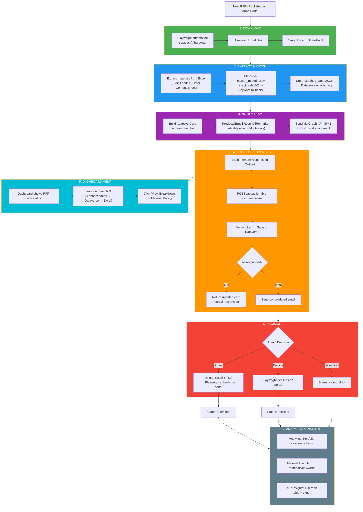

---

## Appendix: Dataverse Entity Relationship

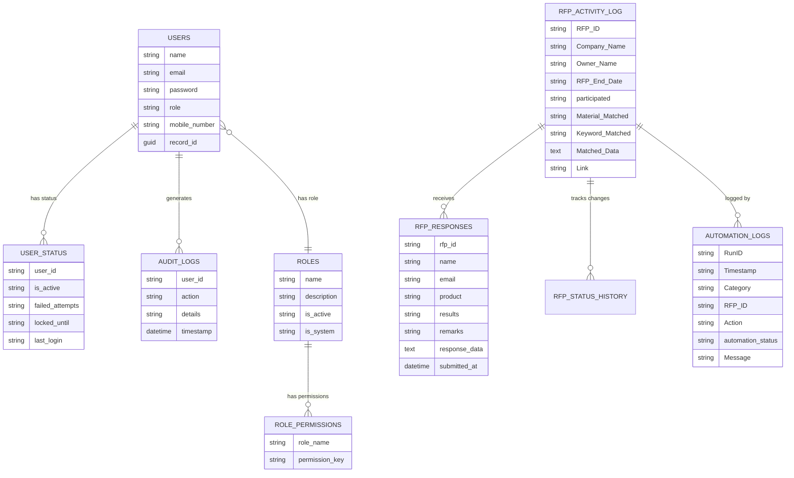
